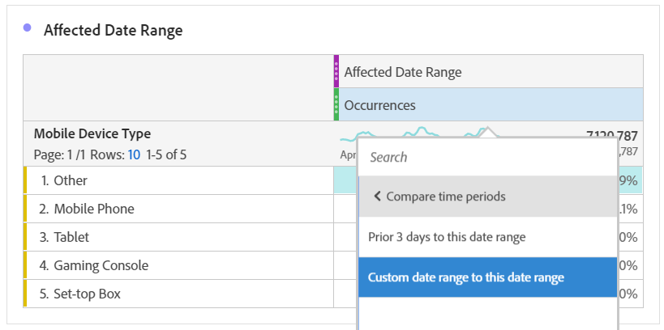

# 以前の範囲との比較によるイベントの影響を受けた日付の比較

イベントの影響を受けた [データがある場合](/help/technotes/event-impacted.md)、履歴トレンドを調べてその影響を測定できます。 この比較は、イベントがデータに与える影響を理解する上で役立ちます。このため、データを除外するか、レポートにメモを追加するか、無視するかを決定できます。

## イベント

イベントを含む日付範囲を作成し、そのイベントの影響を調べます。

1. /に移動 **[!UICONTROL Components]** します **[!UICONTROL Date ranges]**。
2. クリック **[!UICONTROL Add]**.
3. 日付範囲を選択します。イベントが発生した場合。 クリック **[!UICONTROL Save]**.

   

## 表示イベント日と類似した前の範囲を並べて表示

フリーフォームテーブルのビジュアライゼーションを使用して、イベントの日付範囲間の指標を、類似した前の日付範囲と比較できます。

1. Workspaceプロジェクトを開き、フリーフォームテーブルに「日」ディメンションを追加します。 「回数」など、最近作成した日付範囲を指標に適用します。

   

2. 日付範囲を右クリックし、/をクリッ **[!UICONTROL Add time period column]** クしま **[!UICONTROL Custom date range to this date range]**&#x200B;す。
   * 前週比を使用する場合は、イベントの範囲から7日を引いた値を選択します。 イベントとこの日付範囲の間の曜日が揃っていることを確認します。
   * 前月比の比較を行う場合は、先月のイベント範囲を選択します。 また、曜日を揃える場合は、イベントから28日を引いた範囲を選択することもできます。
   * 前年比の比較の場合は、昨年のイベント範囲を選択します。
3. 目的の日付範囲を選択すると、その日付範囲がフリーフォームテーブルに追加されます。 右クリックして、比較する日付範囲をいくつでも追加できます。

   

## 前の類似範囲との差異イベント率の計算

フリーフォームテーブルのビジュアライゼーションを使用して、イベントの日付範囲と類似の前の日付範囲の間のディメンション値を比較します。 次の手順では、1週間を通して実行できる例を示します。

1. Workspaceプロジェクトを開き、フリーフォームテー **ブルに非時間ディメンション** を追加します。 例えば、「モバイルデバイスタイプ」ディメンションを使用できます。 「回数」など、最近作成した日付範囲を指標に適用します。

   

2. 日付範囲を右クリックし、/をクリッ **[!UICONTROL Compare time periods]** クしま **[!UICONTROL Custom date range to this date range]**&#x200B;す。 7日を引いたイベントの範囲を選択します。 イベントとこの日付範囲の間の曜日が揃っていることを確認します。

   

3. 結果の「変化率」指標の名前を、「影響を受ける範囲」など、より具体的な値に変更します。 情報アイコンをクリックし、鉛筆を編集をクリックして指標名を編集します。

   

4. 前月比と前年比の比較で、手順3と4を繰り返します。 この操作は、同じテーブルまたは別々のテーブルで実行できます。

## 比較日付範囲を行として並べて分析

上記の割合の変化をさらに分析する場合は、行に変換できます。

1. フリーフ追加ォームテーブルのビジュアライゼーションを作成し、表ビルダーを有効にします。 このアクションを使用すると、変化の割合の指標を希望の順序で配置できます。
2. 変 `Ctrl` 更指標 `Cmd` 3%を表の行（一度に1つずつ）にドラッグします。

   

3. テ追加ーブルの列およびその他の任意のセグメントへの「すべての訪問」セグメント。

   

4. クリック **[!UICONTROL Build]**. 表示される表から、影響を受ける範囲と、目的のセグメント全体の前の週、月、年との表示を比較できます。

   
