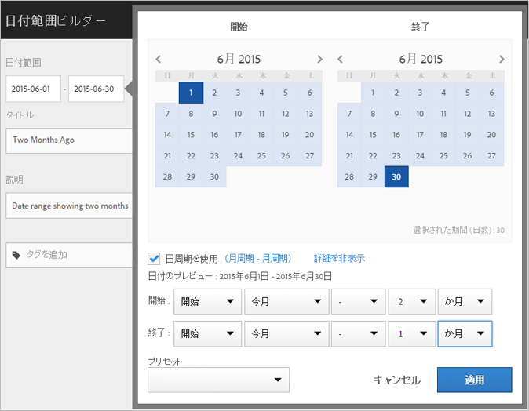
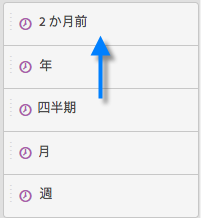
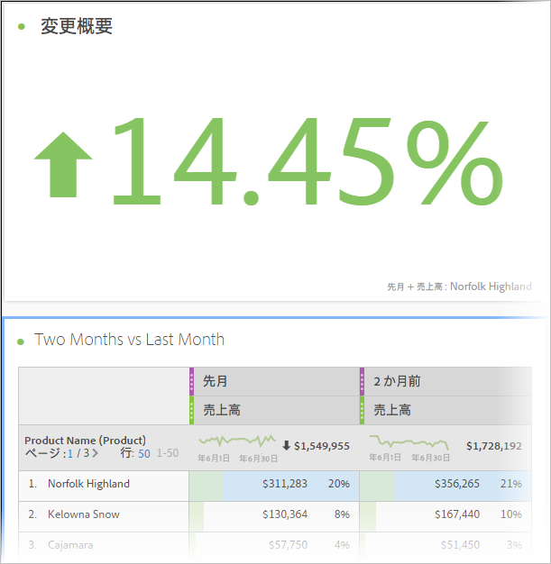
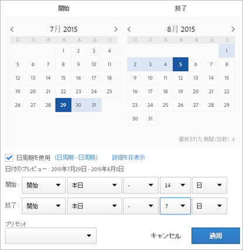

# Analysis Workspace でカスタム日付範囲を作成

Analysis Workspace でカスタム日付範囲を作成し、時間コンポーネントとして保存します。

**[!UICONTROL コンポーネント]** / **[!UICONTROL 新しい日付範囲]**

日付範囲は、パネルレベルに適用します。To add a date range to your project, click **Panels** &gt; *`<select panel>`*, and specify a new date range.

## Date range for "two months ago" {#section_C4109C57CB444BB2A79CC8082BD67294}

次のカスタム日付範囲は、方向の変化を示す変更概要ビジュアライゼーションで、「2 か月前」の日付範囲を示します。

カスタム日付範囲は、プロジェクトの[!UICONTROL 日付範囲]コンポーネントパネルの最上部に表示されます。

比較用に、このカスタム日付範囲を、先月プリセットを使用した、カスタムの、月周期の日付範囲の横の列にドラッグできます。変更概要ビジュアライゼーションを追加して、各列から合計を選択し、方向の変化を示します。

## Use a 7-day rolling date range {#section_7EF63B2E9FF54D2E9144C4F76956A8DD}

日付範囲は、パネルレベルに適用します。プロジェクトに日付範囲を追加するには、**アクション**／**パネルを追加**&#x200B;をクリックして、新しい日付範囲を指定します。

日付範囲ビルダーで、他の日付範囲と共にコンポーネントパネルに表示するカスタム日付範囲を作成できます。

例えば、1 週間前に終了する 7 日周期の時間帯を指定する日付範囲を作成できます。

Use *`rolling daily`*（名前をつけて保存）する必要があります。

* The Start settings would be *`current day minus 14 days`*.

* The End settings would be *`current day minus 7 days`*.

この日付範囲は、コンポーネントとして任意のフリーフォームテーブルにドラッグできます。
