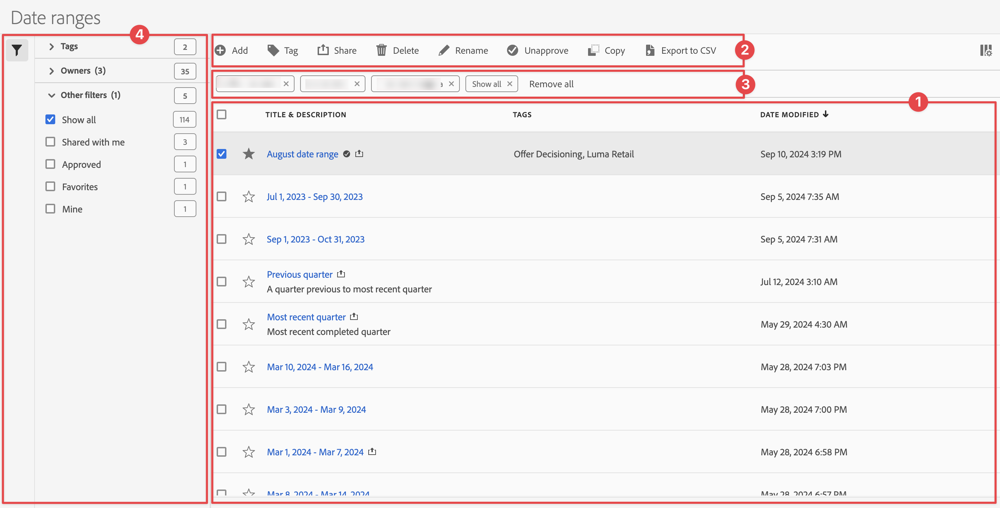

# 日付範囲の管理

中央の[!UICONTROL 日付範囲]管理インターフェイスから、日付範囲を共有、フィルタリング、タグ付け、承認、コピー、共有、削除したり、日付範囲をお気に入りにマークしたりできます。 日付範囲を管理するには：

* メインインターフェイスで「**[!UICONTROL コンポーネント]**」を選択し、**[!UICONTROL 日付範囲]**」を選択します。

## 日付範囲マネージャー

日付範囲マネージャーには、次のインターフェイス要素があります。

### 日付範囲リスト

日付範囲リスト ➊には、すべての日付範囲が表示されます。 リストには、次の列があります。

| 列 | 説明 |
| --- | --- |
|  | 日付範囲をに優先するか、に優先しない場合に選択します。 |
| **[!UICONTROL タイトルと説明]** | タイトルと説明を編集するには、タイトルリンクを選択します。これにより、[日付範囲ビルダー](create.md#date-range-builder)が開きます。 |
| **[!UICONTROL 所有者]** | 日付範囲の所有者。 |
| **[!UICONTROL タグ]** | この日付範囲のタグ。 |
| **[!UICONTROL 共有先]** | 日付範囲を共有した個人またはグループ。 選択して、**[!UICONTROL 共有日付範囲]** ダイアログを開きます。 |
| **[!UICONTROL 変更日時]** | 日付範囲が最後に変更された日時を表示します。 |

{style="table-layout:auto"}

 を使用して、表示する列を指定します。

### アクションバー

アクション バー➋を使用して、日付範囲でアクションを実行できます。 アクションバーには、次のアクションが含まれます。

| アイコン | アクション | 説明 |
|:---:|---|---|
|  | **[!UICONTROL 追加]** | [日付範囲ビルダー](create.md#date-range-builder)を使用して、別の日付範囲を追加します。 |
|  | [!UICONTROL *タイトルで検索*] | リストで日付範囲が選択されていない場合は、この検索フィールドを使用して日付範囲を検索します。 |
|  | **[!UICONTROL タグ]** | 選択した日付範囲にタグを付けます。 **[!UICONTROL タグ日付範囲]** ダイアログで、選択した日付範囲のタグを選択または選択解除します。 選択した日付範囲のタグを保存するには、**[!UICONTROL 保存]**&#x200B;を選択します。 |
|  | **[!UICONTROL 共有]** | 選択した日付範囲を共有します。 **[!UICONTROL 共有日付範囲]** ダイアログで、 *個人またはグループを検索*&#x200B;するか、**[!UICONTROL 組織]**&#x200B;または&#x200B;**[!UICONTROL グループ]**&#x200B;を選択できます。 選択した日付範囲の共有の詳細を保存するには、**[!UICONTROL 保存]**&#x200B;を選択します。 |
|  | **[!UICONTROL 削除]** | 選択した日付範囲を削除します。 確認メッセージが表示されます。 |
|  | **[!UICONTROL 名前変更]** | 選択した1つの日付範囲の名前を変更します。 選択すると、日付範囲の名前をインラインで変更できます。 |
|  | **[!UICONTROL 承認]** | 選択した日付範囲を承認します。 |
|  | **[!UICONTROL コピー]** | 選択した日付範囲をコピーします。 新しい日付範囲は、同じ名前と接尾辞（コピー）で作成されます |
|  | **[!UICONTROL CSV に書き出し]** | 選択した日付範囲を`Date ranges List.csv` ファイルにエクスポートします。 |

### アクティブなフィルターバー

フィルターバー➌には、アクティブなフィルター（ある場合）が表示されます。  を使用すると、フィルターをすばやく削除できます。 複数のフィルターが指定されている場合は、**[!UICONTROL すべてを削除]**&#x200B;を使用してすべてのフィルターを削除します。

### フィルターパネル

日付範囲は、**[!UICONTROL フィルター]**&#x200B;左側のパネル ➍を使用してフィルターできます。 フィルターパネルには、フィルターのタイプと、フィルターを適用する日付範囲の数が表示されます。 「」を選択して、フィルターパネルの表示を切り替えます。

フィルターリストをフィルタリングするには、次の手順に従います。

1. 「」を選択して、フィルターパネルを開きます。 フィルターリストにスペースが必要な場合は、もう一度「」を選択してパネルを閉じることができます。
1. 使用可能な[&#x200B; フィルターセクション &#x200B;](#filter-sections)のいずれかを使用して、日付範囲をフィルタリングできます。

   >[!INFO]
   >
   >*項目*&#x200B;は、[日付範囲リスト &#x200B;](#date-ranges-list)に表示される日付範囲アイテムを参照します。
   > 

#### フィルターセクション

{{tagfiltersection}}
{{ownerfiltersection}}
{{otherfiltersfiltersection}}

[日付範囲リスト &#x200B;](#date-ranges-list)は、フィルター設定に基づいて自動的に更新されます。 設定済みのフィルターは、[アクティブなフィルターバー](#active-filter-bar)で確認できます。

## 日付範囲を編集

日付範囲を編集するには、次の2つの方法があります。

* Workspace プロジェクトでは、[コンポーネント情報](/help/analyze/analysis-workspace/components/use-components-in-workspace.md#component-info)アイコンを使用します。

* [[!UICONTROL 日付範囲] リスト &#x200B;](#date-ranges-list)で、日付範囲のタイトルを選択します。

[日付範囲ビルダー](create.md#date-range-builder)を使用して、日付範囲を編集します。

日付範囲マネージャーを使用して、日付範囲の共有、名前の変更または削除を行います。 日付マネージャヘのアクセス方法：

1. Adobe ID の資格情報を使用して [analytics.adobe.com](https://analytics.adobe.com) にログインします。
1. [!UICONTROL コンポーネント]／[!UICONTROL 日付範囲]に移動します。

<!--

## Interface

The date range manager includes the following options:

* **Add**: Create a new date range. See [create a date range](create.md) for more information.
* **Search by title**: Search for a date range by title. Results are filtered based on text entered here.
* **Filter**: Filter date ranges using the left column. You can filter by custom tag, owner, created by you, your favorites, approved, or shared with you. You can also search for desired filters.
* **Favorite**: Click the  icon next to a date range to add it to your favorites.
* **Customize columns**: Click the  icon to show or hide columns in the date range manager.

Click the checkbox next to one or more date ranges for more options.

* **Tag**: Apply a tag to all selected date ranges. Tags help you organize date ranges, and let you filter them using the left column.
* **Share**: Share a date range to other CX Enterprise users. If you are a product administrator, you can also share to the entire organization or groups. Date ranges that are shared to other users in your organization include a  icon next to the title.
* **Delete**: Permanently delete the selected date range(s).
* **Rename**: If a single date range is selected, you can change its title.
* **Approve**: If you are a product admin, you can add a stamp of approval to a date range. Approved date ranges inform users in your organization that they are 'official', differentiating them from date ranges created by other users in your organization. Approved date ranges include a  icon next to the title.
* **Unapprove**: If you are a product admin and select a date range that is already approved, you can unapprove it.
* **Copy**: Create a copy of the selected date range(s). Copying date ranges appends `(Copy)` to the end of the title of the newly copied date range(s).
* **Export to CSV**: Exports all selected date ranges into a CSV file. Columns in the resulting CSV file include all visible columns in the date range manager.
-->
