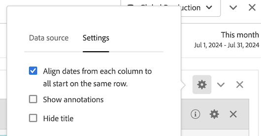

# 日付比較

Analysis Workspace での日付の比較では、日付範囲を含む任意の列を使用して、前年比、前四半期比、前月比などの一般的な日付比較を作成できます。

## 期間を比較 {#section_C4E36BFE0F5C4378A74E705747C9DEE4}

分析にはコンテキストが必要ですが、多くの場合、そのコンテキストは前の期間から得られます。例えば、「前年の同じ時期に比べてどのくらい良くなっているか悪くなっているか」という質問は、ビジネスを把握するうえで基本的な問いです。日付の比較では自動的に「差異」列が含まれ、指定した期間と比較した変更の割合が示されます。

1. ある期間について比較する任意のディメンションと指標を含むフリーフォームテーブルを作成します。
1. Right-click a table row and select **[!UICONTROL Compare Time Periods]**.

   

   >[!IMPORTANT]
   >
   >この右クリックオプションは、指標行、日付範囲行および時間ディメンション行に対しては無効になります。

1. テーブルの日付範囲をどのように設定したかに応じて、次のオプションを比較に使用できます。

   | オプション | 説明 |
   |---|---|
   | **[!UICONTROL この日付範囲の前の週、月、四半期、年]** | この日付範囲の直前の週、月などと比較します。 |
   | **[!UICONTROL 今週、今月、今四半期、今年対昨年]** | 1 年前の同じ日付範囲と比較します。 |
   | **[!UICONTROL 範囲を選択]** | カスタム日付範囲を選択できます。 |

   >[!NOTE]
   >
   >When you select a custom number of days, for example October 7 - October 20 (a 14-day range), you will get only 2 options: **[!UICONTROL Prior 14 days before this date range]**, and **[!UICONTROL Select range]**.

1. 結果として次のような比較が表示されます。

   

   「変更の割合」列は、マイナスの値の場合は赤、プラスの値の場合は緑で表示されます。

1. （オプション）他の Workspace プロジェクトの場合と同様に、これらの期間比較に基づいてビジュアライゼーションを作成できます。以下は横向き棒グラフの例です。

   

   横向き棒グラフで変更の割合を示すためには、[!UICONTROL ビジュアライゼーション設定]で[!UICONTROL 割合 (%)] 設定を有効にしておく必要があります。

## Add a time period column for comparison {#section_93CC2B4F48504125BEC104046A32EB93}

テーブルの各列に期間を追加できるようになりました。これにより、カレンダーの設定先とは異なる期間を追加できます。この方法でも日付を比較することができます。

1. テーブルの列を右クリックし、**[!UICONTROL 期間列を追加を選択します。]**

1. テーブルの日付範囲をどのように設定したかに応じて、次のオプションを比較に使用できます。

   | オプション | 説明 |
   |---|---|
   | **[!UICONTROL この日付範囲の前の週、月、四半期、年]** | この日付範囲の直前の週、月などの列を追加します。 |
   | **[!UICONTROL 今週、今月、今四半期、今年対昨年]** | 1 年前の同じ日付範囲を追加します。 |
   | **[!UICONTROL 範囲を選択]** | カスタム日付範囲を選択できます。 |

   >[!NOTE]
   >
   >When you select a custom number of days, for example October 7 - October 20 (a 14-day range), you will get only 2 options: **[!UICONTROL Prior 14 days before this date range]**, and **[!UICONTROL Select range]**.

1. 選択した列の前に、期間が挿入されます。

   

1. 期間の列はいくつでも追加でき、異なる日付範囲を組み合わせることもできます。

   

1. また、各列で並べ替えて、並べ替えに使用した列に基づいて日付の順序を変更することもできます。

## Align column dates to start on same row {#section_5085E200082048CB899C3F355062A733}

A new setting for all tables lets you **[!UICONTROL Align Dates from each column to all start on the same row (applies to entire table)]**. 「テーブル全体に適用」とは、例えば、テーブルで分類をおこない、分類に対してこの設定を変更すると、テーブル全体で設定が変更されることを意味します。

>[!IMPORTANT]
>
>This setting is **disabled** (unchecked) for all existing projects and **enabled** (checked) for all new projects.

例：日付を整列させると、2016 年 10 月を 9 月と比較する前月比の場合、左側の列は 10 月 1 日、右側の列は 9 月 1 日から始まります。

<!-- 

See Jonny Moon's email from November 3. 

 -->

