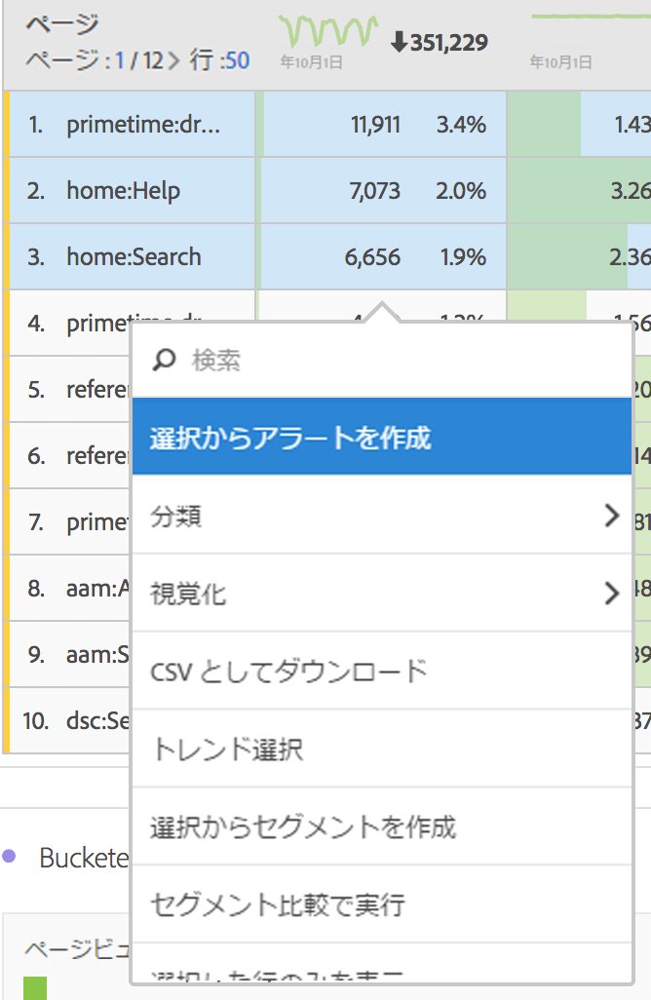
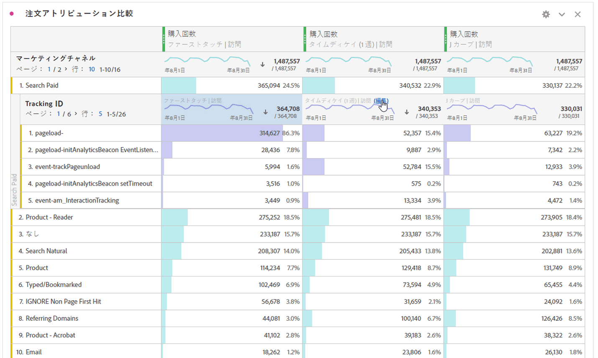

# ディメンションの分類

Analysis Workspace のディメンションおよびディメンション項目を分類します。

特定のニーズに合わせて様々な方法でデータを分類し、関連する指標、ディメンション、セグメント、タイムライン、その他の分析分類値を使用するクエリを作成します。

1. データテーブルを使用して[プロジェクトを作成](/help/analyze/analysis-workspace/home.md)します。
1. データテーブルで行項目を右クリックし、**[!UICONTROL 分類]**／*`<item>`*&#x200B;を選択します。

   

   選択した期間で、ディメンション項目またはオーディエンスセグメントで指標を分類できます。より詳細なレベルまで、さらに詳しく調べることもできます。

   >[!NOTE]
   >
   >テーブルに表示する分類の数は、200 までに制限されています。この制限は、分類をエクスポートする場合は増加します。

## 分類へのアトリビューションモデルの適用

テーブル内の分類には、任意のアトリビューションモデルを適用することもできます。このアトリビューションモデルは、親列と同じ場合と異なる場合があります。例えば、マーケティングチャネルディメンションで線形の注文件数を分析するものの、チャネル内の特定のトラッキングコードには U 字形の注文件数を適用するといったことができます。分類に適用されるアトリビューションモデルを編集するには、その分類モデルの上にマウスポインターを置いて「**[!UICONTROL 編集]**」をクリックするだけです。

アトリビューションモデルを分類に適用したり編集したりする際に想定される動作です。

* 他のアトリビューションが存在しないときにアトリビューションを適用すると、そのアトリビューションは列ツリー全体に適用されます。

* アトリビューションが適用された後に分類を追加する場合、そのディメンションにデフォルトが設定されている場合は、追加された特定の分類に対してデフォルトが使用されます。それ以外の場合は、親列の分類が使用されます。一部のディメンションにはデフォルトの割り当てがあります。 例えば、[!UICONTROL 時間] ディメンションと [!UICONTROL リファラー] は [!UICONTROL 同一タッチ] を使用します。[!UICONTROL 製品] ディメンションでは、 [!UICONTROL ラストタッチ] を使用します。他のディメンションにはデフォルトはなく、親列の割り当てが使用されます。

* 列ツリーに既にアトリビューションが存在する場合、アトリビューションの変更は、編集中のアトリビューションにのみ影響します。

## ビデオ

Analysis Workspace でのプロジェクトへのディメンションと指標の追加：

>[!VIDEO](https://video.tv.adobe.com/v/30606/?quality=12)

フリーフォームテーブルでのディメンションの操作：

>[!VIDEO](https://video.tv.adobe.com/v/40179/?quality=12)

以下は、ディメンションの位置別分類に関するビデオです。

>[!VIDEO](https://video.tv.adobe.com/v/24033/?quality=12)
