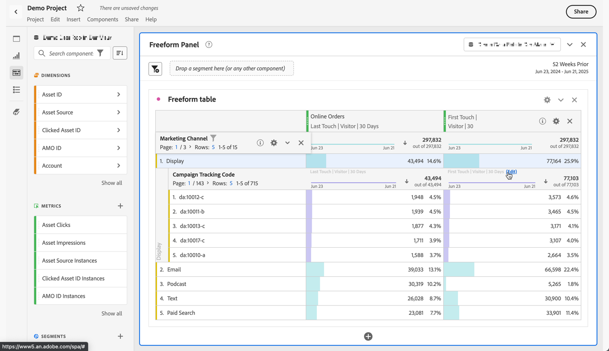
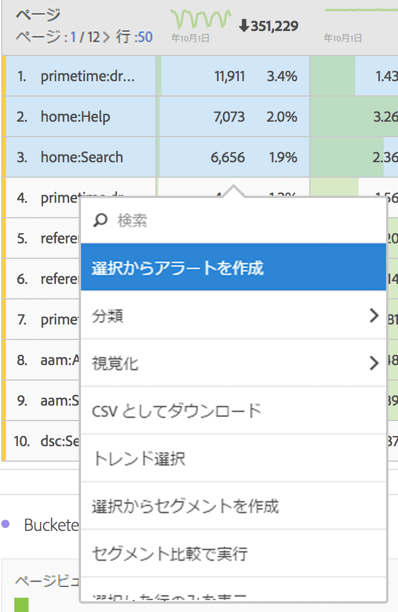
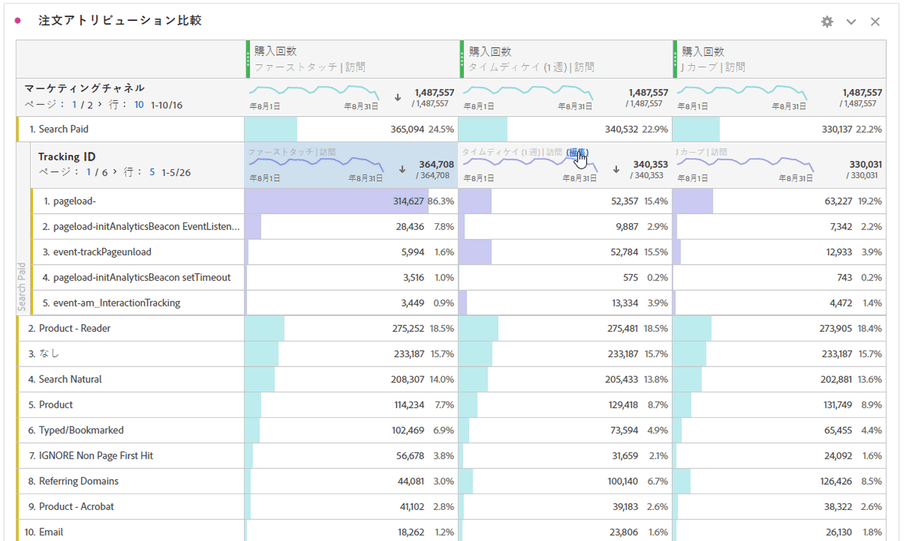

# ディメンションの分類

Analysis Workspaceでは、適切な指標やディメンション、セグメント、タイムラインなどの分析ブレークダウン値を使用してクエリを構築し、特定のニーズに合わせて無制限にデータを分類できます。

1. [&#x200B; フリーフォームテーブル &#x200B;](/help/analyze/analysis-workspace/visualizations/freeform-table/freeform-table.md)で、選択した1つ以上の行のコンテキストメニューから、**[!UICONTROL 分類]** を選択します。

   

1. サブメニューから、**[!UICONTROL ディメンション]**、**[!UICONTROL 指標]**、**[!UICONTROL セグメント]**&#x200B;または&#x200B;**[!UICONTROL 日付範囲]**&#x200B;を選択し、項目を選択します。 または、**[!UICONTROL *検索&#x200B;*]**&#x200B;フィールドでコンポーネントを検索します。

選択した期間で、ディメンション項目またはオーディエンスセグメントで指標を分類できます。 より詳細なレベルまで、さらに詳しく調べることもできます。

>[!NOTE]
>
>テーブルに表示する分類の数は、200 までに制限されています。 この制限は、分類をエクスポートする場合は増加します。

## 位置で分類

デフォルトでは、分類は静的な行アイテムに固定されています。 例えば、上位 3 つのページディメンション項目（ホームページ、検索結果、チェックアウト）をマーケティングチャネル別に分類するとします。 その後、プロジェクトを終了し、2 週間後に戻ります。 プロジェクトを再度開くと、トップ 3 ページが変更され、ホームページ、検索結果、チェックアウトがトップ 4 ～ 6 ページになりました。 デフォルトでは、マーケティングチャネルの分類は、現在は 4～6 行になっているにもかかわらず、ホームページ、検索結果、チェックアウトの下に引き続き表示されます。

対照的に、**位置による分類**&#x200B;は、これらの項目が何であるかに関係なく、常に上位3つの項目を分類します。 例に戻って参照すると、プロジェクトを再度開く際、マーケティングチャネルの分類はテーブルの上位 3 ページに関連付けられます。 また、現在、4～6 行になっているホームページ、検索結果、チェックアウトには関連付けられません。 この設定の設定方法については、[行の設定](/help/analyze/analysis-workspace/visualizations/freeform-table/column-row-settings/table-settings.md)を参照してください。

## 分類へのアトリビューションモデルの適用

テーブル内の分類には、任意のアトリビューションモデルを適用することもできます。 このアトリビューションモデルは、親列と同じ場合と異なる場合があります。 例えば、マーケティングチャネルディメンションで線形の注文件数を分析するものの、チャネル内の特定のトラッキングコードには U 字形の注文件数を適用するといったことができます。 分類に適用されたアトリビューションモデルを編集するには、分類モデルにカーソルを合わせて、**[!UICONTROL 編集]**&#x200B;を選択します。

アトリビューションモデルを分類に適用したり編集したりする際に想定される動作です。

* 他のアトリビューションが存在しないときにアトリビューションを適用すると、そのアトリビューションは列ツリー全体に適用されます。

* アトリビューションが適用された後に分類を追加した場合は、追加された特定の分類に対してデフォルトが使用されます（そのディメンションにデフォルトが設定されている場合）。 それ以外の場合は、親列の分類が使用されます。 一部のディメンションにはデフォルトの割り当てがあります。 例えば、時間ディメンションとリファラーは同一タッチを使用します。 製品ディメンションでは、ラストタッチを使用します。 他のディメンションにはデフォルトはなく、親列の割り当てが使用されます。

* 列ツリーに既にアトリビューションが存在する場合、アトリビューションの変更は、編集中のアトリビューションにのみ影響します。

>[!BEGINSHADEBOX]

デモ動画については、 [Analysis WorkspaceのDimension](https://video.tv.adobe.com/v/41372?captions=jpn&quality=12&learn=on){target="_blank"}を参照してください。

>[!ENDSHADEBOX]

>[!BEGINSHADEBOX]

デモ動画については、 [Dimensionの内訳](https://video.tv.adobe.com/v/327337?captions=jpn&quality=12&learn=on){target="_blank"}を参照してください。

>[!ENDSHADEBOX]

>[!BEGINSHADEBOX]

デモ動画については、 [&#x200B; ディメンションと指標の追加](https://experienceleague.adobe.com/ja/docs/analytics-learn/tutorials/analysis-workspace/dimensions/adding-dimensions-and-metrics-to-your-project-in-analysis-workspace){target="_blank"}を参照してください。

>[!ENDSHADEBOX]

>[!BEGINSHADEBOX]

デモ動画については、 [&#x200B; フリーフォームテーブルでのディメンションの操作](https://experienceleague.adobe.com/ja/docs/analytics-learn/tutorials/analysis-workspace/building-freeform-tables/working-with-dimensions-in-a-freeform-table){target="_blank"}を参照してください。

>[!ENDSHADEBOX]

>[!BEGINSHADEBOX]

デモ動画については、 [Dimensionの位置別の内訳](https://video.tv.adobe.com/v/327412?captions=jpn){target="_blank"}を参照してください。

>[!ENDSHADEBOX]

<!--
# Break down dimensions

Break down dimensions and dimension items in Analysis Workspace.

Break down your data in unlimited ways for your specific needs; build queries using relevant metrics, dimensions, segments, time lines, and other analysis breakdown values.

1. [Create a project](/help/analyze/analysis-workspace/home.md) with a data table.
1. In the data table, right-click a line item and select **[!UICONTROL Breakdown]** > *`<item>`*.

   

   You can break down metrics by dimension items or audience segments across selected time periods. You can also drill down further to a more granular level.

   >[!NOTE]
   >
   >The number of breakdowns to show in the table is limited to 200. This limit will increase for exporting breakdowns.

## Apply attribution models to breakdowns

Any breakdown within a table can also have any attribution model applied to it. This attribution model can be the same or different from the parent column. For example, you can analyze linear Orders on your Marketing Channels dimension but apply U-Shaped Orders to the specific tracking codes within a Channel. To edit the attribution model applied to a breakdown, hover over the breakdown model and click **[!UICONTROL Edit]**:

This is the expected behavior when applying attribution models to breakdowns or editing them:

* If you apply an attribution when no other attributions exist, then the attribution applies to the entire column tree.

* If you add a breakdown after an attribution has been applied, it will use the default for the given breakdown that was added, if that dimension has a default. Otherwise it will use the breakdown from the parent column. Some dimensions have a default allocation.  For example, [!UICONTROL Time] dimensions and [!UICONTROL Referrer] use [!UICONTROL Same Touch]. The [!UICONTROL Product] dimension uses [!UICONTROL Last Touch]. Other dimensions don't have a default, and will use the parent column allocation.

* If there are already attributions in the column tree, changing the attribution only impacts the one you are editing.

## Videos

>[!BEGINSHADEBOX]

See  [Adding dimensions and metrics to your project in Analysis Workspace](https://experienceleague.adobe.com/ja/docs/analytics-learn/tutorials/analysis-workspace/dimensions/adding-dimensions-and-metrics-to-your-project-in-analysis-workspace){target="_blank"} for a demo video.

>[!ENDSHADEBOX]

>[!BEGINSHADEBOX]

See  [Working with dimensions in a Freeform Table](https://experienceleague.adobe.com/ja/docs/analytics-learn/tutorials/analysis-workspace/building-freeform-tables/working-with-dimensions-in-a-freeform-table){target="_blank"} for a demo video.

>[!ENDSHADEBOX]

>[!BEGINSHADEBOX]

See  [dimension breakdowns by position](https://video.tv.adobe.com/v/327412?captions=jpn&quality=12&learn=on){target="_blank"} for a demo video.

>[!ENDSHADEBOX]

-->