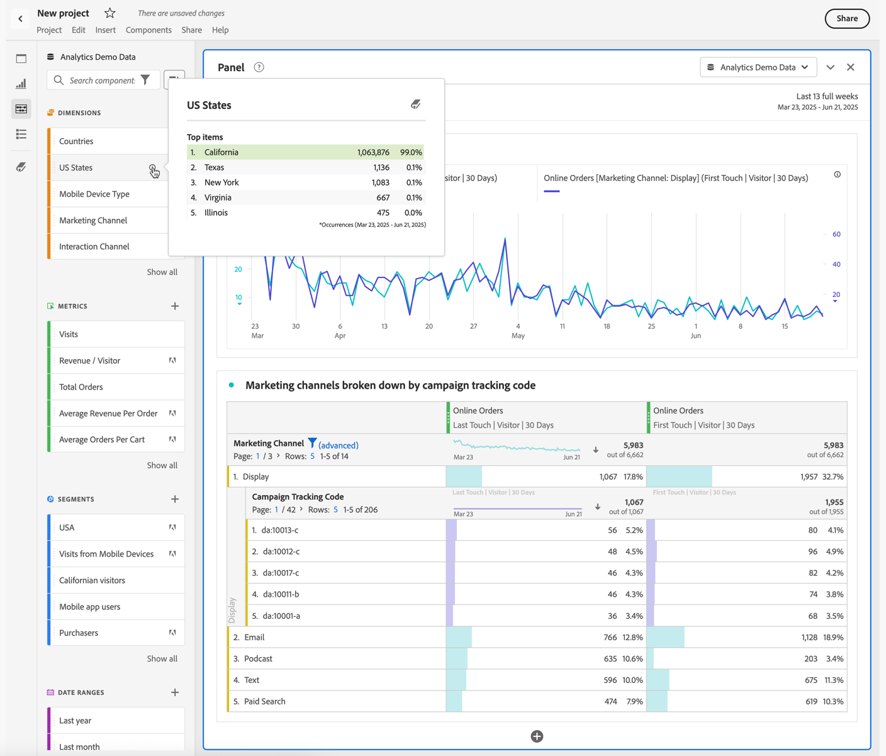
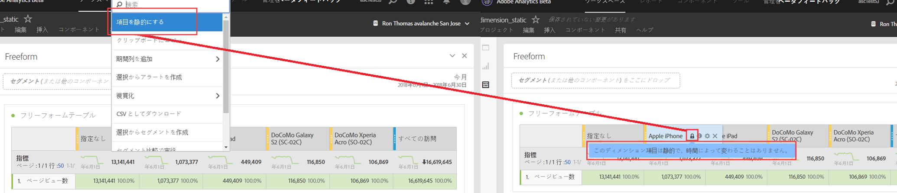
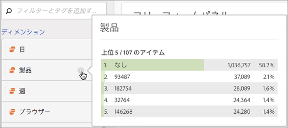

# ディメンションのプレビュー

コンポーネントの[&#x200B; コンポーネント情報](/help/analyze/analysis-workspace/components/use-components-in-workspace.md#component-info)を使用して、ディメンションの上位アイテムを表示できます。

<!--
Now, by default, we show dynamic values instead of static ones, with the option to turn them into static values. Other things to note:

* As your data updates, the dynamic dimension columns will update to show the current 5/15 dimension items.
* A dynamic dimension column that is copied or moved will become static.
* When hovering a static dimension column you will see a lock icon, indicating that the dimension is static.

-->

## ディメンション項目の表示

コンポーネントパネルでディメンションのを選択すると、ディメンション項目のリストが表示されます。 通常、ディメンション項目のリストには、過去30日間の上位の項目が表示されます。 より多くの項目が使用可能な場合、パネルで選択した日付範囲の外で、リンクを選択して他の項目を表示します。 例えば、**[!UICONTROL 先月]**&#x200B;の項目を表示します。

<!--
# Preview dimensions

Hover over the information (i) icon next to a dimension. This shows the top 5 values for non-time dimensions (and 15 for time dimensions). We used to keep those values static (i.e., the 5 values picked never changed).

Now, by default, we show dynamic values instead of static ones, with the option to turn them into static values. Other things to note:

* As your data updates, the dynamic dimension columns will update to show the current 5/15 dimension items.
* A dynamic dimension column that is copied or moved will become static.
* When hovering a static dimension column you will see a lock icon, indicating that the dimension is static.

## Show dimension items

When you hover over a dimension and click the grey right-arrow next to it, a list of its dimension items appears. Any list of dimension items usually shows the top items for the last 30 days.

If you scroll down to the bottom of the list, you see **[!UICONTROL Show Top Items From Last 18 Months]**. Click this option to see top dimension items from the last 547 days.

-->
