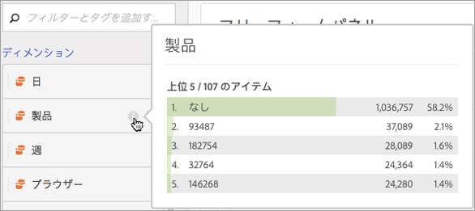

# ディメンションのプレビュー

ディメンションの隣の情報「i」アイコンにマウスポインターを置きます。時間以外のディメンションの上位 5 位（時間ディメンションの場合は 15 位）の値が表示されます。以前は、常に静的な値が表示されていました（選択された 5 つの値は変更されることはありませんでした）。

現在は、デフォルトでは静的な値ではなく動的な値が表示されると共に、静的な値に変更するオプションもあります。その他の注意事項を次に示します。

* データが更新されると、動的ディメンションも上位の 5 個または 15 個の項目で置き換えられます。
* 手動でコピーまたは移動された動的ディメンション列は、静的に変更されます。
* 静的ディメンション列の上にマウスポインターを置くと、ディメンションが静的であることを示すロックアイコンが表示されます。

## ディメンション項目の表示

ディメンションにマウスポインターを置き、その横にある灰色の右矢印をクリックすると、ディメンション項目のリストが表示されます。ディメンション項目のリストには通常、過去 30 日間の上位の項目が表示されます。

下にスクロールしてリストの下部に移動すると、「**[!UICONTROL 過去 6 ヶ月の上位の項目を表示]**」が表示されます。このオプションをクリックすると、過去 180 日の上位のディメンション項目が表示されます。
