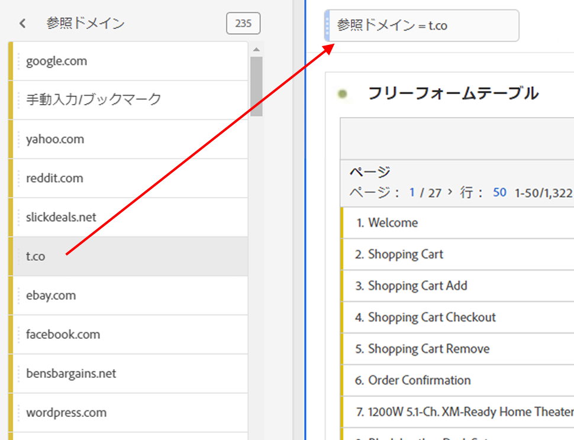

# アドホックプロジェクトセグメント

アドホックプロジェクトセグメントを使用すると、任意のコンポーネントをパネルのドロップゾーンに直接ドラッグ&amp;ドロップして、セグメントを作成できます。 セグメントが [プロジェクトレベルのセグメント](https://experienceleague.adobe.com/docs/analytics/analyze/analysis-workspace/components/segments/quick-segments.html?#what-are-project-only-segments%3F) 現在のプロジェクトのローカル

アドホックプロジェクトセグメントの作成に関するビデオをご覧ください。

>[!VIDEO](https://video.tv.adobe.com/v/23978/?quality=12)

1. 任意の種類のコンポーネント（ディメンション、ディメンション項目、イベント、指標、セグメント、セグメントテンプレート、日付範囲）をパネルの上部にあるセグメントドロップゾーンにドロップします。コンポーネントタイプはアドホックセグメントに自動変換されるか、 [クイックセグメント](https://experienceleague.adobe.com/docs/analytics/analyze/analysis-workspace/components/segments/quick-segments.html) 互換性がある場合は。
以下に、Twitter 参照ドメイン用のセグメントの作成方法の例を示します。

   

   パネルにこのセグメントが自動的に適用され、結果をすぐに確認できます。

1. 1 つのパネルに追加できるセグメントの数に制限はありません。
1. このセグメントを保存する場合は、以下の節を参照してください。

次の点に注意してください。

* 次の種類のコンポーネントをセグメントゾーンにドロップすることは&#x200B;**できません**：セグメントを作成できない計算指標およびディメンション／指標。
* Analysis Workspace では、すべてのディメンションおよびイベントに対して、「存在する」ヒットセグメントを作成します。例：`Hit where eVar1 exists` または `Hit where event1 exists`。
* 「未指定」または「なし」がセグメントドロップゾーンにドロップされると、セグメントで正しく扱えるように、自動的に「存在しない」セグメントに変換されます。

プロジェクト内で作成および適用できる様々なセグメントの比較については、 [ここ](/help/analyze/analysis-workspace/components/segments/t-freeform-project-segment.md).

## アドホックセグメントの保存 {#ad-hoc-save}

アドホックセグメントは、保存することで他のプロジェクトで使用できるようになります。

1. ドロップゾーンのセグメントの上にマウスポインターを置いて、「i」アイコンをクリックします。
1. 編集鉛筆アイコンをクリックして、セグメントビルダーに移動します。
1. チェック **[!UICONTROL すべてのプロジェクトで使用できるようにし、コンポーネントリストに追加する]**.
1. クリック **[!UICONTROL 保存]**.

保存すると、セグメントは左側のパネルコンポーネントリストで使用でき、セグメントマネージャから他のユーザーと共有できます。
