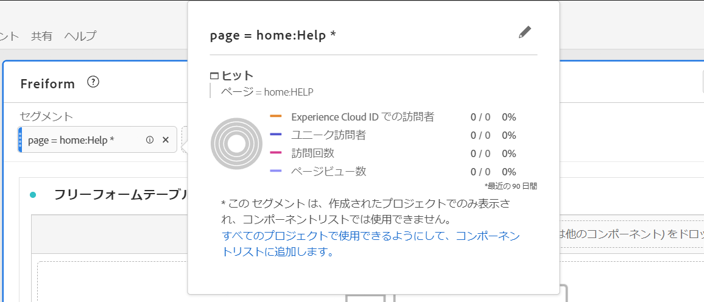

# アドホックプロジェクトセグメント

アドホックプロジェクトセグメントの作成に関するビデオをご覧ください。

>[!VIDEO](https://video.tv.adobe.com/v/23978/?quality=12)

アドホックプロジェクトセグメントを作成すると、セグメントビルダーに移動せずに、セグメントがプロジェクトに与える影響をすばやく確認できます。 これらのセグメントは、一時的なプロジェクトレベルのセグメントと考えてください。 通常これらは、左側のパネルのコンポーネントセグメントのように、セグメント「ライブラリ」に含まれません。 ただし、以下に示すように、これらを保存できます。

アドホックセグメントの機能と本格的なコンポーネントレベルのセグメントの機能の比較については、[こちら](/help/analyze/analysis-workspace/components/segments/t-freeform-project-segment.md)を参照してください。

1. 任意の種類のコンポーネント（ディメンション、ディメンション項目、イベント、指標、セグメント、セグメントテンプレート、日付範囲）をパネルの上部にあるセグメントドロップゾーンにドロップします。コンポーネントの種類はセグメントに自動変換されます。以下に、Twitter 参照ドメイン用のセグメントの作成方法の例を示します。

   

   パネルにこのセグメントが自動的に適用され、結果をすぐに確認できます。

1. パネルに追加できるコンポーネントの数に制限はありません。
1. このセグメントを保存する場合は、以下の節を参照してください。

次の点に注意してください。

* 次の種類のコンポーネントをセグメントゾーンにドロップすることは&#x200B;**できません**：セグメントを作成できない計算指標およびディメンション／指標。
* Analysis Workspace では、すべてのディメンションおよびイベントに対して、「存在する」ヒットセグメントを作成します。例：`Hit where eVar1 exists` または `Hit where event1 exists`。
* 「未指定」または「なし」がセグメントドロップゾーンにドロップされると、セグメントで正しく扱えるように、自動的に「存在しない」セグメントに変換されます。

>[!NOTE]
>
>この方法で作成されたセグメントは、プロジェクト内部にあります。

## アドホックプロジェクトセグメントの保存 {#ad-hoc-save}

次の手順に従うことで、これらのセグメントの保存を選択できます。

1. ドロップゾーンのセグメントの上にマウスポインターを置いて、「i」アイコンをクリックします。
1. 表示される情報パネルで、「**[!UICONTROL 保存]**」をクリックします。

   

## プロジェクトのみのセグメントとは

プロジェクトのみのセグメントは、クイックセグメントまたはアドホックなワークスペースのプロジェクトセグメントです。 セグメントビルダーで編集するとき、または開くとき、プロジェクトのみのボックスが表示されます。 ユーザーがビルダーでクイックセグメントを「適用」し、「使用可能にする」チェックボックスをオフにした場合、そのセグメントはプロジェクトのみのセグメントのままですが、QS ビルダーで開くことはできません。 ユーザーがチェックボックスをオンにして「保存」すると、コンポーネントリストセグメントになります。