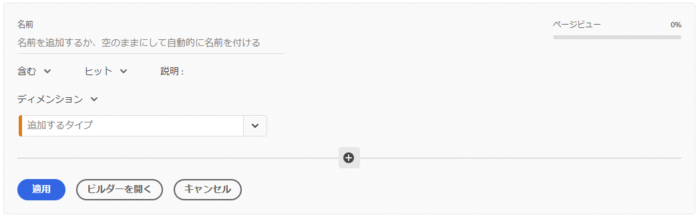
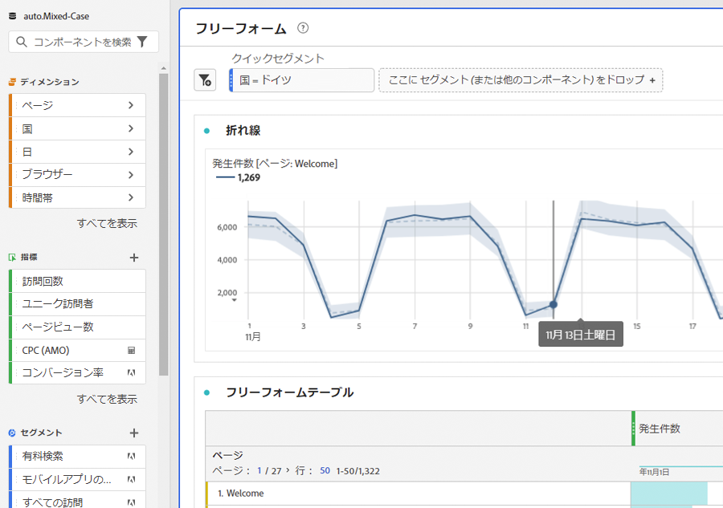
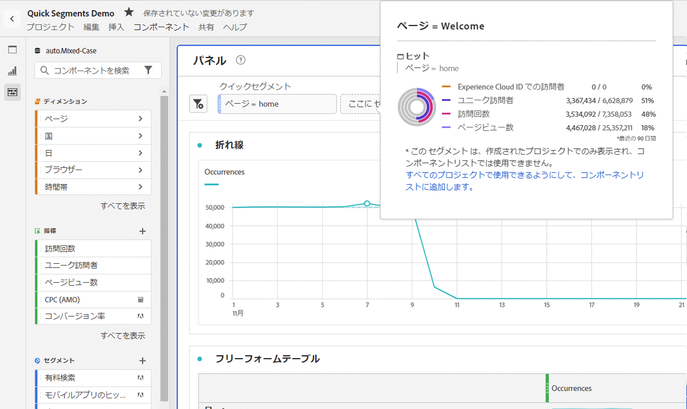
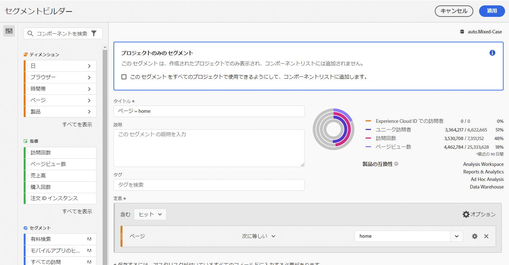
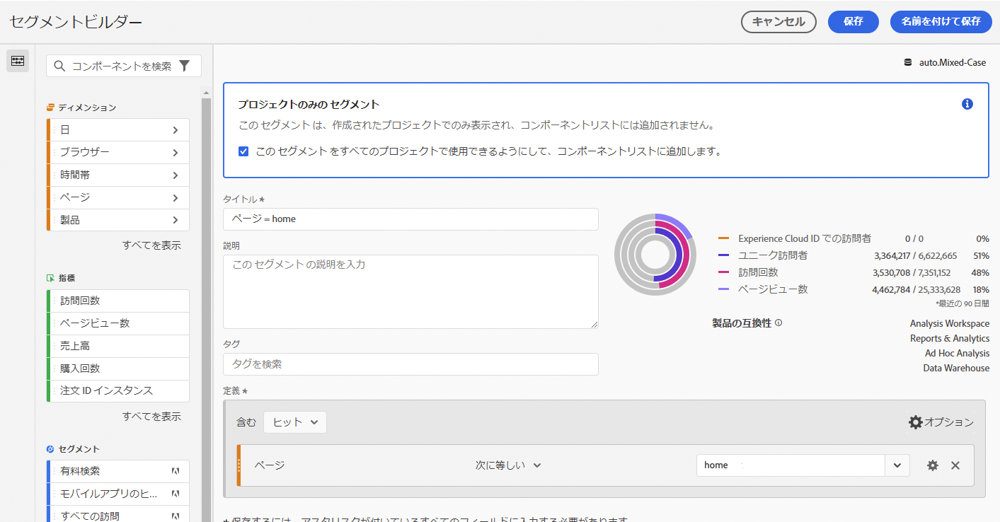

# クイックセグメント

プロジェクト内にクイックセグメントを作成して、[セグメントビルダー](/help/components/segmentation/segmentation-workflow/seg-build.md)全体の複雑さを回避できます。クイックセグメント

* 適用方法 [プロジェクトのみのセグメント](https://experienceleague.adobe.com/docs/analytics/analyze/analysis-workspace/components/segments/quick-segments.html?lang=en#what-are-project-only-segments%3F).
* 最大 3 つのルールを設定できます。
* ネストされたコンテナや順次ルールに対応しません。

クイックセグメントの機能と本格的なコンポーネントリストのセグメントの機能の比較については、[こちら](/help/analyze/analysis-workspace/components/segments/t-freeform-project-segment.md)を参照してください。

次に、クイックセグメントの概要ビデオを示します。

>[!VIDEO](https://video.tv.adobe.com/v/341466/?quality=12&learn=on)

## 前提条件 

[!UICONTROL クイックセグメント]は誰でも作成できます。ただし、クイックセグメントを保存したり、[!UICONTROL セグメントビルダー]で開いたりするには、[Adobe Admin Console](https://experienceleague.adobe.com/docs/analytics/admin/admin-console/permissions/summary-tables.html?lang=ja#analytics-tools) で[!UICONTROL セグメントの作成]権限が必要です。

## クイックセグメントの作成

フリーフォームテーブルで、パネルヘッダーのフィルター + アイコンをクリックします。

この「空白」のスレートからクイックセグメントを設定します。

| 設定 | 説明 |
| --- | --- |
| 名前 | セグメントのデフォルト名は、セグメント内のルール名の組み合わせです。セグメントの名前は変更できます。 |
| 含む／除く | セグメント定義にコンポーネントを含めるか除外することはできますが、両方に対応していません。 |
| ヒット／訪問／訪問者コンテナ | クイックセグメントには、ディメンション／指標／日付範囲をセグメントに含める（またはセグメントから除外する）ことができる[セグメントコンテナ](https://experienceleague.adobe.com/docs/analytics/components/segmentation/seg-overview.html?lang=ja#section_AF2A28BE92474DB386AE85743C71B2D6)が 1 つだけ含まれます。[!UICONTROL 訪問者]には、訪問およびページビュー全体で訪問者に固有の包括的なデータが含まれます。[!UICONTROL 訪問] コンテナでは、訪問者のデータを訪問に基づいて分類するルールを設定でき、 [!UICONTROL ヒット] コンテナでは、訪問者情報を個々のページビューに基づいて分類できます。デフォルトのコンテナは [!UICONTROL ヒット] です。 |
| コンポーネント（ディメンション／指標／日付範囲） | コンポーネント（ディメンション／指標／日付範囲）とその値を追加して、最大 3 つのルールを定義できます。適切なコンポーネントを見つける方法は 3 つあります。<ul><li>入力を開始すると、[!UICONTROL クイックセグメント]ビルダーが適切なコンポーネントを自動的に見つけます。</li><li>ドロップダウンリストを使用して、コンポーネントを検索します。</li><li>データセットを左側のパネルからドラッグ＆ドロップします。</li></ul> |
| 演算子 | 標準演算子と [!UICONTROL 個別カウント] 演算子を検索するには、ドロップダウンメニューを使用します。[詳細情報](https://experienceleague.adobe.com/docs/analytics/components/segmentation/segment-reference/seg-operators.html?lang=ja) |
| プラス（+）記号 | 別のルールの追加 |
| AND／OR 修飾子 | 「AND」修飾子または「OR」修飾子をルールに追加できますが、1 つのセグメント定義で「AND」修飾子と「OR」修飾子を混在させることはできません。 |
| 適用 | このセグメントをパネルに適用します。セグメントにデータが含まれていない場合は、続行するかどうかを尋ねられます。 |
| ビルダーを開く | セグメントビルダーを表示します。セグメントビルダーでセグメントを保存または適用すると、「クイックセグメント」とは見なされなくなります。これは、コンポーネントリストセグメントライブラリの一部になります。 |
| キャンセル | このクイックセグメントをキャンセルします。適用しないでください。 |
| 日付範囲 | バリデーターは、データ参照にパネルの日付範囲を使用します。ただし、クイックセグメントで適用した日付範囲は、パネルの上部にあるパネルの日付範囲より優先されます。 |
| プレビュー（右上） | 有効なセグメントがあるかどうか、およびセグメントの範囲を確認できます。このセグメントを適用した場合に予想されるデータセットの分類を表します。このセグメントにデータがないことを示す通知が表示される場合があります。この場合は、続行するか、セグメント定義を変更できます。 |

ディメンションと指標を組み合わせたセグメントの例を次に示します。

セグメントが上部に表示されます。左側のセグメントライブラリにあるコンポーネントレベルのセグメントの青いサイドバーとは異なり、青い縞のサイドバーに注意してください。

## クイックセグメントの編集

1. クイックセグメントにカーソルを移動し、鉛筆アイコンを選択します。
1. セグメント定義やセグメント名を編集します。
1. 「[!UICONTROL 適用]」をクリックします。

## クイックセグメントの保存

>[!IMPORTANT]
>セグメントを保存または適用すると、クイックセグメントビルダーでは編集できなくなり、通常のセグメントビルダーでのみ編集できます。

1. クイックセグメントを適用したら、該当するセグメントにカーソルを移動し、情報 「i」アイコンを選択します。

   

1. 「**[!UICONTROL すべてのプロジェクトで使用できるようにして、コンポーネントリストに追加する]**」をクリックします。
1. （オプション）セグメントの名前を変更します。
1. 「**[!UICONTROL 保存]**」をクリックします。

セグメントのサイドバーが縞の青から薄い青に変わるのに注意してください。 これで、左側のパネルコンポーネントリストにも表示されます。

## プロジェクトのみのセグメントとは

プロジェクトのみのセグメントとは、作成元の現在のプロジェクトにのみ適用されるセグメントです。 他のプロジェクトでは使用できず、他のユーザーと共有することもできません。 これは、左側のパネルでセグメントを作成して保存する必要なく、データをすばやく調査するためのものです。 プロジェクトのみのセグメントは、クイックセグメントまたは [アドホックセグメント](https://experienceleague.adobe.com/docs/analytics/analyze/analysis-workspace/components/segments/ad-hoc-segments.html?lang=en).

プロジェクトのみのセグメントが [!UICONTROL セグメントビルダー]に設定すると、プロジェクトのみの通知が表示されます。 「このセグメントを使用可能にする」をオフにした場合。 をクリックし、 **[!UICONTROL 適用]**&#x200B;の場合、セグメントはプロジェクトのみのセグメントのままです。 注意：セグメントビルダーからクイックセグメントを適用した場合、そのセグメントは [!UICONTROL クイックセグメントビルダー].

「このセグメントを使用可能にする」をオンにした場合 をクリックし、 **[!UICONTROL 保存]**&#x200B;の場合、セグメントが左側のレールのコンポーネントリストで使用可能になり、他のプロジェクトで使用できるようになります。 セグメントマネージャから他のユーザーと共有することもできます。

