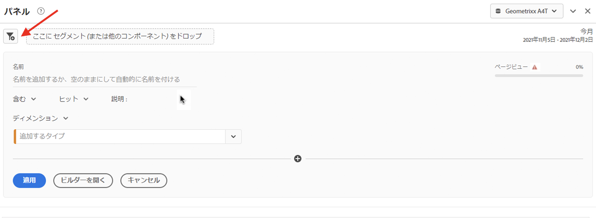
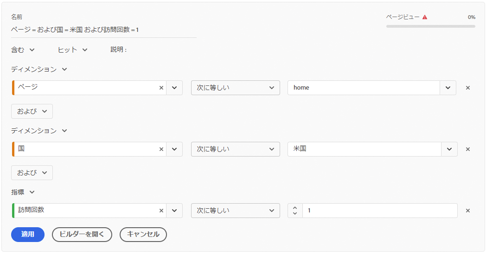
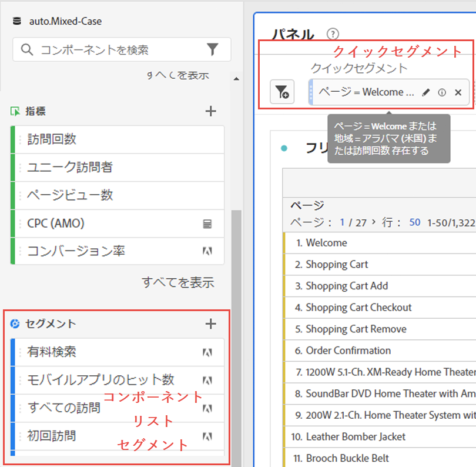
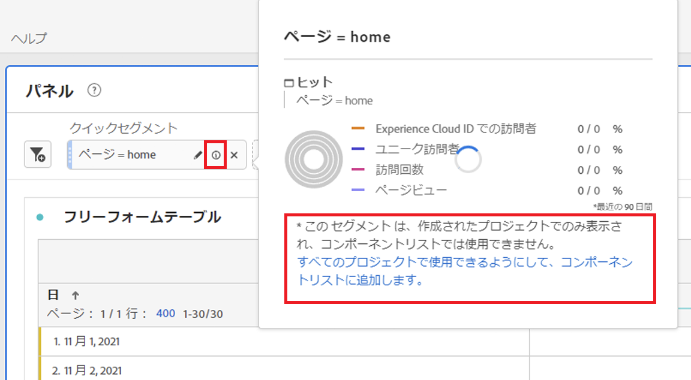
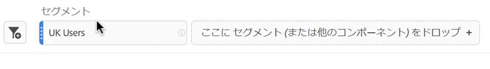
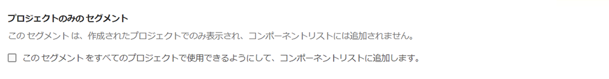

# クイックセグメント

プロジェクト内に迅速なセグメントを作成して、[セグメントビルダー](/help/components/segmentation/segmentation-workflow/seg-build.md)全体の複雑さを回避できます。 クイックセグメント

* 特定のプロジェクトにのみ適用（変更可能）
* 最大3つのルールを許可
* ネストされたコンテナや順次ルールに対応しない。
* 複数のレポートスイートを含むパネルでの作業

本格的なコンポーネントリストセグメントとクイックセグメントの機能の比較については、[ここ](/help/analyze/analysis-workspace/components/segments/t-freeform-project-segment.md)を参照してください。

>[!IMPORTANT]
> 現在、クイックセグメントは制限付きテストで、一般にはまだ利用できません。

## 前提条件 

すばやくセグメントを作成するには、[Adobe Admin Console](https://experienceleague.adobe.com/docs/analytics/admin/admin-console/permissions/summary-tables.html?lang=en#analytics-tools)で[!UICONTROL セグメントの作成]権限が必要です。

## クイックセグメントの作成

フリーフォームテーブルで、パネルヘッダーのフィルター+アイコンをクリックします。

| 設定 | 説明 |
| --- | --- |
| 名前 | セグメントのデフォルト名は、セグメント内のルール名の組み合わせです。 セグメントの名前を変更できます。 |
| 含む／除く | セグメント定義にコンポーネントを含めるか除外するかはできますが、両方を含めることはできません。 |
| ヒット/訪問/訪問者コンテナ | クイックセグメントには、ディメンション/指標/日付範囲をセグメントに含める（またはセグメントから除外する）ための[セグメントコンテナ](https://experienceleague.adobe.com/docs/analytics/components/segmentation/seg-overview.html?lang=en#section_AF2A28BE92474DB386AE85743C71B2D6)のみが含まれます。  訪問者には、訪問およびページビュー全体で訪問者に固有の包括的なデータが含まれます。[!UICONTROL 訪問]コンテナでは、訪問者のデータを訪問に基づいて分類するルールを設定でき、[!UICONTROL ヒット]コンテナでは、訪問者情報を個々のページビューに基づいて分類できます。 デフォルトのコンテナは[!UICONTROL ヒット]です。 |
| コンポーネント(Dimension/指標/日付範囲) | コンポーネントのディメンションや指標、日付範囲およびその値を追加して、最大3つのルールを定義できます。 適切なコンポーネントを見つける方法は3つあります。<ul><li>入力を開始すると、[!UICONTROL クイックセグメント]ビルダーが適切なコンポーネントを自動的に見つけます。</li><li>ドロップダウンリストを使用して、コンポーネントを検索します。</li><li>左側のパネルからコンポーネントをドラッグ&amp;ドロップします。</li></ul> |
| 演算子 | 標準演算子と[!UICONTROL 個別カウント]演算子を検索するには、ドロップダウンメニューを使用します。 [詳細情報](https://experienceleague.adobe.com/docs/analytics/components/segmentation/segment-reference/seg-operators.html?lang=en) |
| プラス記号(+) | 別のルールの追加 |
| AND/OR修飾子 | 「AND」修飾子または「OR」修飾子をルールに追加できますが、1つのセグメント定義で「AND」修飾子と「OR」修飾子を混在させることはできません。 |
| 適用 | このセグメントをパネルに適用します。 セグメントにデータが含まれていない場合は、続行するかどうかを尋ねられます。 |
| ビルダーを開く | セグメントビルダーを開きます。 セグメントビルダーで保存したセグメントは、「クイックセグメント」とは見なされなくなります。 これは、コンポーネントリストセグメントライブラリの一部になります。 |
| キャンセル | このクイックセグメントをキャンセルします。適用しないでください。 |
| 日付範囲 | バリデーターは、データ参照にパネルの日付範囲を使用します。 ただし、クイックセグメントで適用された日付範囲は、パネルの上部にあるパネルの日付範囲より優先されます。 |
| プレビュー（右上） | 有効なセグメントがあるかどうか、およびセグメントの範囲を確認できます。 このセグメントを適用する際に予期されるデータセットの分類を表します。 このセグメントにデータがないことを示す通知が表示される場合があります。 セグメント定義を続行または変更できます。 |

ディメンションと指標を組み合わせたセグメントの例を次に示します。

セグメントが上部に表示されます。 左側のセグメントライブラリのコンポーネントレベルのセグメントの青いサイドバーとは異なり、青い縞のサイドバーに注意してください。

## クイックセグメントの編集

1. クイックセグメントにカーソルを移動し、鉛筆アイコンを選択します。
1. セグメント定義またはセグメント名を編集します。

## クイックセグメントの保存

[!UICONTROL クイックセグメントビルダー]または[!UICONTROL セグメントビルダー]でクイックセグメントを保存するよう選択できます。

>[!IMPORTANT]
>セグメントを保存または適用すると、クイックセグメントビルダーでは編集できなくなり、通常のセグメントビルダーでのみ編集できます。

### クイックセグメントビルダーで保存

1. クイックセグメントを適用したら、該当するセグメントにカーソルを移動し、情報(「i」)アイコンを選択します。
1. 「**[!UICONTROL すべてのプロジェクトで使用可能にする]**」をクリックし、コンポーネントリストに追加します。
1. （オプション）セグメント名を変更します。
1. 「**[!UICONTROL 保存]**」をクリックします。

セグメントのサイドバーがストライプの青から青に変わる点に注意してください。 これで、左側のレールのコンポーネントリストに表示されます。

### セグメントビルダーで保存

1. クイックセグメントにカーソルを移動し、情報(「i」)アイコンを選択します。
1. 「**[!UICONTROL セグメントを保存]**」を選択します。

   

1. 名前はそのままにするか、セグメントの名前を変更します。

   Workspaceに戻り、セグメントが青いサイドバーになっていることを確認します。 これは、クイックセグメントビルダーで編集/開くことができなくなったことを示しています。 保存すると、コンポーネントリストの一部になります。

   

セグメントを適用したら、セグメントコンポーネントリストに追加して、すべてのプロジェクトで使用できるようにします。

1. 保存したセグメントの上にマウスポインターを置いて、鉛筆アイコンを選択します。

1. セグメントビルダーの上部に、次のダイアログが表示されます。

   

1. 「**[!UICONTROL このセグメントをすべてのプロジェクトで使用できるようにし、コンポーネントリストに追加します。]**
1. 「**[!UICONTROL 保存]**」をクリックします。
1. セグメントが、すべてのプロジェクトのセグメントコンポーネントリストに表示されます。
1. また、[セグメント](/help/components/segmentation/segmentation-workflow/t-seg-share.md)を組織内の他のユーザーと共有することもできます。

## プロジェクトのみのセグメントとは

プロジェクトのみのセグメントは、クイックセグメントまたはアドホックWorkspaceプロジェクトセグメントです。 [!UICONTROL セグメントビルダー]で編集または開くと、プロジェクト専用のボックスが表示されます。 ビルダーでクイックセグメントを適用したが、「使用可能にする」ボックスをオンにしなかった場合、そのセグメントはプロジェクトのみのセグメントですが、[!UICONTROL クイックセグメントビルダー]で開けなくなります。 このボックスをオンにして「**[!UICONTROL 保存]**」をクリックすると、コンポーネントリストセグメントになります。