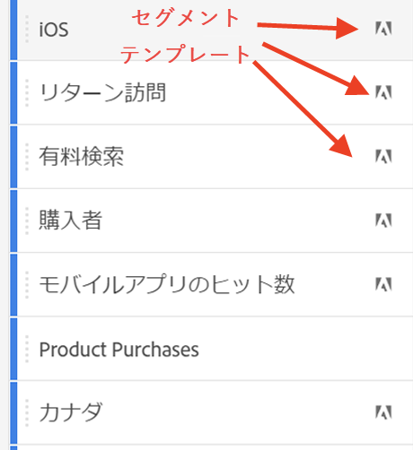
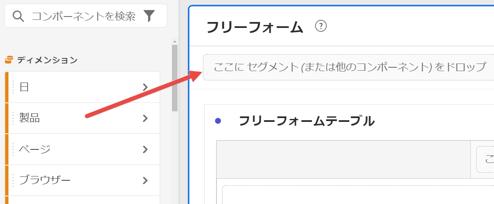
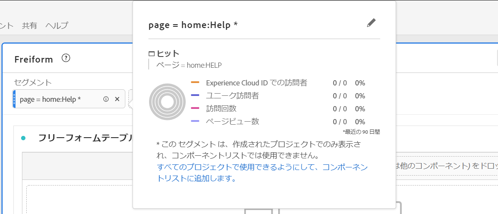

# セグメント {#topic_DC2917A2E8FD4B62816572F3F6EDA58A}

複雑さの要件や、このプロジェクトにのみ適用するかどうかなどに応じて、様々なタイプのセグメントを作成できます。 セグメントタイプの概要を次に示します。

| セグメントタイプ | どこで？ | 適用可能な場所 | 複数のコンテナ？ |
| --- | --- | --- | 
| コンポーネントリストセグメント | [セグメントビルダー](/help/components/segmentation/segmentation-workflow/seg-build.md) | 左側のレール内のすべてのプロジェクト | ○ | 青 |
| クイックセグメント | [クイックセグメントビルダー](/help/analyze/analysis-workspace/components/segments/quick-segments.md) | プロジェクトレベルのみ | × |
| アドホックセグメント： | 以下を参照 | プロジェクトレベルのみ | × |
| - Ad hoc Workspaceプロジェクトセグメント | セグメントにドラッグ&amp;ドロップした場合 新しいプロジェクトで |  |  |
|  — 計算指標ベースのセグメント | 計算指標ビルダー |  |  |
| - VRSベースのセグメント | 仮想レポートスイートビルダー |  |  |
|  — セグメントビルダー「適用」 &quot; | セグメントビルダー |  |  |

Adobe Analyticsでのセグメント化の詳細な説明については、[こちら](/help/components/segmentation/seg-overview.md)を参照してください。

## 左側のパネルのコンポーネントリストセグメント {#section_3B07D458C43E42FDAF242BB3ACAF3E90}

コンポーネントメニューのセグメントパネルには、次のアイコンで示されるようにセグメントとセグメントテンプレートが表示されます。

[Analysis Workspace でのセグメントの使用](https://experienceleague.adobe.com/docs/analytics-learn/tutorials/analysis-workspace/applying-segments/using-segments-in-analysis-workspace.html?lang=ja)（6:46）

## Analysis Workspace のアドホック（一時的な）セグメント

次に、アドホックセグメントに関するビデオを示します。

>[!VIDEO](https://video.tv.adobe.com/v/23978/?quality=12)

## セグメントの作成 {#section_693CFADA668B4542B982446C2B4CF0F5}

任意の種類のコンポーネント（ディメンション、ディメンション項目、イベント、指標、セグメント、セグメントテンプレート、日付範囲）をパネルの上部にあるセグメントドロップゾーンにドロップすることで、セグメントを即座に作成できます。

コンポーネントの種類はセグメントに自動変換されます。また、「セグメントを追加」ドロップダウンの「+」記号をクリックすることもできます。

次の点に注意してください。

* 次の種類のコンポーネントをセグメントゾーンにドロップすることは&#x200B;**できません**：セグメントを作成できない計算指標およびディメンション／指標。
* Analysis Workspace では、すべてのディメンションおよびイベントに対して、「存在する」ヒットセグメントを作成します。例：「eVar1 が存在するヒット」または「event1 が存在するヒット」。
* 「未指定」または「なし」がセグメントドロップゾーンにドロップされると、セグメントで正しく扱えるように、自動的に「存在しない」セグメントに変換されます。

>[!NOTE]
>
>この方法で作成されたセグメントは、プロジェクト内部にあります。

次の手順に従うことで、これらのセグメントを公開（グローバル）できます。

1. ドロップゾーンのセグメントの上にマウスポインターを置いて、「i」アイコンをクリックします。
1. 表示される情報パネルで、「**[!UICONTROL 公開する]**」をクリックします。

   

## セグメントを適用するその他の方法 {#section_10FF2E309BA84618990EA5B473015894}

>[!VIDEO](https://video.tv.adobe.com/v/30994/?quality=12)

フリーフォームプロジェクトにセグメントを適用するには、他にもいくつかの方法があります。

| アクション | 説明 |
|--- |--- |
| 選択からセグメントを作成 | インラインセグメントを作成します。行を選択して、選択範囲を右クリックし、インラインセグメントを作成します。このセグメントは、オープンプロジェクトにのみ適用し、Analytics セグメントとして保存されません。1. 行を選択します。2. 選択範囲を右クリックします。3. 「*選択からセグメントを作成*」をクリックします。 |
| コンポーネント／新しいセグメント | セグメントビルダーを表示します。セグメント化について詳しくは、[セグメントビルダー](https://experienceleague.adobe.com/docs/analytics/components/segmentation/segmentation-workflow/seg-build.html?lang=ja)を参照してください。 |
| 共有／プロジェクトを共有または共有／プロジェクトデータをキュレート | [キュレーションおよび共有](https://experienceleague.adobe.com/docs/analytics/analyze/analysis-workspace/curate-share/curate.html?lang=ja#concept_4A9726927E7C44AFA260E2BB2721AFC6)では、プロジェクトに適用するセグメントを、受信者に共有された分析で使用する方法について学習します。 |
| ディメンションとしてセグメントを使用 | ビデオ：[Analysis Workspace でセグメントをディメンションとして使用する](https://experienceleague.adobe.com/docs/analytics-learn/tutorials/analysis-workspace/applying-segments/using-segments-as-dimensions-in-analysis-workspace.html?lang=ja) |

