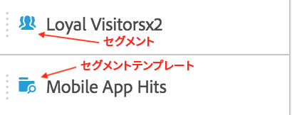
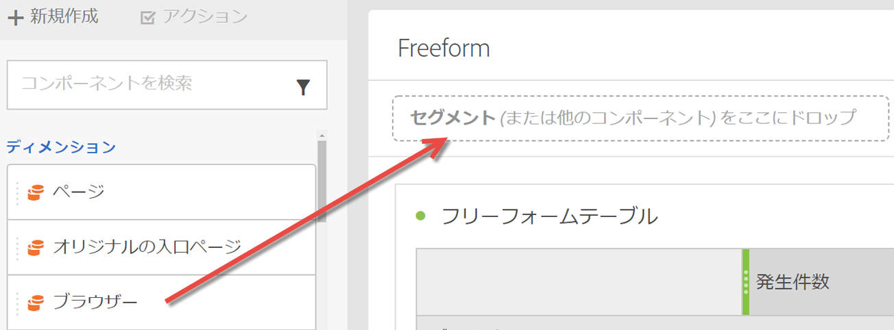
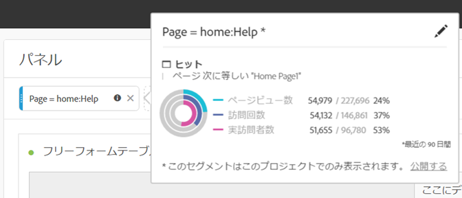

# セグメント {#topic_DC2917A2E8FD4B62816572F3F6EDA58A}

## Segment rail {#section_3B07D458C43E42FDAF242BB3ACAF3E90}

コンポーネントメニューのセグメントレールには、次のアイコンで示されるようにセグメントとセグメントテンプレートが表示されます。

[YouTube上のAnalysis Workspaceでのセグメントの使用](https://www.youtube.com/watch?v=QlUCdQDnni4)（6:46）

## セグメントの作成 {#section_693CFADA668B4542B982446C2B4CF0F5}

任意の種類のコンポーネント（ディメンション、ディメンション項目、イベント、指標、セグメント、セグメントテンプレート、日付範囲）をパネルの上部にあるセグメントドロップゾーンにドロップすることで、セグメントを即座に作成できます。

コンポーネントの種類はセグメントに自動変換されます。また、「セグメントを追加」ドロップダウンの「+」記号をクリックすることもできます。

次の点に注意してください。

* 次の種類のコンポーネントをセグメントゾーンにドロップすることは&#x200B;**できません**：セグメントを作成できない計算指標およびディメンション／指標。
* Analysis Workspace では、すべてのディメンションおよびイベントに対して、「存在する」ヒットセグメントを作成します。例：「eVar1 が存在するヒット」または「event1 が存在するヒット」
* セグメントドロップゾーンに「未指定」または「なし」がドロップした場合、セグメント化で正しく処理されるように、セグメントは「存在しない」セグメントに自動的に変換されます。

>[!NOTE]
>
>この方法で作成されたセグメントは、プロジェクトの内部にあります。

次の手順に従うことで、これらのセグメントを公開（グローバル）できます。

1. ドロップゾーンのセグメントの上にマウスポインターを置いて、「i」アイコンをクリックします。
1. In the information panel that displays, click **[!UICONTROL Make public]**.

   

## Other methods for applying segments {#section_10FF2E309BA84618990EA5B473015894}

フリーフォームプロジェクトにセグメントを適用するには、他にもいくつかの方法があります。

| アクション | 説明 |
|--- |--- |
| 選択からセグメントを作成 | インラインセグメントを作成します。行を選択して、選択範囲を右クリックし、インラインセグメントを作成します。このセグメントは、オープンプロジェクトにのみ適用し、Analytics セグメントとして保存されません。1. 行を選択します。2. 選択範囲を右クリックします。3. Click *Create segment from selection*. |
| コンポーネント／新しいセグメント | セグメントビルダーを表示します。See [Segment Builder](https://docs.adobe.com/content/help/en/analytics/components/segmentation/segmentation-workflow/seg-build.html) for more information about segmentation. |
| 共有/プロジェクトを共有または共有/プロジェクトデータをキュレーション | [キュレーションおよび共有](https://docs.adobe.com/content/help/en/analytics/analyze/analysis-workspace/curate-share/curate.html#concept_4A9726927E7C44AFA260E2BB2721AFC6)で、プロジェクトに適用するセグメントを受信者の共有分析で使用できるようにします。 |
| ディメンションとしてセグメントを使用 | ビデオ:[Analysis Workspace でセグメントをディメンションとして使用する](https://www.youtube.com/watch?v=WmSdReKTWto&list=PL2tCx83mn7GuNnQdYGOtlyCu0V5mEZ8sS&index=39) |
