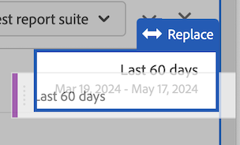

# Analysis Workspaceのコンポーネントの使用

コンポーネントは、Analysis Workspaceの任意のプロジェクトの実際のデータを構成します。 コンポーネントは、ディメンション、指標、セグメントおよび日付範囲で構成されています。 コンポーネントをビジュアライゼーションまたはパネルにドラッグすることで、プロジェクトに追加できます。

追加できるコンポーネントのタイプの概要については、を参照してください。 [コンポーネントの概要](/help/analyze/analysis-workspace/components/analysis-workspace-components.md).

>[!TIP]
>
>各コンポーネントについて詳しくは、Analysis Workspaceの左側のパネルでコンポーネント名の横にある情報アイコンをクリックするか、 [Analytics コンポーネントガイド](/help/components/home.md).

## プロジェクトへのコンポーネントの追加の開始

1. [Analysis Workspaceでのプロジェクトの作成](/help/analyze/analysis-workspace/build-workspace-project/create-projects.md) まだの場合は、

1. [パネルを追加](/help/analyze/analysis-workspace/c-panels/panels.md) または [ビジュアライゼーションを追加](/help/analyze/analysis-workspace/visualizations/freeform-analysis-visualizations.md#add-visualizations-to-a-panel) をAnalysis Workspaceのプロジェクトに追加します。

   空のプロジェクトにコンポーネントを追加すると、フリーフォームテーブル ビジュアライゼーションが自動的に作成されます。

1. 左側のパネルにある&#x200B;**[!UICONTROL コンポーネント]**&#x200B;アイコンを選択します。

   

1. 追加するコンポーネントまでスクロールするか検索し、プロジェクト内のパネルまたはビジュアライゼーションにドラッグします。

   例えば、セグメントをパネルヘッダーのセグメントドロップゾーンにドラッグできます。

   

1. 詳しくは、追加するコンポーネントのタイプに応じて、次のいずれかの節に進みます。

   * [プロジェクトへのディメンションの追加](#add-dimensions-to-a-project)

   * [プロジェクトへの指標の追加](#add-metrics-to-a-project)

   * [プロジェクトへのセグメントの追加](#add-segments-to-a-project)

   * [プロジェクトへの日付範囲の追加](#add-date-ranges-to-a-project)

## プロジェクトへのディメンションの追加

[Dimension](/help/components/dimensions/overview.md) は、通常、文字列値を含むAdobe Analyticsの変数です。 一般的なディメンションには、[ページ](/help/components/dimensions/page.md)、[参照ドメイン](/help/components/dimensions/referring-domain.md)、[eVar](/help/components/dimensions/evar.md) があります。一方、[指標](/help/components/metrics/overview.md)には、ディメンションに結び付く数値が含まれます。基本レポートは、文字列値（ディメンション）の行と数値（指標）の列を示します。

1. の説明に従って、Analysis Workspaceでプロジェクトへのディメンションの追加を開始します [プロジェクトへのコンポーネントの追加の開始](#begin-adding-components-to-a-project).

1. 次のいずれかの方法を選択して、ディメンションを追加し、分析するデータのタイプを決定します。

   * ディメンションをAnalysis Workspaceのビジュアライゼーション（フリーフォームテーブルなど）にドラッグします。

     

   * の説明に従って、左側のパネルからセグメント ドロップゾーンに 1 つ以上のディメンションをドラッグして、アドホックセグメントを作成します [プロジェクトへのセグメントの追加](#add-segments-to-a-project).

     

Analysis Workspaceでディメンションを使用する方法について詳しくは、以下を参照してください [ディメンションをプレビュー](/help/analyze/analysis-workspace/components/dimensions/view-dimensions.md), [ディメンションの分類](/help/analyze/analysis-workspace/components/dimensions/t-breakdown-fa.md)、および [時間分割ディメンション](/help/analyze/analysis-workspace/components/dimensions/time-parting-dimensions.md).

## プロジェクトへの指標の追加

[指標](/help/analyze/analysis-workspace/components/apply-create-metrics.md) を使用すると、Analysis Workspaceでデータポイントを数量化できます。 これらは、ビジュアライゼーション内の列として最も一般的に使用され、ディメンションに関連付けられます。

Analysis Workspaceでプロジェクトに指標を追加するには：

1. の説明に従って、Analysis Workspaceでプロジェクトに指標を追加します [プロジェクトへのコンポーネントの追加の開始](#begin-adding-components-to-a-project).

1. Analysis Workspaceに指標を追加するには、次のいずれかの方法を選択します。

   * 空のフリーフォームテーブルの指標ドロップゾーンに指標をドラッグすると、プロジェクトの日付期間中のその指標のトレンドを確認できます。

     

   * ディメンションが存在する場合に指標をドラッグすると、その指標を各ディメンション項目と比較して確認できます。

   * 指標を既存の指標ヘッダーの上にドラッグすると、指標を置き換えることができます。

   * 指標をヘッダーの横にドラッグすると、両方の指標を並べて確認できます。

Analysis Workspaceでの指標の使用方法について詳しくは、 [指標](/help/analyze/analysis-workspace/components/apply-create-metrics.md).

## プロジェクトへのセグメントの追加

[セグメント](/help/components/segmentation/seg-overview.md) を使用すると、特性や特定のインタラクションに基づいて訪問者のサブセットを識別できます。

Analysis Workspaceでセグメントをプロジェクトに追加するには：

1. の説明に従って、Analysis Workspaceでプロジェクトへのセグメントの追加を開始します。 [プロジェクトへのコンポーネントの追加の開始](#begin-adding-components-to-a-project).

1. パネルのフィルターを開始するには、次のいずれかの方法を選択します。

   * 個々のセグメントを左パネルからセグメントドロップゾーンにドラッグします。

     

   * 左側のパネルで複数のセグメントを選択するには、Shift キーまたは Ctrl キーを押しながらセグメント ドロップゾーンにドロップします。

     

     これによりドロップダウンメニューが作成され、パネルのユーザーが適用するフィルターを選択できるようになります。 ドロップダウンメニューには、 [!UICONTROL **フィルターなし**] パネルにフィルターを適用しない、ユーザーが選択できるオプション。

     （x）を選択すると、ドロップダウンメニューから任意のオプションを削除できます。 を削除した場合 [!UICONTROL **フィルターなし**] オプションを選択する場合は、フィルターが必要です。

   * セグメント以外のコンポーネントをドロップゾーンにドラッグしてアドホックセグメントを作成します。 これにより、セグメントビルダーに移動する時間と労力を節約できます。 この方法で作成されたセグメントは、自動的にヒットレベルのセグメントとして定義されます。 これらの定義は、セグメントの隣の情報アイコン (I)、鉛筆の形をした編集アイコンの順にクリックし、セグメントビルダーで編集することで変更できます。

     アドホックセグメントはクイックセグメントの一種で、プロジェクトに対してローカルです。 公開しない限り、左パネルには表示されません。

     詳しくは、[クイックセグメント](/help/analyze/analysis-workspace/components/segments/quick-segments.md)を参照してください。

パネル上のセグメントドロップゾーンを使用してパネルをフィルタリングする方法について詳しくは、 [ドロップゾーン](/help/analyze/analysis-workspace/c-panels/panels.md#drop-zone) 。対象： [パネルの概要](/help/analyze/analysis-workspace/c-panels/panels.md).

## プロジェクトへの日付範囲の追加

[日付範囲](/help/analyze/analysis-workspace/components/calendar-date-ranges/custom-date-ranges.md) Analysis Workspaceでレポートの時間枠を決定し、プロジェクト内の 1 つ以上のパネルに適用できます。

各パネルには、デフォルトで日付範囲が含まれています。 パネルの日付範囲を更新する方法はいくつかあります。 Analysis Workspaceのパネルの日付範囲を更新する 1 つの方法は、日付範囲コンポーネントを左パネルからドラッグすることです。

1. の説明に従って、Analysis Workspaceでプロジェクトへの日付範囲の追加を開始します。 [プロジェクトへのコンポーネントの追加の開始](#begin-adding-components-to-a-project).

1. 日付範囲を左側のパネルから、パネルの右上部分の現在の日付範囲にドラッグします。

   

Analysis Workspaceでカレンダーと日付範囲を使用する方法について詳しくは、 [カレンダーと日付範囲の概要](/help/analyze/analysis-workspace/components/calendar-date-ranges/calendar.md).
