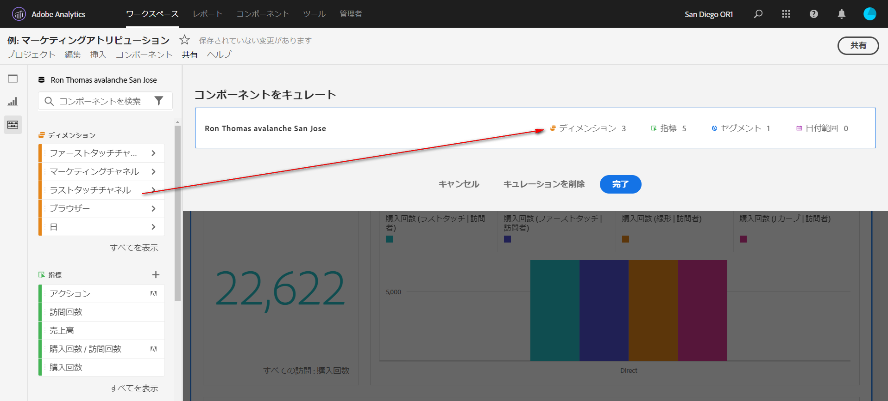
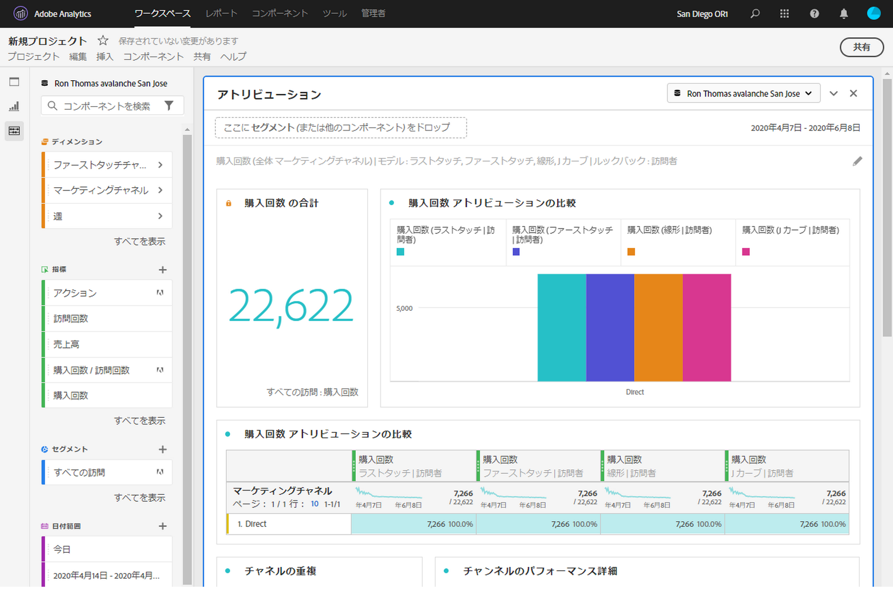

# プロジェクトのキュレーション

キュレーションを使用すると、プロジェクトを共有する前にコンポーネント（ディメンション、指標、セグメント、日付範囲）を制限できます。受信者がプロジェクトを開くと、キュレーションされたコンポーネントの制限付きセットが表示されます。キュレーションはオプションですが、プロジェクトを共有する前に行うことをお勧めします。

>[!NOTE]
> 製品プロファイルは、ユーザーに表示されるコンポーネントを管理する主要メカニズムです。Adobe Experience Cloud Admin Console で管理されます。キュレーションはセカンダリフィルターです。

## プロジェクトキュレーションの適用

1. **[!UICONTROL 共有]**／**[!UICONTROL プロジェクトデータをキュレート]** をクリックします。
プロジェクトで使用されるコンポーネントが自動的に追加されます。
   **注意**：プロジェクトに複数のレポートスイートが含まれる場合は、プロジェクト内の各レポートスイートに対してキュレーションされたフィールドが表示されます。
1. （オプション）他のコンポーネントを追加するには、共有するコンポーネントを左側のレールから「[!UICONTROL コンポーネントをキュレーション ]」フィールドにドラッグします。
1. 「**[!UICONTROL 完了]**」をクリックします。

キュレーションは、[!UICONTROL 共有]メニューで「**[!UICONTROL キュレーションと共有]**」をクリックして適用することもできます。このオプションは、プロジェクト内で使用されているコンポーネントに合わせて、プロジェクトを自動的にキュレーションします。上記の手順に従って、追加のコンポーネントを追加できます。

## キュレーションされたプロジェクトの表示

キュレーションされたプロジェクトを受信者が開くと、ユーザーには、定義したキュレーション済みのコンポーネントのセットのみが表示されます。

## プロジェクトキュレーションの削除

プロジェクトのキュレーションを削除し、左側のレールのコンポーネントの完全なセットを復元するには：

1. **[!UICONTROL 共有]**／**[!UICONTROL プロジェクトデータをキュレート]**&#x200B;をクリックします。
1. 「**[!UICONTROL キュレーションを削除]**」をクリックします。
1. 「**[!UICONTROL 完了]**」をクリックします。

## 仮想レポートスイート（VRS）のキュレーション

多数のプロジェクトに同時に適用できるように、レポートスイートレベルでキュレーションを適用する場合は、[仮想レポートスイート（VRS）内のコンポーネントをキュレーション](https://docs.adobe.com/content/help/ja-JP/analytics/components/virtual-report-suites/vrs-components.html)できます。

>[!NOTE]
> VRS キュレーションは常に、プロジェクトのキュレーション前に適用されます。つまり、キュレーションされたプロジェクトに特定のコンポーネントが含まれている場合でも、キュレーションされた VRS に含まれていない場合は除外されます。

## 「すべてのコンポーネントを表示」オプション

キュレーションされたプロジェクトまたは VRS では、受信者に、左側のレールに&#x200B;**[!UICONTROL すべてのコンポーネントを表示]**&#x200B;するオプションが表示されます。「[!UICONTROL すべてを表示]」は、以下に応じて異なるコンポーネントセットを表示します。

* ユーザーの権限レベル（管理者／非管理者）
* プロジェクトの役割（所有者／編集者／その他）
* 適用されるキュレーションのタイプ（VRS またはプロジェクト）
* ユーザーが所有または共有するコンポーネント。 所有／共有コンポーネントには、セグメント、計算指標、日付範囲が含まれます。 eVar、prop、カスタムイベントなどの実装済みコンポーネントは含まれません。

注意：管理者以外の閲覧ロールは、プロジェクトの左側のパネルにアクセスできないので、以下の表から省略されています。

| キュレーションのタイプ | 管理者 | 管理者以外のプロジェクト所有者または編集の役割 | 管理者以外の重複ロール |
|---|---|---|---|
| キュレーションされた VRS | キュレーションされていないすべての VRS コンポーネント | この役割が所有しているか、この役割と共有されているキュレーションされていない VRS コンポーネント | この役割が所有しているか、この役割と共有されているキュレーションされていない VRS コンポーネント |
| キュレーションされたプロジェクト | キュレーションされていないすべてのプロジェクトコンポーネント | キュレーションされていないすべてのプロジェクトコンポーネント | この役割が所有しているか、この役割と共有されているキュレーションされていないプロジェクトコンポーネント |
| キュレーションされた VRS のキュレーションされたプロジェクト | キュレーションされていない、次のすべてのコンポーネント&#x200B;**[!UICONTROL キュレーションされていないプロジェクトコンポーネント]**&#x200B;および&#x200B;**[!UICONTROL キュレーションされていない VRS コンポーネント]** | キュレーションされていないすべてのプロジェクトコンポーネントと、この役割が所有する、またはこの役割と共有されている、キュレーションされていない VRS コンポーネント | この役割が所有しているか、この役割と共有されている、キュレーションされていない VRS およびプロジェクトコンポーネント |
