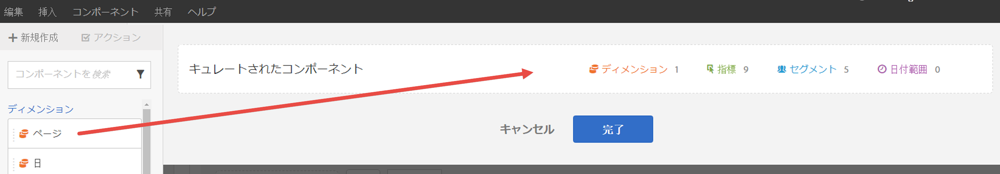
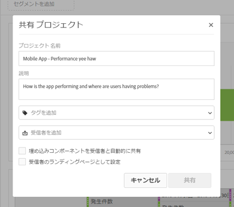

# キュレーション／共有の概要

キュレーションを使用すると、プロジェクトを共有する前にコンポーネントを制限できます。社内のマーケティング担当者およびその他のアナリストでないユーザーと、プロジェクトおよびそのコンポーネントを共有できます。プロジェクトに注釈を付けたりタグを適用したりします。

**ビデオの概要**

>[!VIDEO](https://www.youtube.com/watch?v=LJJRskdmlOg&index=79&t=0s&list=PL2tCx83mn7GuNnQdYGOtlyCu0V5mEZ8sS)

**[!UICONTROL Workspace]**／**[!UICONTROL 共有]**／**[!UICONTROL プロジェクトデータをキュレート]**

## プロジェクトデータをキュレート

1. プロジェクトを作成およびキュレーションするための権限を指定します。

   Analysis Workspace プロジェクトを作成またはキュレーションするユーザーは、先に、管理者に **[!UICONTROL Analysis Workspace のアクセス]**&#x200B;権限を有効にした[グループ](https://marketing.adobe.com/resources/help/en_US/reference/groups.html)か、**[!UICONTROL 全レポートアクセス]**&#x200B;ユーザーグループに追加してもらう必要があります（**[!UICONTROL 管理者]**／**[!UICONTROL ユーザー管理]**／**[!UICONTROL グループ]**）。

1. [プロジェクトを作成および保存](/help/analyze/analysis-workspace/build-workspace-project/t-freeform-project.md)して、**[!UICONTROL 共有]**／**[!UICONTROL プロジェクトデータをキュレート]**&#x200B;をクリックします。
1. 共有したいコンポーネントを、左側にあるドラッグ可能なコンポーネントスタックから「**[!UICONTROL キュレートされたコンポーネント]**」フィールドにドラッグします。

   

   >[!IMPORTANT]
   >
   >プロジェクトを共有する場合、コンポーネントのキュレーションは必須ではありません。プロジェクトをすべての利用可能なデフォルトコンポーネント、または選択したコンポーネントと共有できます。プロジェクト内のすべてのデフォルトコンポーネントを保持するためのベストプラクティスは、コンポーネントをキュレーションする前に、（「**[!UICONTROL 名前を付けて保存]**」を使用して）自分でプロジェクトのコピーを作成することです。プロジェクト内でコンポーネントをキュレーションすると、その他のコンポーネントをそのプロジェクトで使用できなくなります。

1. 「**[!UICONTROL 完了]**」をクリックします。

生成されるプロジェクトは、Analysis Workspace の通常のプロジェクトのように動作しますが、選択できるのは指定したコンポーネントだけです。

## キュレーションされたプロジェクトの共有

共有機能を使用すると、このプロジェクトを組織内の他の Analysis Workspace ユーザーも利用できるようになります。他のユーザーがこのプロジェクトを使用する際には、既に実行したキュレーションがすべて反映されています。

1. レポートのコンポーネントをキュレーションしたら、**[!UICONTROL 共有]**／**[!UICONTROL プロジェクトを共有]**&#x200B;をクリックします。

   

1. 受信者を追加します。
1. （オプション）埋め込みプロジェクトコンポーネント（セグメント、計算指標、日付範囲）をすべての受信者と共有できます。共有すると、これらのコンポーネントは受信者のWorkspace のコンポーネントドロップダウンに表示されます。

   >[!IMPORTANT]
   >
   >この設定は持続しません。共有時の一回限りのアクションです。

1. オプションで、このページを受信者のランディングページとして設定できます。

   >[!IMPORTANT]
   >
   >この設定は持続しません。共有時の一回限りのアクションです。

1. 「**[!UICONTROL 共有]**」をクリックします。

<!-- 

 <b>Annotate and tag a project</b> 
 

An alternative way to collaborate on a project is to use the Information panel. This panel will be re-introduced in an upcoming release. 
 

 
 
<ul id="ul_EFD045FD9F3B4BF8A70637B00EE0BC9C"> 
 <li id="li_EC6C5EAF9C234E76BDA7FF0226B82083">Tag reports for sharing. </li> 
 <li id="li_CF6A438C55F847F8890F8CB674CAA4F7">Specify the recipient (filter by permission group or user name), the storage folder. In-product notifications let users know that they have a shared report waiting. </li> 
 <li id="li_C8E088DA43024277908705CB0F3A142A">Write messages or report descriptions for recipients. </li> 
 <li id="li_342EB4758C344B859757E23691068FA3"> Select the dimensions, metrics, and segments to recommend to a non-analyst colleague, who can view the report you are curating and sharing. Curating the component gives the recipient access to those components, based on their permission settings. </li> 
 <li id="li_6487500F9315481599B7F3897998879F"> Add suggested items to a previously configured report. These new items exist as recommended selectable options. </li> 
</ul>

 -->

