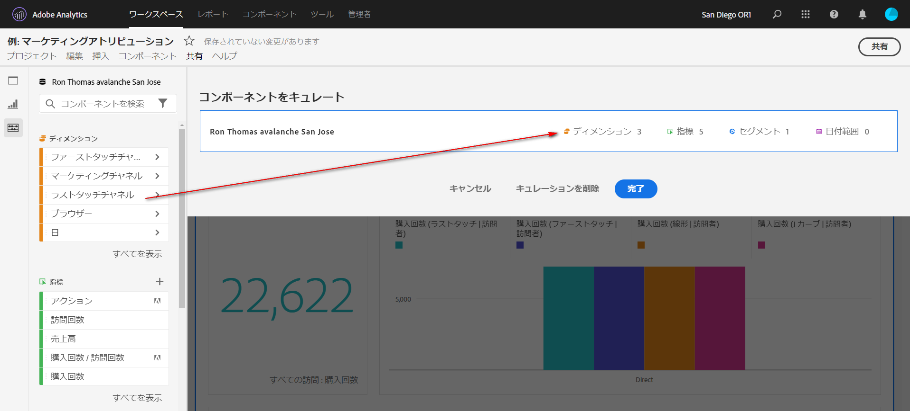

# プロジェクトのキュレーション

キュレーションを使用すると、プロジェクトを共有する前にコンポーネント（ディメンション、指標、セグメント、日付範囲）を制限できます。 受信者がプロジェクトを開くと、キュレートされたコンポーネントの制限付きセットが表示されます。 キュレーションはオプションですが、プロジェクトを共有する前に行うことをお勧めします。

>[!NOTE]
> 製品プロファイルは、ユーザーに表示されるコンポーネントを管理する主要メカニズムです。 Adobe CX Enterprise Admin Consoleで管理されています。 キュレーションはセカンダリフィルターです。

>[!BEGINSHADEBOX]

デモ動画については、 [&#x200B; プロジェクトのキュレート &#x200B;](https://video.tv.adobe.com/v/24711?quality=12&learn=on){target="_blank"}を参照してください。

>[!ENDSHADEBOX]

## プロジェクトキュレーションの適用

1. **[!UICONTROL 共有]**／**[!UICONTROL プロジェクトデータをキュレート]**&#x200B;をクリックします。
プロジェクトで使用されるコンポーネントが自動的に追加されます。
プロジェクトに複数のレポートスイートがある場合は、プロジェクト内の各レポートスイートに対してキュレートされたドロップターゲットが表示されます。
1. （オプション）さらにコンポーネントを追加するには、共有するコンポーネントを左パネルからレポートスイートの&#x200B;**[!UICONTROL コンポーネントをキュレート]** ドロップゾーンにドラッグします。
1. 「**[!UICONTROL 完了]**」を選択します。

キュレートされたプロジェクトを受信者が開くと、ユーザーが定義したキュレート済みコンポーネントのセットのみが表示されます。

## プロジェクトキュレーションの削除

プロジェクトのキュレーションを削除し、左側のレールのコンポーネントの完全なセットを復元するには：

1. **[!UICONTROL 共有]**／**[!UICONTROL プロジェクトデータをキュレート]**&#x200B;をクリックします。
1. 「**[!UICONTROL キュレーションを削除]**」を選択します。
1. 「**[!UICONTROL 完了]**」を選択します。

## 仮想レポートスイートキュレーション

多数のプロジェクトに同時に適用できるように、レポートスイートレベルでキュレーションを適用する場合は、[仮想レポートスイート内のコンポーネントをキュレーション](/help/components/vrs/vrs-components.md)できます。

>[!NOTE]
>
> 仮想レポートスイートキュレーションは常に、プロジェクトのキュレーション前に適用されます。 キュレーションされたプロジェクトに特定のコンポーネントが含まれている場合でも、キュレーションされた仮想レポートスイートにこれらのコンポーネントが含まれていない場合は、それらのコンポーネントは除外されます。
> 

## コンポーネントキュレーションオプション

キュレーションされたプロジェクトまたは仮想レポートスイートでは、受信者には、左側のパネルに「**[!UICONTROL すべて表示]**」コンポーネントを表示するオプションが表示されます。 「[!UICONTROL すべてを表示]」では、以下に応じて異なるコンポーネントセットを表示します。

* ユーザーの権限レベル（管理者／非管理者）
* プロジェクトの役割（所有者／編集者／その他）
* 適用されるキュレーションのタイプ（仮想レポートスイートまたはプロジェクト）
* ユーザーが所有または共有するコンポーネント。 所有／共有コンポーネントには、セグメント、計算指標、日付範囲が含まれます。 eVar、prop、カスタムイベントなどの実装されたコンポーネントは含まれていません。

注意：管理者以外の閲覧ロールは、プロジェクトの左側のパネルにアクセスできないので、以下の表から省略されています。

| キュレーションタイプ | 管理者 | 管理者以外のプロジェクト所有者または編集の役割 | 管理者以外の重複ロール |
|---|---|---|---|
| **キュレーションされた仮想レポートスイート** | キュレーションされていないすべての仮想レポートスイートコンポーネント | この役割が所有しているか、この役割と共有されている、キュレーションされていない仮想レポートスイートコンポーネント | この役割が所有しているか、この役割と共有されている、キュレーションされていない仮想レポートスイートコンポーネント |
| **厳選されたプロジェクト** | キュレーションされていないすべてのプロジェクトコンポーネント | キュレーションされていないすべてのプロジェクトコンポーネント | キュレーションされていないプロジェクトコンポーネントで、このロールが所有しているか、共有されているもの |
| **キュレーションされた仮想レポートスイート内のキュレーションされたプロジェクト** | **[!UICONTROL キュレーションされていないプロジェクトコンポーネント]**&#x200B;および&#x200B;**[!UICONTROL キュレーションされていない仮想レポートスイートコンポーネント]**&#x200B;に表示されるキュレーションされていないすべてのコンポーネント | この役割が所有しているか、この役割と共有されている、キュレーションされていないすべてのプロジェクトコンポーネントおよびキュレーションされていない仮想レポートスイートコンポーネント | この役割が所有しているか、この役割と共有されている、キュレーションされていない仮想レポートスイートおよびプロジェクトコンポーネント |
