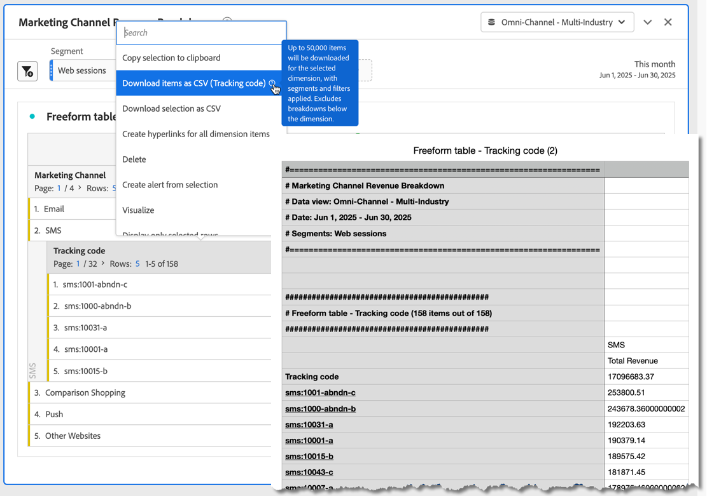

# プロジェクトとデータのダウンロード

Analysis Workspace プロジェクトとデータをローカルデバイスにダウンロードできます。 このダウンロードは、データのコピー、CSV （コンマ区切り値データ）ファイルまたはPDF（Portable Document Format）ドキュメントにすることができます。

* ダウンロードしたファイルにビジュアライゼーションを含める場合は、「PDF」オプションを選択します。
* プレーンテキストデータのみが必要な場合は、「CSV」オプションと「コピーしたデータ」オプションを選択します。

Adobe Analytics データをエクスポートするその他の方法については、[ エクスポートガイド ](/help/export/home.md) を参照してください。

## CSV または PDF としてのダウンロード {#download-project}

プロジェクトを as a PDFとしてダウンロードする場合は、次の点に注意してください。

* Adobe サーバーでプロジェクトが再実行され、PDF形式でレンダリングされるので、ダウンロードには数分かかる場合があります。 ブラウザーでプロジェクトがダウンロードされるまで、プロジェクトを残さないでください。  ダウンロードのレンダリング中も、引き続きプロジェクトに変更を加えることができます。 PDFのレンダリングに 5 分以上かかる場合は、代わりに [PDFにメールを送信 ](../curate-share/send-schedule-files.md) するよう求められます。
* ダウンロードは、ページ番号が適用されない単一ページとしてレンダリングされます。
* PDFには、Analysis Workspaceのブラウザーページに表示される内容が含まれます。 コンテンツが切り詰められるのを防ぐために、カスタムサイズのビジュアライゼーションとパネルのサイズを自動で調整する必要があります。  を選択すると、カスタムサイズのビジュアライゼーションまたはパネルのサイズが自動的に変更されます。
* [ ハイパーリンク ](/help/analyze/analysis-workspace/visualizations/freeform-table/freeform-table-hyperlinks.md) フリーフォームテーブル内に、ダウンロードされたPDFのハイパーリンクとして。

プロジェクトをPDF ファイルとしてダウンロードするには：

1. **[!UICONTROL プロジェクト]**/**[!UICONTROL PDFをダウンロード]** を選択します。
**[!UICONTROL Your download has been requested. お待ちください。]** が表示されます。

1. ダウンロードの準備が整うとすぐに、メッセージ **[!UICONTROL *プロジェクト名 *を含む緑色のバーがPDFの準備が整います。]**が表示されます。
「**[!UICONTROL ダウンロード]**」を選択して、PDFをダウンロードします。 PDFの表示方法やダウンロード方法は、PDF ドキュメントを処理するためのブラウザー設定によって異なります。

プロジェクトを CSV ファイルとしてダウンロードするには：

* **[!UICONTROL プロジェクト]**/**[!UICONTROL CSV をダウンロード]** を選択します。 プロジェクトは、ブラウザー設定の一部として設定されたダウンロードフォルダーに直接ダウンロードされます。 ファイル名は、例えば `Example Project - Omni-Channel - Luma - Jun 30, 2025.csv` のように *プロジェクト名* - *レポートスイート名* - *日付* で構成されます。

## クリップボードにコピー {#copy-data}

コンテキストメニューの **[!UICONTROL クリップボードにコピー]** オプションを使用すると、Analysis Workspaceからデータをすばやくコピーし、サードパーティのツールに貼り付けることができます。

* 表示されたテーブルデータをコピーする場合は、テーブルヘッダーを選択し、コンテキストメニューから **データをクリップボードにコピー** を選択します。
* データのサブセットをコピーする場合は、テーブルに選択範囲を作成し、コンテキストメニューから **選択範囲をクリップボードにコピー** を選択します。

>[!TIP]
>
>ホットキー **_cmd + c_** （macOS）または **_ctrl + c_** （Windows）を使用して、選択範囲をクリップボードにコピーできます。 次に、**_cmd + v_** （macOS）または **_ctrl + v_** （Windows）を使用して、データを貼り付けます。

{zoomable="yes"}

## CSV としてダウンロード {#download-data}

コンテキストメニューの「CSV としてダウンロード」オプションを使用すると、データのテーブルまたはビジュアライゼーションのデータソースを CSV としてダウンロードできます。

それには、次の手順を実行します。

* 任意のテーブルまたはビジュアライゼーションのヘッダーで、コンテキストメニューから **[!UICONTROL データを CSV としてダウンロード]** を選択します。 これにより、テーブルに表示されたデータやビジュアライゼーションの基になるデータソースが CSV 形式でダウンロードされます。

<!-- Only relevant as soon as CJA supports Map visualization 
  >[!NOTE]
  >
  >  Note: the Map visualization does not support this option.
-->

* コンテキストメニューからテーブル内の **[!UICONTROL 選択を CSV としてダウンロード]** を選択します。 このオプションでは選択内容のみがダウンロードされ、表示されているテーブル全体はダウンロードされません。

## 項目を CSV としてダウンロード {#download-items}

テーブルに表示されている 400 行を超えるデータを分析する場合は、テーブルヘッダーまたは任意の行のコンテキストメニューから「**項目を CSV としてダウンロード（_Dimension名_）**」を選択します。 このオプションでは、選択したディメンションに対して、並べ替えオプションとフィルターを適用した最大 50,000 個のディメンション項目（テーブルの並べ替えに基づく）を書き出します。テーブルの上部からこのオプションを選択した場合、テーブルの最初のディメンションがエクスポートされます。

フリーフォームテーブルに制限は適用されません。 最適なパフォーマンスを確保するために、20 列未満のテーブルでこのオプションを使用することをお勧めします。

>[!TIP]
>
> ディメンションが 50,000 項目を超える場合は、異なる並べ替え指標が適用されたファイルをダウンロードするか、セグメントを適用します。例えば、あるダウンロードでは訪問回数の降順で並べ替え、2 回目のダウンロードでは訪問回数の昇順で並べ替えます。この説明は、ロングテールの項目を取得するのに役立ちます。

プロジェクト内で複数のタスクを使用できます。また、ダウンロードの処理中に、同じタブで新しい Workspace プロジェクトに移動することもできます。新しいブラウザータブを開くと、ダウンロードは一時停止します。Workspace を完全に終了するか、ブラウザータブを閉じると、ダウンロードはキャンセルされます。

### ダウンロードした項目ファイル {#items-file}

ダウンロードされたファイルには、フリーフォームテーブルの次の機能が適用されます。

* すべてのパネルセグメントがフィルターとして適用されます。
* テーブルで選択されたディメンションの&#x200B;**上**&#x200B;の分類は、各列よりも上のフィルターとして適用されます。
* テーブル内で選択されたディメンションよりも&#x200B;**下**&#x200B;の分類は削除されます。

### ダウンロード通知 {#notifications}

ファイルがダウンロードされると、次の通知が表示されます。

* 青い **[!UICONTROL _テーブル名 _-_Dimension _.csv がリクエストされています。_x _% 完了]**進行状況を示します。 ダウンロードをキャンセルするには、「**[!UICONTROL ダウンロードをキャンセル]**」を選択します。 メッセージを閉じる場合は、「」を選択します。この場合、ダウンロードはキャンセルされません。
* 緑色の **[!UICONTROL _テーブル名 _-_Dimension _.csv がダウンロードされました]**ファイルのダウンロードが完了すると、完了通知が表示されます。 ファイルがブラウザーに設定されたダウンロードフォルダーにダウンロードされます。

一度に複数のダウンロードをリクエストすると、前のダウンロードが完了するまで、追加の各ダウンロードはキューに入れられるという通知が届きます。

## FAQ {#faq}

| 質問 | 回答 |
| --- | --- |
| ダウンロードしたPDFが 1 ページのみで構成されているのはなぜですか？ | [PDFをダウンロード ](#download-as-csv-or-pdf) 機能では、ダウンロードされた PDF にページ番号は付けられません。 |
| 「**[!UICONTROL 項目を CSV としてダウンロード]**」オプションを使用して 50,000 個を超える項目を書き出すことはできますか？ | 各ダウンロードには最大 50,000 個のディメンションアイテムを含めることができますが、テーブルの種類を変更してテールがより長いアイテムを取得したり、フィルターを適用して特定のアイテムをダウンロードしたりできます。 |
| 「**[!UICONTROL ビジュアライゼーションをコピー]**」は何を実行しますか？ | [!UICONTROL **データをクリップボードにコピー**] または [!UICONTROL **選択範囲をクリップボードにコピー**] とは異なり、**[!UICONTROL ビジュアライゼーションをコピー]** コンテキストメニューオプションはエクスポートオプションではありません。 このオプションを使用すると、Workspace内のある場所から別の場所に [ ビジュアライゼーションをコピー ](/help/analyze/analysis-workspace/visualizations/freeform-analysis-visualizations.md#context-menu) または [ パネルをコピー ](/help/analyze/analysis-workspace/c-panels/panels.md#context-menu) できます。 例えば、同じプロジェクト内のパネル間、またはプロジェクト間でコピーできます。 |

<!--

# Download 

There are several ways to export data from Analysis Workspace. The method you choose depends on what set of data you want to analyze and who needs to access it.

Exported data can be in the form of copied data, CSV, or PDF. A PDF is typically preferred if you want visualizations included in the file. CSV and copied data is preferred if you simply want plain-text data.

## Download a project as CSV or PDF {#download-project}

Consider the following when downloading projects:

* When downloading projects as a CSV or PDF, the project can be saved or unsaved when you request a project download. However, only saved projects can be [scheduled](/help/analyze/analysis-workspace/curate-share/t-schedule-report.md). 

* When downloading projects as a PDF:
  * Downloads can take several minutes to export because the project is re-run on Adobe servers before rendering in PDF format. We recommend not leaving the project until the PDF downloads in your browser. However, you can continue to make changes to the project while you wait. If a PDF takes longer than 5 minutes to render, you will be prompted to email it instead.
  * Downloads are rendered as a single page with no pagination applied.
  * PDF renderings contain what is on the page in Workspace. If a project has custom-sized visualizations and panels, you need to change them to be auto-sized (button in top-right corner) so that there will be no truncated content.
  * Any [hyperlinks](/help/analyze/analysis-workspace/visualizations/freeform-table/freeform-table-hyperlinks.md) that exist within freeform tables are not functional in the downloaded PDF. 

To download a project as a CSV or PDF file:

1. Do either of the following, depending on what format you want to download the project in:

   * **PDF:** Select **[!UICONTROL Project]** > **[!UICONTROL Download PDF]**.

     Choose this option if you want the downloaded file to contain all the displayed (visible) tables and visualizations in the project.

   * **CSV:** Select **[!UICONTROL Project]** > **[!UICONTROL Download CSV]**. 

     Choose this option if you want plain-text data.

   

1. (Conditional) If you chose to download a PDF, a message is shown after the project is ready to be downloaded. Click [!UICONTROL **Download**].
1. Click the **[!UICONTROL Download this file]** icon and save the file to a folder of your choice.

## Copy data to clipboard (hotkey: cmd + c) {#copy-data}

The right-click option **[!UICONTROL Copy to clipboard]** lets you quickly copy data from Workspace and paste it in a third-party tool. 

* If you want the displayed table copied, right-click the table header and choose **Copy data to clipboard**. 
* If you want a subset of data copied, make a selection in the table and then right-click > **Copy selection to clipboard**.

>[!TIP]
>
>You can use the hotkey `Ctrl+C` to copy your selection to the clipboard, then use `Ctrl+V` to paste it into a third-party tool.

## Download data as CSV {#download-data}

The right-click option **[!UICONTROL Download data as CSV]** allows you to download a table of data or the data source of any visualization as a CSV.

* From the header of any table or visualization, right-click and choose **[!UICONTROL Download data as CSV]**. This downloads the displayed data in the table or the underlying data source for a visualization as a CSV. 

  >[!NOTE]
  >
  >  Note: the Map visualization does not support this option.

* Within a table, right-click and choose **[!UICONTROL Download selection as CSV]**. Only the selection is downloaded with this option, as opposed to the full, displayed table.

## Download items as CSV {#download-items}

If you want to analyze more than the visible 400 rows of data in a table, right-click the table header or any row and select **Download items as CSV (_Dimension name_)**. This option exports up to 50,000 dimension items (based on the table sort) for the selected dimension, with filters and segments applied. If you chose this option from the top of the table, the first dimension in the table will be exported. While no limits are enforced in the freeform table, it is recommended that the Download items option be used in tables with less than 20 columns to ensure optimal performance.

>[!TIP]
>
> If your dimension exceeds 50,000 items, download the file with different sort metrics applied or apply a filter. For example, sort descending by Visits in one download and then ascending by Visits in a second download. This tip can help you retrieve longer-tail items.

You can multi-task within the project and even navigate to a new Workspace project in the same tab while the download is in progress. The download pauses if you open a new browser tab. The download is canceled if you leave Workspace completely or close the browser tab.

### Downloaded items file 

Features of the table will be applied to the downloaded file as follows:

* All panel segments are applied as filters.
* Breakdowns **above** the selected dimension in the table are applied as filters above each column. 
* Breakdowns **below** the selected dimension in the table are removed.

In the example above, Page items are downloaded with the panel segment (New Visitors Customers) and components above (Marketing Channel = Email) applied as filters, and the components below (Mobile Device Type) removed from the downloaded CSV.

### Download notifications

As the file downloads, you will see an informational notification with the progress. At any time, you can cancel the download by clicking **[!UICONTROL Cancel download]**. Closing the toast **will not** cancel the download. 

Once the file completes, you will see a completion notification and the file will download to your browser.

If you request more than one download at a time, you will receive a notification that each additional download will be queued until the prior download completes.

## FAQ {#faq}

| Question | Answer |
| --- | --- |
| Why is my downloaded PDF one page? | Workspace does not paginate downloaded PDFs at this time. |
| Can I export more than 50,000 items with the "Download items as CSV" option? | While each download can contain up to 50,000 dimension items, you can change the sort of your table to retrieve longer tail items, or apply a filter to download more specific items. |
| What does **[!UICONTROL Copy visualization]** do? | Unlike [!UICONTROL **Copy data to clipboard**] or [!UICONTROL **Copy selection to clipboard**], the **[!UICONTROL Copy visualization]** right-click option is not an export option. It allows you to copy a visualization or panel from one place in Workspace to another. For example, from one panel to another in the same project, or from one project to another project. [Intra-linking video](https://experienceleague.adobe.com/docs/analytics-learn/tutorials/analysis-workspace/visualizations/intra-linking-in-analysis-workspace.html) |

-->