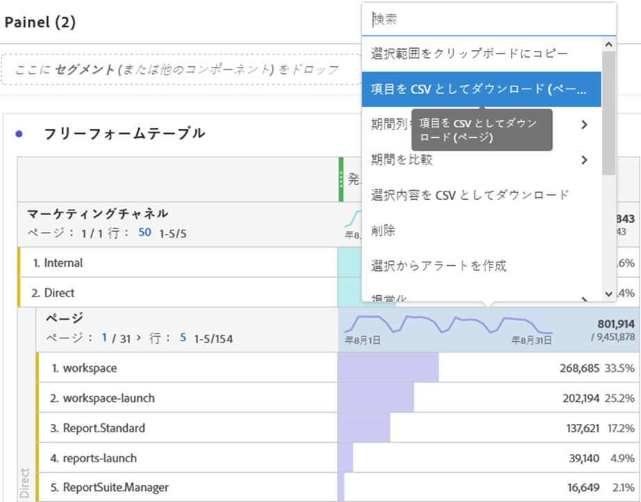

# PDF ファイルまたは CSV ファイルのダウンロード

Analysis Workspaceからデータをエクスポートする方法は、ツール以外で分析するデータのセットと、その情報を受け取る必要があるユーザーに応じて異なります。 書き出されたデータは、コピーされたデータ、CSV、PDFファイルの形式にすることができます。 通常、ファイルにビジュアライゼーションを含める場合はPDFをお勧めします。プレーンテキストデータを含める場合はCSV（またはコピーしたデータ）をお勧めします。

## プロジェクトをCSVまたはPDFでダウンロード{#download-project}

**[!UICONTROL プロジェクト/PDF（またはCSV）]**&#x200B;に移動して、完全なプロジェクトをダウンロードできます。 ダウンロードしたファイルには、プロジェクト内に表示されている（表示されている）すべてのテーブルとビジュアライゼーションが含まれています。 ファイルにビジュアライゼーションを含める場合はPDFをお勧めしますが、プレーンテキストデータを含める場合はCSVをお勧めします。

プロジェクトをダウンロードする場合は、次の点に注意してください。

* プロジェクトのダウンロードを要求すると、プロジェクトを保存または未保存にできます。 ただし、[スケジュール](https://docs.adobe.com/content/help/ja-JP/analytics/analyze/analysis-workspace/curate-share/t-schedule-report.html)できるのは、保存したプロジェクトだけです。
* PDF形式でレンダリングする前にAdobeサーバーでプロジェクトが再実行されるので、ブラウザーでダウンロードしたPDFは、書き出しに数分かかる場合があります。 PDF がブラウザーでダウンロードされるまで、プロジェクトを終了しないことをお勧めします。ただし、待っている間も引き続きプロジェクトに変更を加えることができます。PDFのレンダリングに5分以上かかる場合は、代わりに電子メールで送信するよう求められます。
* PDFダウンロードは、ページ番号が適用されない単一のページとしてレンダリングされます。
* プロジェクトがPDFにレンダリングされると、ページ上の内容がレンダリングされます。 プロジェクトにカスタムサイズのビジュアライゼーションとパネルが含まれている場合、内容が切り詰められないように、自動サイズに変更する必要があります（右上隅のボタン）。

## データをクリップボードにコピー(ホットキー：Ctrl + C) {#copy-data}

右クリックオプション&#x200B;**[!UICONTROL 「クリップボードにコピー」]**&#x200B;を使用すると、Workspaceからデータをすばやくコピーして他の場所に貼り付けることができます。

* 表示された表をコピーする場合は、表のヘッダーを右クリックし、「**データをクリップボードにコピー**」を選択します。
* データのサブセットをコピーする場合は、テーブル内に選択範囲を作成し、右クリックして、**選択範囲をクリップボードにコピー**&#x200B;を選択します。

また、ホットキー`Ctrl+C`は、選択した内容をクリップボードにコピーします。 コピーが完了したら、別のツールに移動して、情報を貼り付けることができます（または`Ctrl+V`を押します）。

## データを CSV としてダウンロード {#download-data}

右クリックオプション&#x200B;**[!UICONTROL 「データをCSVでダウンロード]**」を使用すると、データのテーブルまたはビジュアライゼーションのデータソースをCSVとしてダウンロードできます。

* 任意のテーブルまたはビジュアライゼーションのヘッダーで、**[!UICONTROL 「データをCSVとしてダウンロード]**」を右クリックします。 これにより、テーブルに表示されたデータやビジュアライゼーションの基になるデータソースがCSVとしてダウンロードされます。 注意：マップのビジュアライゼーションは、このオプションをサポートしていません。
* テーブル内で選択が行われた場合、このオプションでは「**[!UICONTROL 選択をCSV]**&#x200B;としてダウンロードします。」と表示されます。 このオプションを選択した項目のみがダウンロードされます。表示されている表全体ではダウンロードされません。

## 項目を CSV としてダウンロード {#download-items}

表に表示される400行を超えるデータを分析する場合は、表のヘッダーまたは行を右クリックし、「**DimensionをCSV（アイテム名）**&#x200B;としてダウンロード」を選択します。 このオプションでは、選択したディメンションに対して（テーブルの並べ替えに基づいて）最大50,000個のディメンション項目をエクスポートし、フィルターとセグメントを適用します。 テーブルの上部からこのオプションを選択した場合、テーブルの最初のディメンションがエクスポートされます。 フリーフォームテーブルに制限は適用されませんが、最適なパフォーマンスを確保するために、「項目をダウンロード」オプションを20列未満のテーブルで使用することをお勧めします。

>[!TIP]
>
> ディメンションが50,000項目を超える場合は、異なる並べ替え指標が適用されたファイルをダウンロードするか、フィルターを適用します。 例えば、1つのダウンロードでは訪問回数の降順で並べ替え、2つ目のダウンロードでは訪問回数の昇順で並べ替えます。 このヒントは、より長い尾を持つ項目を取得するのに役立ちます。

プロジェクト内で複数のタスクを使用できます。また、ダウンロードの進行中に、同じタブで新しいWorkspaceプロジェクトに移動することもできます。 新しいブラウザータブを開くと、ダウンロードは一時停止します。 Workspaceを完全に終了するか、ブラウザータブを閉じると、ダウンロードはキャンセルされます。

### ダウンロードした項目ファイル

この表の機能は、次のようにダウンロードされたファイルに適用されます。

* すべてのパネルセグメントがフィルターとして適用されます。
* テーブルで選択されたディメンションの&#x200B;**上の分類**&#x200B;は、各列の上のフィルターとして適用されます。
* テーブル内で選択されたディメンションの&#x200B;**下**&#x200B;の分類は削除されます。

上の例では、ページアイテムが、パネルセグメント(新規訪問者のお客様)と上のコンポーネント(マーケティングチャネル=電子メール)をフィルターとして適用してダウンロードされ、下のコンポーネント（モバイルデバイスタイプ）がダウンロードされたCSVから削除されます。

### ダウンロード通知

ファイルがダウンロードされると、進行状況を示す情報通知が表示されます。 [**[!UICONTROL ダウンロードをキャンセル]**]をクリックすると、いつでもダウンロードをキャンセルできます。 トースト&#x200B;**を閉じても、ダウンロードは**&#x200B;キャンセルされません。

ファイルが完了すると、完了通知が表示され、ファイルがブラウザにダウンロードされます。

一度に複数のダウンロードをリクエストする場合、追加のダウンロードが1つずつ、前回のダウンロードが完了するまでキューに入れられるという通知を受け取ります。

## FAQ {#faq}

| 質問 | 回答 |
| --- | --- |
| ダウンロードしたPDFが1ページになるのはなぜですか？ | 現時点では、Workspaceでは、ダウンロードされたPDFのページ番号は付けられません。 |
| 「アイテムをCSV形式でダウンロード」オプションを使用して50,000個を超えるアイテムをエクスポートできますか。 | 各ダウンロードには最大50,000個のディメンション項目を含めることができますが、テーブルの種類を変更してより長い末尾の項目を取得したり、フィルターを適用してより詳細な項目をダウンロードしたりできます。 |
| **[!UICONTROL ビジュアライゼーション]**&#x200B;のコピーの機能 | **[!UICONTROL 「コピーの]** ビジュアライゼーション」は書き出しオプションではありません。Workspace内のある場所から別の場所にビジュアライゼーションまたはパネルをコピーできます。 例えば、同じプロジェクト内のパネル間、または1つのプロジェクトから別のプロジェクト間などです。 [イントラリンクビデオ](https://docs.adobe.com/content/help/ja-JP/analytics-learn/tutorials/analysis-workspace/visualizations/intra-linking-in-analysis-workspace.html) |

