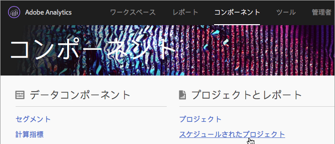
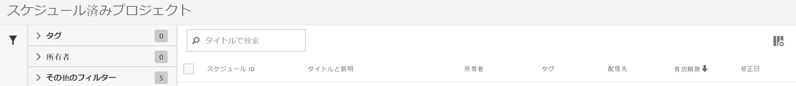

# スケジュール済みプロジェクトマネージャー

スケジュールされた Analysis Workspace プロジェクトを管理します。

**[!UICONTROL Analytics]** /コンポ **[!UICONTROL ーネント]** /スケジ **[!UICONTROL ュール済みプ]**&#x200B;ロジェクト。

スケジュール済みプロジェクトマネージャーでは、定期的なプロジェクト配信を編集および削除できます。レポートを電子メール経由で指定のアドレスに送信する配信スケジュールを設定できます。これらのスケジュールを設定して、ある期間中のみまたは無期限に、指定した間隔でレポートを自動送信したり、定期的なプロジェクトの配信を停止したりできます。

スケジュール済みプロジェクトマネージャーには、特定のユーザーが作成した項目が表示されます。 ユーザーアカウントがアプリケーションで無効になっている場合、予定されたすべての配信が停止されます。

* スケジュール済みプロジェクトの編集。
* プロジェクトのスケジュール ID の表示（主にデバッグ目的で使用）。
* スケジュール済みプロジェクトの検索。
* スケジュール済みプロジェクトのタグ付け。
* スケジュール済みプロジェクトの所有者の指定／変更。
* その他のフィルターの追加（承認済み、失敗、お気に入り、自分が所有、すべてを表示、期限切れのプロジェクト）。

* スケジュール済みプロジェクトの有効期限の定義。

