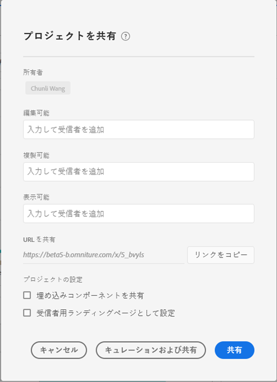
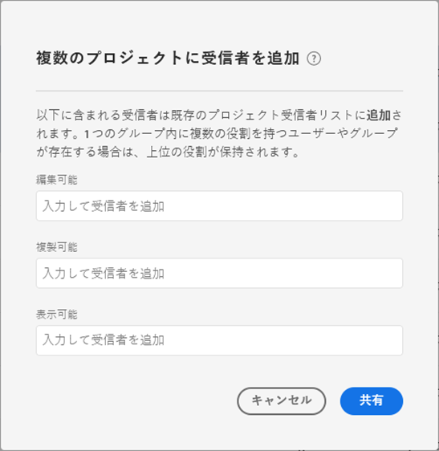

# Workspace プロジェクトの共有

共有機能を使用すると、プロジェクトを組織内の他の Analysis Workspace ユーザーも利用できるようになります。適用した[キュレーション](curate.md)は、受信者がプロジェクトを開くと反映されます。

## プロジェクトの役割 {#Roles}

受信者は、プロジェクトの 3 つの役割のいずれかに追加できます。プロジェクトの役割は、ユーザーと特定のプロジェクト ID に結び付けられます。プロジェクトの役割は、[Adobe Experience Cloud Admin Console](https://docs.adobe.com/content/help/ja-JP/core-services/interface/manage-users-and-products/admin-getting-started.html) で管理されるユーザー権限とは独立しています。

| 役割 | プロジェクト管理 |
|---|---|
| 編集可能 | 受信者は、変更をプロジェクトに「**[!UICONTROL 保存]**」し、共同所有者になることができます。この役割は、他の同僚とプロジェクトを共同管理する場合に役立ちます。これには、共有プロジェクトの受信者リストの編集、削除、変更が含まれます。 注：Analysis Workspace は現在、ライブコラボレーションをサポートしていないので、一度に 1 人のユーザーだけがプロジェクトを編集することをお勧めします。プロジェクトを同時に保存すると、最後のバージョンが保持されます。 |
| 複製可能 | 受信者は、 **[!UICONTROL 名前を付けて保存]**&#x200B;し、左側のパネルにアクセスできます。この役割では、プロジェクトの操作は制限されません。この役割は、組織のデータと Analysis Workspace の使用方法を理解しているが、プロジェクトを変更してほしくないユーザーとプロジェクトを共有する場合に役立ちます。 |
| 表示可能 | 受信者は「名前を付けて保存」できず、左パネルにアクセスできません。プロジェクトの操作も制限されます。この役割は、組織のデータ構造、Analysis Workspace、または Adobe Analytics の一般的な知識の低いユーザーにプロジェクトを共有する場合に役立ちます。ただし、引き続き、安全な環境でデータやインサイトを利用したいと考える場合です。 「[プロジェクト体験を表示できる](/help/analyze/analysis-workspace/curate-share/view-only-projects.md)」についての詳細をご覧ください。 |

>[!IMPORTANT]
> 2020 年 6 月 19 日より前に追加されたプロジェクト受信者は、プロジェクトの役割に移行されました。管理者ユーザーは&#x200B;**[!UICONTROL 編集]**&#x200B;の役割に移行され、管理者以外のユーザーは&#x200B;**[!UICONTROL 複製]**&#x200B;の役割に移行されました。これらの役割は、以前と同じプロジェクト体験を提供します。さらに、すべてのグループ（「すべて」を含む）が&#x200B;**[!UICONTROL 複製]**&#x200B;の役割に移行されました。

### 役割が割り当てられていません（プロジェクトリンク受信者）

受信者に役割が割り当てられていないがプロジェクトへの[リンク](https://docs.adobe.com/content/help/ja-JP/analytics/analyze/analysis-workspace/curate-share/shareable-links.html)を受け取った場合（**[!UICONTROL 共有]／[!UICONTROL プロジェクトリンクを取得]**）、そのユーザーはデフォルトで役割に配置されます。管理者は&#x200B;**[!UICONTROL 編集]**&#x200B;の役割を受け取り、管理者以外は&#x200B;**[!UICONTROL 複製]**&#x200B;の役割を受け取ります。

### 複数の役割の割り当て

受信者が複数の役割に配置される場合、常に最高のエクスペリエンスが得られます。これは、受信者が個人として、またはグループの一部として追加された場合に発生する可能性があります。例えば、個人として&#x200B;**[!UICONTROL 編集]**&#x200B;の役割、グループのメンバーとして&#x200B;**[!UICONTROL 表示]**&#x200B;の役割が与えられたユーザーは、**[!UICONTROL 編集]**&#x200B;エクスペリエンスを受け取ります。

### 管理者と役割

管理者に&#x200B;**[!UICONTROL 複製]**&#x200B;または&#x200B;**[!UICONTROL 表示]**&#x200B;の役割が割り当てられている場合、プロジェクトを開くと、それらによって制限されたエクスペリエンスが提供されます。管理者は、必要に応じて、**[!UICONTROL コンポーネント]／[!UICONTROL プロジェクト]**&#x200B;を使用して、いつでも自分の役割を&#x200B;**[!UICONTROL 編集]**&#x200B;に増やすことができます 。

## 共有プロジェクトへの受診者の追加 {#Add}

共有プロジェクトに受信者を追加するには：

1. **[!UICONTROL 共有]** /**[!UICONTROL プロジェクトを共有]**をクリックします。
未保存の変更がある場合は、最初にプロジェクトを保存するように求められます。
1. 受信者または受信者のグループを追加します。
各役割の説明については、上部のヘルプアイコンを参照してください。
1. （オプション）埋め込みプロジェクトコンポーネント（セグメント、計算指標、日付範囲）をすべての受信者と共有します。共有すると、これらのコンポーネントは受信者の Workspace のコンポーネントドロップダウンに表示されます。この設定は持続しないのでご注意ください。これは、共有時の一回限りのアクションです。
1. （オプション）このページを受信者のランディングページとして設定します。
この設定は持続しません。共有時の一回限りのアクションです。
1. 「共有」をクリックします。「**[!UICONTROL キュレーションと共有]**」をクリックして、プロジェクトのキュレーションを自動的に適用することもできます。プロジェクトが既に共有されている場合は、**[!UICONTROL 更新]**／**[!UICONTROL キュレーションと更新]**&#x200B;というボタンが表示されます。[プロジェクトのキュレーションの詳細](https://docs.adobe.com/content/help/ja-JP/analytics/analyze/analysis-workspace/curate-share/curate.html)を表示します。

## 受信者のグループに共有 {#Groups}

すべてのユーザーが、受信者の集まりであるグループにプロジェクトを共有できます。Adobe Analytics は、グループは [Adobe Experience Cloud Admin Console](https://docs.adobe.com/content/help/ja-JP/core-services/interface/manage-users-and-products/admin-getting-started.html) の製品プロファイルによって定義されます。

* 管理者は、「すべて」を含む任意のグループと共有できます。
* 管理者以外のユーザーは、「すべて」を除き、自分が属するグループと共有できます。

## プロジェクトリンクの共有 {#Links}

プロジェクトへのリンクは、**[!UICONTROL 共有]／[!UICONTROL プロジェクトリンクを取得]**&#x200B;で取得できます。クリックすると、受信者はプロジェクトにランディングする前にログインする必要があります。受信者が役割に配置されていない場合は、デフォルトの役割が割り当てられます。管理者は&#x200B;**[!UICONTROL 編集]**&#x200B;の役割を受け取り、管理者以外は&#x200B;**[!UICONTROL 複製]**&#x200B;の役割を受け取ります。Workspace プロジェクトへの共有可能なリンクを作成する方法について[詳しく説明](https://docs.adobe.com/content/help/ja-JP/analytics/analyze/analysis-workspace/curate-share/shareable-links.html)します。

## プロジェクトマネージャーでプロジェクトを共有する {#Manager}

プロジェクトは、**[!UICONTROL コンポーネント]／[!UICONTROL プロジェクト]**&#x200B;から共有することもできます。上記と同じ手順で、1 のプロジェクトを共有できます。  複数のプロジェクトを共有するように選択した場合、受信者は各プロジェクトの既存の受信者リストに追加されます。

次に例を示します。

* プロジェクト A は受信者 1、2、3 に共有されます。
* プロジェクト B は受信者 4、5、6 に共有されます。

プロジェクト A と B を選択した状態で、受信者 4 と 7 が共有リストに追加されます。現在は、各プロジェクトの新しい共有リストは次のとおりです。

* プロジェクト A：1,、2、3、4、7
* プロジェクト B：4、5、6、7

## よくある質問（FAQ） {#FAQs}

| 質問 | 回答 |
|---|---|
| 2 人の編集者が同時にプロジェクトを保存するとどうなりますか？ | 変更は結合されず、最後に保存したプロジェクトのバージョンが保持されます。Analysis Workspace は現在、ライブコラボレーションをサポートしていません。 |
| 管理者として、どのプロジェクトエクスペリエンスが表示されますか。 | 管理者に&#x200B;**[!UICONTROL 複製]**&#x200B;または&#x200B;**[!UICONTROL 表示]**&#x200B;の役割が割り当てられている場合、プロジェクトを開くと、それらによって制限されたエクスペリエンスが提供されます。管理者は、必要に応じて、**[!UICONTROL コンポーネント]／[!UICONTROL プロジェクト]**&#x200B;を使用して、いつでも自分の役割を&#x200B;**[!UICONTROL 編集]**&#x200B;に増やすことができます 。 |
| 受信者が 1 つの役割に個人として配置され、別の役割にグループのメンバとして配置された場合はどうなりますか？ | 受信者が複数の役割に配置されている場合、常により高いエクスペリエンスを受け取ります。例えば、個人として&#x200B;**[!UICONTROL 編集]**&#x200B;の役割、グループのメンバーとして&#x200B;**[!UICONTROL 表示]**&#x200B;の役割が与えられたユーザーは、**[!UICONTROL 編集]**&#x200B;エクスペリエンスを受け取ります。 |
| プロジェクトのリンクを開いた場合、ユーザーはどのようなエクスペリエンスを得られますか。 | 受信者は、共有モーダルに配置した役割を受け取ります。受信者に役割が割り当てられていない場合（**[!UICONTROL 共有]／[!UICONTROL プロジェクトリンクを取得]**）、そのユーザーはデフォルトで役割に配置されます。管理者は&#x200B;**[!UICONTROL 編集]**&#x200B;の役割を受け取り、管理者以外は&#x200B;**[!UICONTROL 複製]**&#x200B;の役割を受け取ります。 |
