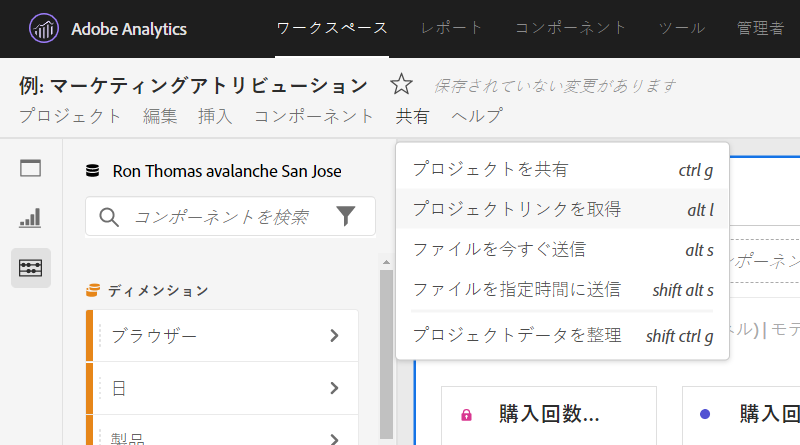
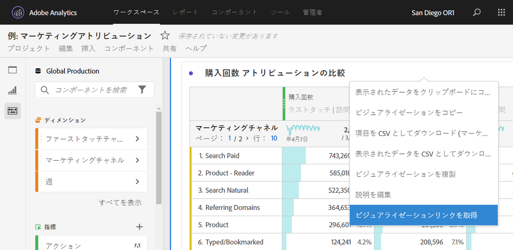
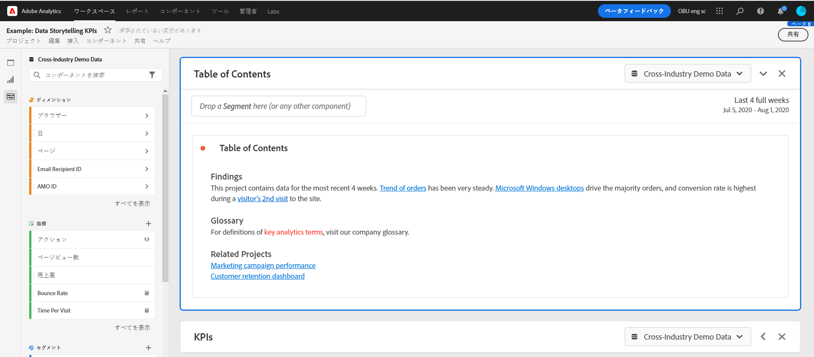

# 共有可能なリンクの作成

Analysis Workspace には、プロジェクトまたはプロジェクトの特定の部分へのリンクを取得する機能など、ユーザーとプロジェクトを共有する多くの方法が用意されています。リンクを受け取ったユーザーは、プロジェクトにアクセスする前に Adobe Analytics にログインする必要があります。

## プロジェクトリンクの取得 {#project-link}

完全なプロジェクトへのリンクを共有するには、 **[!UICONTROL 共有／プロジェクトリンクの取得]**&#x200B;に移動します。リンクの受信者に[プロジェクトの役割](https://docs.adobe.com/content/help/ja-JP/analytics/analyze/analysis-workspace/curate-share/share-projects.html)が割り当てられていない場合、管理者には「**[!UICONTROL 編集可能]**」が表示され、管理者以外のユーザーには「**[!UICONTROL 複製可能]**」のエクスペリエンスが表示されます。

## パネルまたはビジュアライゼーションリンクの取得 {#panel-link}

また、パネルや個々のビジュアライゼーションなど、プロジェクトの特定の部分へのリンクを共有することもできます。これは、イントラリンクと呼ばれる場合があります。これは、プロジェクト内の主要なインサイトにユーザーの注意を引くのに役立ちます。

* 任意のパネルヘッダーから、「**[!UICONTROL パネルのリンクを取得]**」を右クリックします
* 任意のテーブルまたはビジュアライゼーションのヘッダーから、「**[!UICONTROL ビジュアライゼーションリンクを取得]**」を右クリックします

リンクを作成し、それらを使用して受信者をプロジェクトの特定の部分に導く方法に関する[ビデオを視聴](https://www.youtube.com/watch?v=lvmAdKNfWQw)します。

## 目次でのリンクの使用 {#TOC}

様々なリンクオプションを活用するためのヒントの 1 つは、Workspace プロジェクトの上部に常に目次を含めることです。目次では、他の関連プロジェクト、特定のパネルおよび特定のビジュアライゼーションにリンクできます。これにより、プロジェクトの受信者によるナビゲーションが容易になります。

リンクと Workspace のリッチテキストエディターを使用して目次を作成する方法に関する[ビデオ](https://www.youtube.com/watch?v=Xo6fTguWm-M)をご覧ください。

