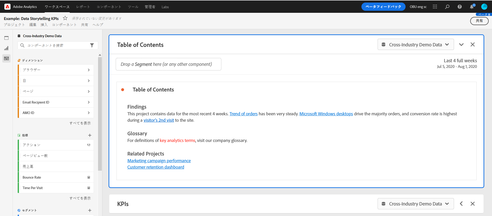
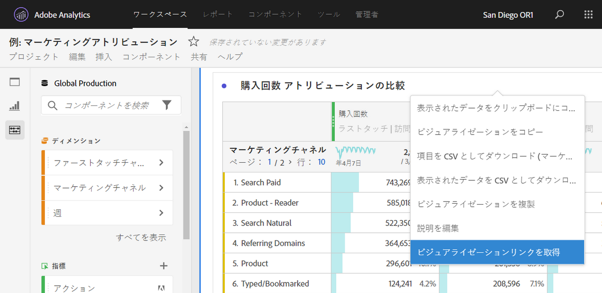

# 共有可能なリンクの作成

Analysis Workspace には、プロジェクトまたはプロジェクトの特定の部分へのリンクを取得する機能など、ユーザーとプロジェクトを共有する多くの方法が用意されています。 一部のリンクタイプでは、プロジェクトにアクセスする前に受信者が Adobe Analytics にログインする必要がありますが、その他のリンクタイプでは必要ありません。

## 他の Workspace ユーザーと共有するプロジェクトリンクの取得

プロジェクトへのリンクを共有するには、共有するプロジェクトに移動し、「**[!UICONTROL 共有]** > **[!UICONTROL プロジェクトリンクを取得]** （または&#x200B;**[!UICONTROL 共有]** > **[!UICONTROL Workspace ユーザーと共有]** > **[!UICONTROL リンクで共有]**）に移動」を選択します。 リンクを共有するユーザーは、ログインする必要があります。

リンクの受信者が[&#x200B; プロジェクトの役割](/help/analyze/analysis-workspace/curate-share/share-projects.md)を割り当てられていない場合、管理者は&#x200B;**[!UICONTROL 元の編集]**&#x200B;を受け取り、管理者以外のユーザーは&#x200B;**[!UICONTROL コピーの編集]**&#x200B;を受け取ります。

## 任意のユーザーと共有する読み取り専用リンクの取得

Analysis Workspace プロジェクトへの読み取り専用リンクは、Adobe Analyticsにアクセスできないユーザーと共有できます。

詳しくは、[誰とでも共有](/help/analyze/analysis-workspace/curate-share/share-projects.md#share-a-project-with-anyone-no-login-required)を参照してください。

## パネルまたはビジュアライゼーションリンクを取得

また、パネルや個々のビジュアライゼーションなど、プロジェクトの特定の部分へのリンクを共有することもできます。 これは、イントラリンクと呼ばれる場合があります。 これは、プロジェクト内の主要なインサイトにユーザーの注意を引くのに役立ちます。

* パネルヘッダーのコンテキストメニューから、**[!UICONTROL パネルリンクを取得]**&#x200B;を選択します
* ビジュアライゼーションヘッダーのコンテキストメニューから、**[!UICONTROL ビジュアライゼーションリンクを取得]**&#x200B;を選択します

リンクを作成し、それらを使用して受信者をプロジェクトの特定の部分に導く方法に関する[ビデオを視聴](https://experienceleague.adobe.com/docs/analytics-learn/tutorials/analysis-workspace/visualizations/intra-linking-in-analysis-workspace.html?lang=ja)します。

## 目次でリンクを使用する {#TOC}

様々なリンクオプションを活用するためのヒントの 1 つは、Workspace プロジェクトの上部に常に目次を含めることです。 目次では、他の関連プロジェクト、特定のパネルおよび特定のビジュアライゼーションにリンクできます。 これにより、プロジェクトの受信者によるナビゲーションが容易になります。

リンクと Workspace のリッチテキストエディターを使用して目次を作成する方法に関する[ビデオ](https://experienceleague.adobe.com/docs/analytics-learn/tutorials/analysis-workspace/navigating-workspace-projects/create-a-toc-in-analysis-workspace.html?lang=ja)をご覧ください。

<!--
# Create shareable links

Analysis Workspace offers many ways to share a project to your users, including the ability to get a link to a project or a specific part of a project. Some link types require the recipient to log in to Adobe Analytics before accessing the project, while others do not. 

## Get a project link to share with other Workspace users

To share a link to a project, go to the project you want to share, then select go to [!UICONTROL **Share**] > [!UICONTROL **Share with Workspace users**] > [!UICONTROL **Share by link**]. Users you share the link with are required to log in. 

If the recipient of the link has not been assigned a [project role](/help/analyze/analysis-workspace/curate-share/share-projects.md), admins receive **[!UICONTROL Edit original]** and non-admins receive **[!UICONTROL Edit copy]** experiences.

## Get a read-only link to share with anyone

You can share a read-only link to Analysis Workspace projects with people who don't have access to Adobe Analytics. Users you share the link with are not required to log in. 

For more information, see "Share a project with anyone (no login required)" in the article [Share projects](/help/analyze/analysis-workspace/curate-share/share-projects.md).

## Get panel or visualization link

You can also share a link to a specific part of a project, such as a panel or individual visualization. This is sometimes referred to as intra-linking. This can be useful to draw your users' attention to key insights within the project.  

* From any panel header, right-click **[!UICONTROL Get panel link]** 
* From any table or visualization header, right-click **[!UICONTROL Get visualization link]** 

[Watch the video](https://experienceleague.adobe.com/docs/analytics-learn/tutorials/analysis-workspace/visualizations/intra-linking-in-analysis-workspace.html) on how to create links and use them to drive recipients to specific parts of your project. 

-->