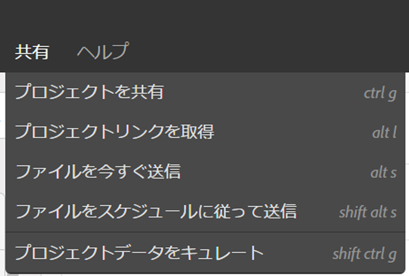
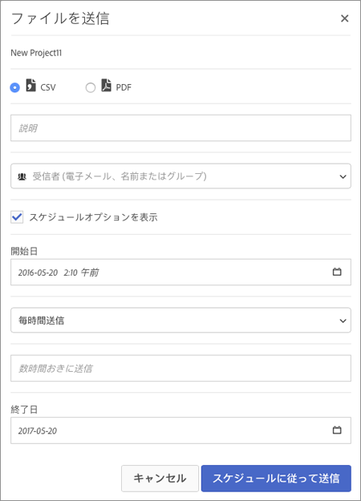

# ファイルの送信-プロジェクトの配信スケジュールの設定

電子メールを使用して Analysis Workspace を送信したり、Analysis Workspace の配信をスケジュールしたりします。

1. [ Analysis Workspace プロジェクトを作成](https://marketing.adobe.com/resources/help/en_US/analytics/analysis-workspace/t_freeform_project.html)して保存します。
1. **[!UICONTROL 共有]** /ファイルをスケジュールで **[!UICONTROL 送信をクリック]**&#x200B;します。

   

1. [!UICONTROL ファイルを送信]ページで、ファイルタイプ（CSV または PDF）を指定します。

   

1. Add recipients email addresses or names, the click **[!UICONTROL Send Now]**.
1. (Optional) Click **[!UICONTROL Show Scheduling Options]** to specify a delivery schedule, then click **[!UICONTROL Send on Schedule]**.
1. **[!UICONTROL コンポーネント]** / [スケジュール済みプロジェクトでスケジュール済みプロジェクトを管理](../../../analyze/analysis-workspace/curate-share/schedule-projects.md#concept_A7B9856EF2504BD791FE5A9E8AA7C29C)します。