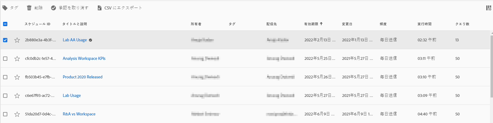

# プロジェクトのスケジュール

Workspace の&#x200B;**共有**&#x200B;メニューから、選択した受信者に電子メールで Analysis Workspace プロジェクトを送信できます。ファイルは CSV 形式または PDF 形式で送信できます。

## ファイルを今すぐ送信

電子メールで受信者に直ちにファイルを送信するには、以下を実行します。

1. **共有／ファイルを今すぐ送信**&#x200B;をクリックします。
1. ファイルタイプ（CSV または PDF）を指定します。
1. （オプション）電子メールに含まれる、受信ファイルについての説明を追加します。
1. 受信者またはグループを追加します。電子メールアドレスを入力することもできます。
1. 「**今すぐ送信**」をクリックします。
1. （オプション）「**スケジュールオプションを表示する** 」をクリックして、配信スケジュールを指定します。

## ファイルをスケジュールに従って送信

定期的なスケジュールでファイルを電子メールで受信者に送信するには、以下を実行します。

1. **共有／ファイルをスケジュールに従って送信**&#x200B;をクリックします。
1. ファイルタイプ（CSV または PDF）を指定します。
1. （オプション）電子メールに含まれる、受信ファイルについての説明を追加します。
1. 受信者またはグループを追加します。電子メールアドレスを入力することもできます。
1. 入力時に「開始」と「終了」を変更して、スケジュールを配信する範囲を指定します。終了日は、スケジュールの作成日または変更日から 1 年以内に設定する必要があります。
1. 配信頻度を指定します。頻度ごとに異なるカスタマイズが可能です。
1. 「**送信スケジュール**」をクリックします。

## スケジュール済みプロジェクトマネージャー

スケジュールされた Analysis Workspace プロジェクトは、 **Analytics／コンポーネント／スケジュールされたプロジェクト**&#x200B;で管理できます。

スケジュール済みプロジェクトマネージャーでは、定期的なプロジェクトスケジュールを編集および削除できます。検索バーまたは左側のパネルのフィルタオプションを使用して、スケジュールを検索します。タグ、承認されたスケジュール、所有者などでフィルターできます。

| フィールド | 説明 |
| --- | --- |
| お気に入り | 星のアイコンを選択すると、このスケジュールがお気に入りになります。 |
| スケジュール ID | この ID は、主にデバッグ目的で使用されます。 |
| タイトルと説明 | このプロジェクトのタイトルと説明。 |
| 所有者 | プロジェクトを作成し、所有する人。 |
| タグ | （オプション）タグ付けは、プロジェクトを整理するのに適しています。 すべてのユーザーがタグを作成し、1 つ以上のタグをプロジェクトに適用できます。 ただし、自分が所有しているプロジェクトまたは自分が共有しているプロジェクトのタグのみを表示できます。 |
| 配信先 | このスケジュール済みプロジェクトの受信者。 |
| 有効期限 | デフォルトの有効期限は作成日の 1 年後です。 |
| 頻度 | このスケジュールプロジェクトを受信者に送信する頻度を指定します。 |
| 実行時間 | このスケジュール済みプロジェクトが送信される時刻。 |
| クエリ数 | このプロジェクトに対するクエリの数。 |

## 一般的なアクション

スケジュール済みプロジェクトマネージャーでの一般的な操作は次のとおりです。

| アクション | 説明 |
|---|---|
| **スケジュールを編集** | スケジュールのタイトルをクリックして、配信設定を更新します。 |
| **スケジュールを削除** | リストでスケジュール済みのプロジェクトを選択し、メニューから「削除」をクリックします。これにより、プロジェクトで選択したスケジュールが削除されます。プロジェクト自体は削除されません。 |
| **タグを追加** | リストでスケジュール済みのプロジェクトを選択し、「タグ」または「承認」を選択してスケジュールを整理し、検索しやすくします。 |
| **失敗スケジュールを表示** | 左側のパネル／その他のフィルター／失敗に移動して、失敗したスケジュールを表示します。 |
| **期限切れスケジュールを表示** | 左側のパネル／その他のフィルター／期限切れに移動して、期限切れのスケジュールを表示します。新しい配信スケジュールを設定するには、スケジュールのタイトルをクリックします。 |
| **スケジュール ID を表示** | 右上の列のオプションに移動し、表にスケジュール ID 列を追加します。スケジュール ID は、多くの場合デバッグに役立ちます。 |

スケジュールされたプロジェクトマネージャーには、特定のユーザーが作成したアイテムが表示されます。ユーザーアカウントがアプリケーションで無効になっている場合、予定されたすべての配信が停止されます。スケジュールされたプロジェクトの所有権は、 **管理者／Analytics ユーザーとアセット／アセットを転送**&#x200B;で新しいユーザーに&#x200B;**転送**&#x200B;できます 。
