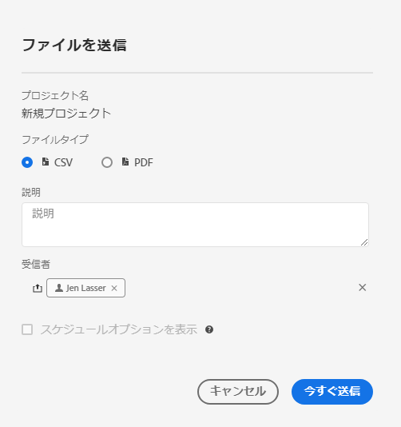
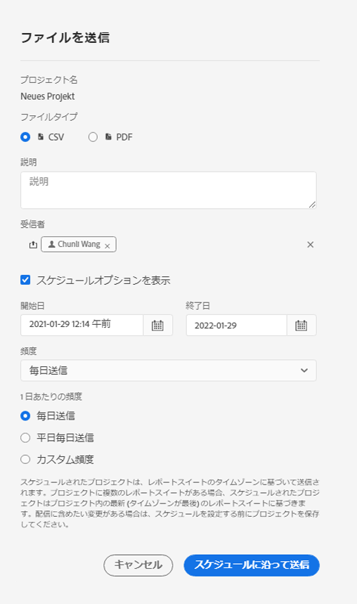

# スケジュールされたプロジェクト

ワークスペース **共有メニューから**、選択した受信者に電子メールでAnalysis Workspaceプロジェクトを送信できます。 ファイルはCSV形式またはPDF形式で送信できます。

## ファイルを今すぐ送信

電子メールで受信者に直ちにファイルを送信するには：

1. **共有/今すぐファイルを送信をクリックします**。
1. ファイルタイプ（CSVまたはPDF）を指定します。
1. （オプション）受信追加するファイルについて説明する電子メールに含まれる説明。
1. 追加受信者またはグループ。 電子メールアドレスを入力することもできます。
1. 「**今すぐ送信**」をクリックします。
1. （オプション）「スケジュールオプションを **表示する** 」をクリックして、配信スケジュールを指定します。

## ファイルをスケジュールに従って送信

定期的なスケジュールでファイルを電子メールで受信者に送信するには：

1. **共有/ファイルをスケジュールに従って送信をクリックし**&#x200B;ます。
1. ファイルタイプ（CSVまたはPDF）を指定します。
1. （オプション）受信追加するファイルについて説明する電子メールに含まれる説明。
1. 追加受信者またはグループ。 電子メールアドレスを入力することもできます。
1. 入力時に「開始」と「終了」を変更して、スケジュールを配信する範囲を指定します。 終了日は、スケジュールの作成日または変更日から1年以内に設定する必要があります。
1. 配信頻度を指定します。 頻度ごとに異なるカスタマイズが可能です。
1. 「 **送信スケジュール**」をクリックします。

## スケジュール済みプロジェクトマネージャー

予定されたAnalysis Workspaceプロジェクトは、 **Analytics/コンポーネント/予定されたプロジェクトで管理できます**。

スケジュール済みプロジェクトマネージャーで、定期的なプロジェクトスケジュールを編集および削除できます。 検索バーで、または左側のレールのフィルタオプションを使用して、スケジュールを検索します。 タグ、承認されたスケジュール、所有者などでフィルターできます。

スケジュール済みプロジェクトマネージャーでの一般的な操作は次のとおりです。

| アクション | 説明 |
|---|---|
| **スケジュールを編集** | スケジュールのタイトルをクリックして、配信設定を更新します。 |
| **スケジュールを削除** | リストでスケジュール済みのプロジェクトを選択し、メニューから「削除」をクリックします。 これにより、プロジェクトで選択したスケジュールが削除されます。プロジェクト自体は削除されません。 |
| **追加タグ** | リストでスケジュール済みのプロジェクトを選択し、「タグ」または「承認」を選択してスケジュールを整理し、検索しやすくします。 |
| **表示失敗スケジュール** | 左側のレール/その他のフィルター/失敗に移動して、失敗したスケジュールを表示します。 |
| **表示期限切れスケジュール** | 左側のレール/その他のフィルター/期限切れに移動して、有効期限切れのスケジュールを表示します。 新しい配信スケジュールを設定するには、スケジュールのタイトルをクリックします。 |
| **表示スケジュールID** | 右上の列のオプションに移動し、表にスケジュールID列を追加します。 スケジュールIDは、多くの場合デバッグに役立ちます。 |

スケジュールされたプロジェクトマネージャーには、特定のユーザーが作成したアイテムが表示されます。ユーザーアカウントがアプリケーションで無効になっている場合、予定されたすべての配信が停止されます。スケジュールされたプロジェクト所有権は **、** 管理者/Analyticsユーザーとアセット/アセットを転送できます ****。
