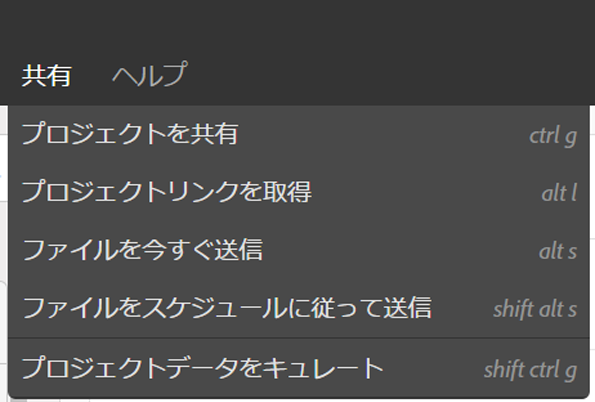
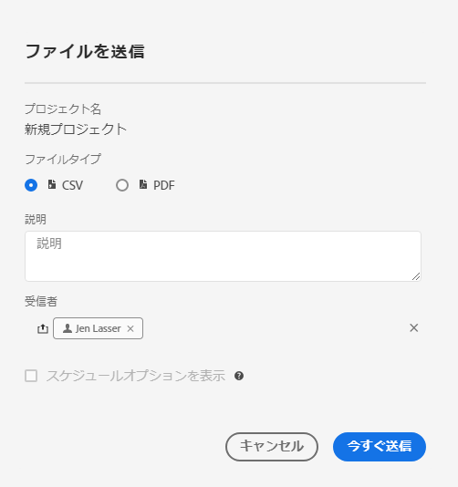
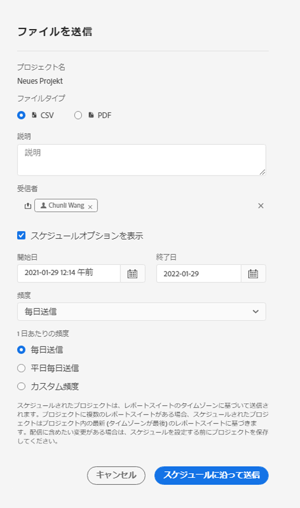

# プロジェクトの送信とスケジュール

選択したユーザーに電子メールでAdobe Analytics プロジェクトをファイルとして送信できます。 ファイルを一時的に送信したり、スケジュールに従って送信するようにファイルを設定したりできます。

ファイルを送信する際には、次の点に注意してください。

* ファイルは CSV 形式または PDF 形式で送信できます。

* プロジェクトに適用されたタグは、書き出しに自動的に適用されます。

Adobe Analytics データを書き出す他の方法も使用できます（[書き出しの概要](/help/export/home.md)を参照）。

## ファイルを送信

受信者にアドホックのファイルを電子メールで送信するには：

1. **[!UICONTROL 共有] / [!UICONTROL  ファイルを送信]**&#x200B;を選択します。
1. 次のいずれかのファイルタイプを指定します。
   * [!UICONTROL **CSV**]：プレーンテキストデータが必要な場合は、このオプションを選択します。
   * [!UICONTROL **PDF**]：ダウンロードしたファイルに、プロジェクト内に表示されているすべてのテーブルとビジュアライゼーションを含める場合は、このオプションを選択します。
1. （オプション） **[!UICONTROL 説明]**&#x200B;を使用して、メールに含める説明を追加します。
1. 受信者またはグループを追加します。 メールアドレスも入力できます。
1. （オプション）「**[!UICONTROL スケジュール設定オプションを表示]**」から「[ ファイルの書き出しをスケジュール ](#schedule-file-export)」を選択します。
1. 「**[!UICONTROL 今すぐ送信]**」をクリックします。 「**[!UICONTROL キャンセル]**」を選択すると、キャンセルします。

## ファイルの書き出しをスケジュール {#schedule}

スケジュール上のファイルを受信者に電子メールで送信するには：

1. **[!UICONTROL 共有]/[!UICONTROL  ファイルの書き出しをスケジュール]**&#x200B;を選択します。
1. 次のいずれかのファイルタイプを指定します。
   * [!UICONTROL **CSV**]：プレーンテキストデータが必要な場合は、このオプションを選択します。
   * [!UICONTROL **PDF**]：ダウンロードしたファイルに、プロジェクト内に表示されているすべてのテーブルとビジュアライゼーションを含める場合は、このオプションを選択します。
1. （オプション） **[!UICONTROL 説明]**&#x200B;を使用して、メールに含める説明を追加します。
1. 受信者またはグループを追加します。 メールアドレスも入力できます。
1. （Healthcare Shieldのお客様のみ）スケジュール済みレポートをパスワードで保護する[にパスワードを提供します](#password-protect-a-new-scheduled-project)。
1. **[!UICONTROL スケジュール設定オプションを表示]**&#x200B;が選択されていることを確認します。
1. **[!UICONTROL 頻度]**&#x200B;を選択します。 次のいずれかを選択できます。

   | 頻度 | オプション |
   |---|---|
   | **[!UICONTROL 1時間ごとに送信]** | **[!UICONTROL 時間ごとに送信]**&#x200B;する値を入力してください。 |
   | **[!UICONTROL 毎日送信]** | **[!UICONTROL 毎日の頻度]**&#x200B;を選択：**[!UICONTROL 毎日の送信]**、**[!UICONTROL 毎週毎日の送信]**、または&#x200B;**[!UICONTROL カスタム頻度]**。  「**[!UICONTROL カスタム頻度]**」を選択した場合、**[!UICONTROL 日数ごとに送信]**&#x200B;の値を入力します。 |
   | **[!UICONTROL 毎週送信]** | **[!UICONTROL 週ごとに送信]**&#x200B;する値を入力してください。 「**[!UICONTROL 週の日]**」を選択します。 |
   | **[!UICONTROL 曜日ごとに月単位で送信]** | **[!UICONTROL 週の日]**&#x200B;と&#x200B;**[!UICONTROL 週の月]**&#x200B;を選択します。 |
   | **[!UICONTROL 月ごとの月次送信]** | **[!UICONTROL 月のこの日に送信]**&#x200B;から値を選択します。 |
   | **[!UICONTROL 月の日付ごとに毎年送信]** | **[!UICONTROL 週の日]**&#x200B;を選択し、**[!UICONTROL 月]**&#x200B;を選択し、**[!UICONTROL 年の月]**&#x200B;を選択します。 |
   | **[!UICONTROL 特定の日付ごとに毎年送信]** | **[!UICONTROL 年の月]**&#x200B;を選択し、**[!UICONTROL 月のこの日に送信]**&#x200B;から値を選択します。 |

1. **[!UICONTROL 開始日を]**&#x200B;から入力してください。 または、を選択して、カレンダーから開始日を選択します。

1. 終了日を&#x200B;****&#x200B;に入力してください。 または、を選択して、カレンダーから終了日を選択します。
1. 「**[!UICONTROL スケジュールに送信]**」を選択します。 「**[!UICONTROL キャンセル]**」を選択すると、キャンセルします。

## スケジュール済みプロジェクトマネージャー {#manager}

スケジュールされたAnalysis Workspace プロジェクトは、**[!UICONTROL コンポーネント]**/**[!UICONTROL スケジュールされたプロジェクト]**&#x200B;を使用して、メイン インターフェイスから管理できます。 詳しくは、[スケジュール済みプロジェクト](/help/components/scheduled-projects-manager.md)を参照してください。

<!--
# Schedule projects

From the Workspace **Share menu**, you can send Analysis Workspace projects using email to selected recipients. Files can be sent in CSV or PDF format. After you share scheduled projects, you can edit the schedule settings to modify the frequency, receipient list, or file type using the Scheduled Projects manager.

## Send file now

To send a file immediately to recipients via email:

1. Click **[!UICONTROL Share] > [!UICONTROL Export file]**.
1. Specify the file type:
   * [!UICONTROL **CSV**]: Choose this option if you want plain-text data.
   * [!UICONTROL **PDF**]: Choose this option if you want the downloaded file to contain all the displayed (visible) tables and visualizations in the project.
1. (Optional) Add a description to include in the email to explain the file being received. 
1. Add recipients or groups. Email addresses can also be entered. 
1. Click **[!UICONTROL Send Now]**.
1. (Optional) Click **[!UICONTROL Show scheduling options]** to specify a delivery schedule.

## Send file on schedule

To send a file on a recurring schedule to recipients via email:

1. Click **[!UICONTROL Share] > [!UICONTROL Schedule file export]**.
1. Specify the file type (CSV or PDF).
1. (Optional) Add a description that will be included in the email to explain the file being received. 
1. Add recipients or groups. Email addresses can also be entered. 
1. Specify the range the schedule should be delivered over by modifying Starting on and Ending on inputs. The end date must be within a year from the day the schedule is created or modified.
1. Specify the delivery frequency. Each frequency allows for different customizations. 
1. Click **[!UICONTROL Send on schedule]**.

## Manage scheduled projects

When you manage scheduled projects, you can edit and delete recurring project schedules:

*  Change the file type (.csv or PDF)
*  Update the project description
*  Add or remove recipients
*  Change the frequency

Scheduled Analysis Workspace projects can be managed under **Analytics > Components > Scheduled Projects**.

For more information, see [Scheduled projects](/help/components/scheduled-projects-manager.md)
-->
