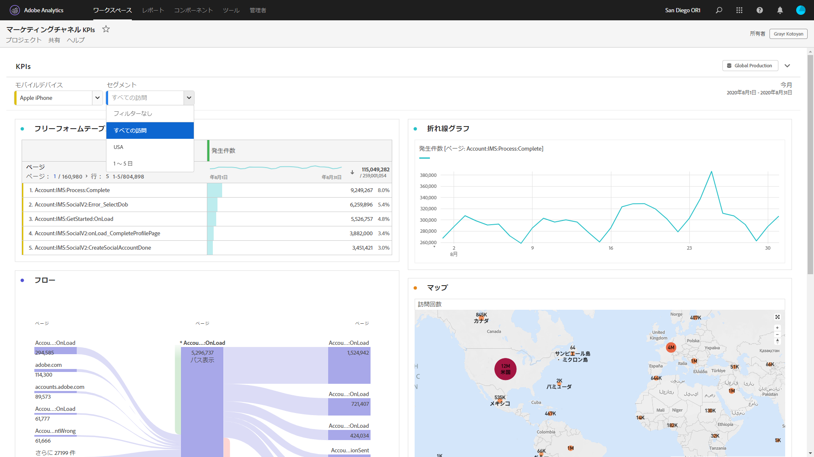

# 表示のみの Workspace プロジェクト

[プロジェクト共有ワークフロー](/help/analyze/analysis-workspace/curate-share/share-projects.md)を使用して、受信者に「表示のみ」としてプロジェクトを共有できます。「Can View」役割に配置された受信者は、より限定的なプロジェクト体験を受け取るようになります。組織のデータ構造、Analysis Workspace、または Adobe Analytics の一般的な知識が低いユーザーにプロジェクトを共有し、安全な環境でデータやインサイトを利用したい場合には、この方法が望ましい場合があります。

## 無効な操作

表示のみのプロジェクトで無効になる操作には、次のものが含まれます。

* 左側のレールを非表示にする
* レポートスイート
* パネルカレンダーの日付範囲注意：受信者にカレンダー制御を付与する場合は、日付範囲を含む[ドロップダウンフィルター](https://docs.adobe.com/content/help/en/analytics-learn/tutorials/analysis-workspace/using-panels/using-drop-down-filters.html)を追加します。
* フリーフォームフィルター
* 表示可能な行のフリーフォーム数
* フリーフォーム行、列またはビジュアライゼーションの設定
* パネルセグメント
* 編集、挿入、コンポーネントメニュー
* Workspace のヒント

## 有効な操作

表示のみのプロジェクトで有効になっているインタラクションのいくつかは、次のとおりです。

| 面グラフ | 有効な操作 |
|---|---|
| フリーフォームテーブル | <ul><li>ページネーションと並べ替え</li><li>ホバリング</li><li>リンクされたビジュアライゼーションを更新するセルの選択</li><li>右クリックしてビジュアライゼーションリンクを取得</li><li>右クリックしてクリップボードにコピー</li></ul> |
| ビジュアライゼーション | <ul><li>クリックして凡例のオン／オフを切り替え</li><li>ホバリング</li><li>右クリックしてビジュアライゼーションリンクを取得</li><li>折りたたみ／展開</li><li>フロー — フローノードを展開</li><li>マップ — ズーム</li></ul> |
| パネル | <ul><li>インタラクティブドロップダウンフィルター</li><li>右クリックしてパネルリンクを取得</li><li>折りたたみ／展開</li></ul> |
| プロジェクト | <ul><li>すべての情報アイコンの検査</li><li>プロジェクトメニュー — 新規、開く、ランディングページとして設定、更新、CSV／PDF をダウンロード、限られたプロジェクト情報および設定</li><li>共有メニュー — プロジェクトリンクを取得、今すぐファイルを送信</li><li>ヘルプメニュー — 「ヒント」および「デバッガー」オプション以外のすべてのアクション</li></ul> |
