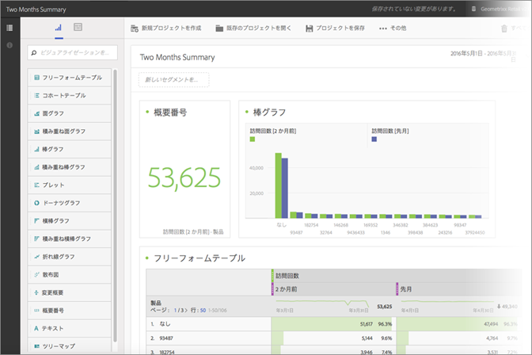
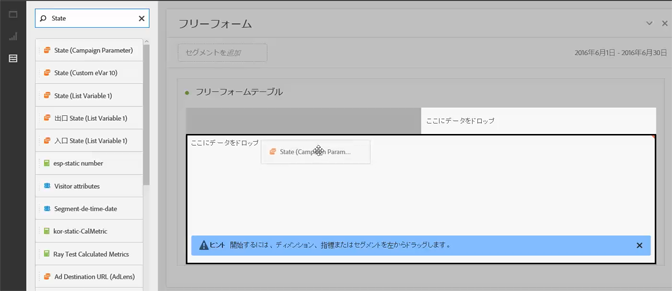
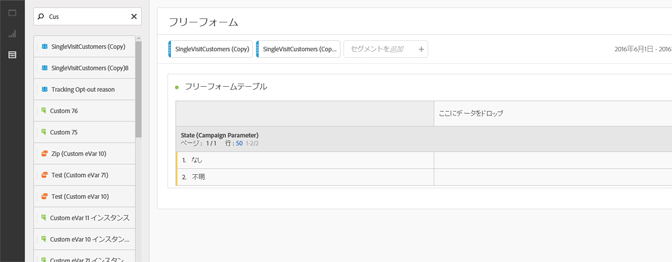
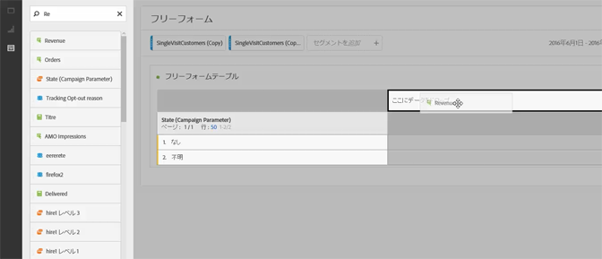
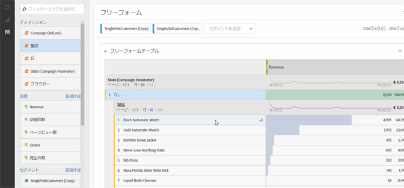
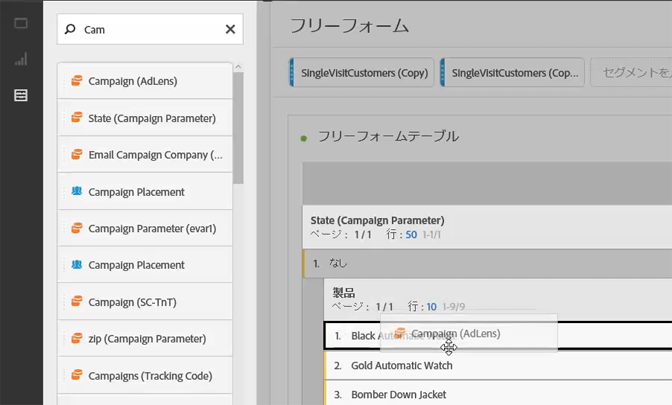
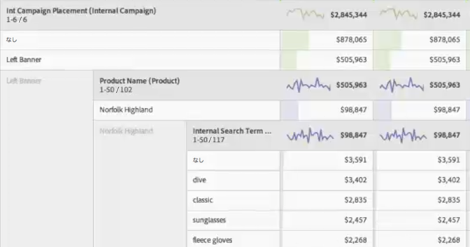

# Analysis Workspace使用例

Analysis Workspace のデータテーブル、セグメントおよび使用例のアイデアの使い方の例です。

データ全体の調査を指示して、特定の質問に答えたり、顧客の行動およびオーディエンスの興味に関するストーリーを組み立てることができます。フリーフォーム環境では、長期にわたるディメンション、指標およびセグメントを適用して、ターゲットデータを直接取得できます。特定のクエリーをカスタマイズするための分析を作成して、共有するリッチレポートおよびビジュアライゼーションで情報を公開し、最も時間に制約される最前線のビジネスユーザーも簡単に解釈できます。

**例**

* メディア企業は、新規訪問者、再訪問者、常連訪問者を比較して、異なる各セグメントについて、時間経過に伴ってコンテンツ消費がどのように変化するかを確認できます。
* ブランドと非ブランドのキーワードについて、コンバージョン率を比較します。
* 内部検索、外部検索、ランディングページなどでページビュー数を分類して、ブランド語句および非ブランド語句のパフォーマンスが異なる理由を理解します。
* ある日とその翌日を比較して、列または行を比較し、複数の指標で成長を分析します。
* ディメンションごとのバウンス率などシンプルなクエリーを実行します。

## 小売の例 {#section_9EFDEF038CAD4954BCFB118A8F33A96F}

あなたはアウトドア用品小売業のマーケティングアナリストで、最近実施された感謝祭のプロモーションを検証し、オンサイトキャンペーンの改善方法について推奨する任務を負っているとします。この例では、異なるセグメントのキャンペーン売上高データを比較し、分類を追加してキャンペーンをさらに詳しく調べる方法を示します。

1. 適切なレポートスイートを選択します。
1. 例えば、社内キャンペーン配置ディメンションを検索して、テーブルキャンバスの左側のセクションにドラッグします（このデータは、テーブルの行を構成します）。

   

1. ここで、左上のセグメントアイコンをクリックして、別の顧客忠誠度セグメントをキャンバスの右半分にドラッグします。その場でセグメントを相互に比較します。これらは、テーブル列の構成要素になります。

   

1. 左上のイベント（指標）アイコンをクリックして、各セグメントの下に売上高指標を追加します。レポートが自動的に生成される方法に注目します。これで、それらの顧客セグメントについて、キャンペーン売上高の比較を開始できます。

   

1. ここで、ページの左側のバナースロットでどの製品が最も効率的かを確認したい場合、左側のバナーを製品名で分類します。ディメンションアイコンをクリックして、製品名ディメンションを左側のバナーの上部にドラッグするだけです。

   

1. しかし、さらに詳しく調べることもできます。人々がどの検索語句を使用して、最も良く売れている製品である Norfolk Highland にたどり着いているかを尋ねるかもしれません。必要なのは、内部検索語句ディメンションを製品名の上にドラッグすることだけです。

   

   新しい分類結果が表示されます。

   

   データは分類され、これにより推奨事項とクロスセルを得ることができます。マーチャンダイジングチームはこれらの推奨とクロスセルを他のキャンペーンに導入したり、会社の売上高を向上させることができます。期待する結果が得られるまで、さらに分類を続けることができます。

   これで、[マーチャンダイジングチームとレポートを共有](../../analyze/analysis-workspace/curate-share/curate.md#concept_4A9726927E7C44AFA260E2BB2721AFC6)できます。

