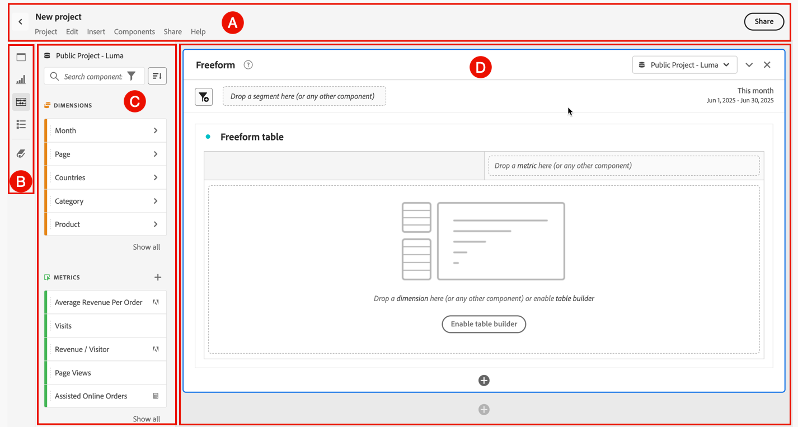

# Analysis Workspace の概要 {#analysis-workspace-overview}

Analysis Workspace では、分析をすばやく作成してインサイトを収集し、他のユーザーと共有できます。ドラッグ＆ドロップのブラウザーインターフェイスを使用して、分析の作成、データを活用するビジュアライゼーションの追加、データセットのキュレーション、選択した任意のユーザーとの[プロジェクト](/help/analyze/analysis-workspace/build-workspace-project/freeform-overview.md)の共有とスケジュールを行うことができます。

>[!BEGINSHADEBOX]

デモビデオについて詳しくは、 [Analysis Workspace の概要](https://video.tv.adobe.com/v/26266/?quality=12&learn=on){target="_blank"}を参照してください。

>[!ENDSHADEBOX]

## インターフェイス

次の画像と付属の表では、Analysis Workspace ユーザーインターフェイスの主な要素を説明します。

| 場所 | 名前と機能 |
|:---------:|----------|
| A | プロジェクトの名前、機能にアクセスするメニュー構造、プロジェクトリストに戻る「」、[Workspace プロジェクトを共有する](/help/analyze/analysis-workspace/curate-share/share-projects.md)「**[!UICONTROL 共有]**」ボタンが含まれています。 いつでもプロジェクトの名前（新規プロジェクトなど）を選択して、名前を変更します。 「」を選択して、プロジェクトをお気に入りのプロジェクト「」として登録します。 |
| B | **ボタンパネル：** Analysis Workspace の主要な[機能](#features)にアクセスするボタンが含まれています。<ul><li> [[!UICONTROL パネル]](/help/analyze/analysis-workspace/c-panels/panels.md)</li><li> [[!UICONTROL ビジュアライゼーション]](/help/analyze/analysis-workspace/visualizations/freeform-analysis-visualizations.md)</li><li>[[!UICONTROL コンポーネント]](/help/components/home.md)を</li><li> [[!UICONTROL 目次]](/help/analyze/analysis-workspace/build-workspace-project/project-table-of-contents.md)</li><li> [[!UICONTROL データ辞書]](/help/analyze/analysis-workspace/components/data-dictionary/data-dictionary-overview.md)</li></ul> |
| C | **左パネル：**&#x200B;この領域には、個々のパネル、ビジュアライゼーション、コンポーネントまたはリストが含まれます。コンテンツは、ボタンパネルで選択したボタンによって異なります。 |
| D | **キャンバス：**&#x200B;これは、左パネルからコンテンツをドラッグしてプロジェクトを作成する主な領域です。パネルの追加、パネルへのビジュアライゼーションの追加、ビジュアライゼーションへのコンポーネントの追加を行うと、プロジェクトは動的に更新されます。複数のパネルを作成でき、各パネル内で複数のビジュアライゼーションを作成できます。 各パネルは、選択したレポートスイートに基づいています。選択したレポートスイートによって、指標やディメンションなど、使用可能なコンポーネントが決まります。詳しくは、[パネル - レポートスイート](/help/analyze/analysis-workspace/c-panels/panels.md#report-suite)を参照してください。 |

## 機能

Analysis Workspace の主な機能は、ボタンパネルから使用できます。

| アイコン | 機能 | 説明 |
|:---:|---|---|
|  | **[!UICONTROL パネル]** | [パネル](/help/analyze/analysis-workspace/c-panels/panels.md)を使用すると、プロジェクト内の分析を整理し、多数のテーブルやビジュアライゼーションを含めることができます。Analysis Workspace で提供される多くのパネルは、少数のユーザー入力に基づいてフルセットの分析を生成します。 |
|  | **[!UICONTROL ビジュアライゼーション]** | 棒グラフや折れ線グラフなどの[ビジュアライゼーション](/help/analyze/analysis-workspace/visualizations/freeform-analysis-visualizations.md)を使用して、データを視覚的に表示できます。左端のパネルで、中央の&#x200B;**[!UICONTROL ビジュアライゼーション]**&#x200B;アイコンを選択し、使用可能なビジュアライゼーションの完全なリストを表示します。 |
|  | **[!UICONTROL コンポーネント]** | [コンポーネント](/help/components/home.md)には、次の要素が含まれます。<ul><li>[ディメンション](/help/components/dimensions/overview.md)</li><li>[指標](/help/analyze/analysis-workspace/components/apply-create-metrics.md)</li><li>[セグメント](/help/components/segmentation/seg-overview.md)</li><li>[日付範囲](/help/analyze/analysis-workspace/components/calendar-date-ranges/calendar.md)</li></ul> |
|  | **[!UICONTROL 目次]** | [目次](/help/analyze/analysis-workspace/build-workspace-project/project-table-of-contents.md)は、プロジェクトに含まれるすべてのパネルとビジュアライゼーションを折りたたみ可能なリストに整理するので、特定のパネルやビジュアライゼーションにすばやくアクセスできます。 |
|  | **データ辞書** | [データ辞書](/help/analyze/analysis-workspace/components/data-dictionary/data-dictionary-overview.md)は、ユーザーと管理者の両方にとって、Analytics 環境のコンポーネントを追跡したり、理解を深めたりするのに役立ちます。 |

## メニュー

Analysis Workspace のほとんどの機能は、ドラッグ＆ドロップのほか、パネル、ビジュアライゼーションおよびコンポーネント内のコンテキストメニューから利用できます。

Workspace メニューとショートカットまたはホットキーを使用して、機能を利用することもできます。ショートカットキーは、ブラウザーを実行しているオペレーティングシステムによって異なります。概要について詳しくは、以下の表を参照してください。

キーボードでは、次のシンボルが使用される場合があります。

- **[!UICONTROL *Shift キー&#x200B;*]**の代わりに**⇧**。
- **[!UICONTROL *cmd *]**（コマンド）の代わりに&#x200B;**⌘**。
- **[!UICONTROL *ctrl *]**（Control）の代わりに&#x200B;**⌃**。
- **[!UICONTROL *opt *]**（Option）の代わりに&#x200B;**⌥**。
- **[!UICONTROL *alt *]**（Alternate）の代わりに&#x200B;**⎇**。

利用できるメニューの概要について詳しくは、以下の表を参照してください。

| **[!UICONTROL プロジェクト]** | ショートカット Mac | ショートカット Windows | 説明 |
|---|---|---|---|
| **[!UICONTROL プロジェクトの作成]** | **[!UICONTROL *Shift + Cmd + P キー&#x200B;*]** | **[!UICONTROL *Shift + Ctrl + P キー&#x200B;*]** | 新しいプロジェクトを作成します。 |
| **[!UICONTROL モバイルスコアカードの作成]** | | | [新しいモバイルスコアカードを作成します](/help/analyze/mobile-app/create-scorecard.md)。 |
| **[!UICONTROL 開いています...]** | **[!UICONTROL *Cmd + O キー&#x200B;*]** | **[!UICONTROL *Ctrl + O キー&#x200B;*]** | [既存のプロジェクトを開きます](/help/analyze/analysis-workspace/build-workspace-project/save-projects.md#open-another-project)。 |
| **[!UICONTROL 以前のバージョンを開いています...]** | **[!UICONTROL *Opt + Cmd + O キー&#x200B;*]** | **[!UICONTROL *Alt + Ctrl + O キー&#x200B;*]** | [以前のバージョンのプロジェクトを開きます](/help/analyze/analysis-workspace/build-workspace-project/save-projects.md#open-previous-version)。 |
| **[!UICONTROL 保存]** | **[!UICONTROL *Cmd + S キー&#x200B;*]** | **[!UICONTROL *Ctrl + S キー&#x200B;*]** | [プロジェクトを保存します](/help/analyze/analysis-workspace/build-workspace-project/save-projects.md#save-projects)。 |
| **[!UICONTROL メモと共に保存...]** | **[!UICONTROL *Opt + Cmd + S キー&#x200B;*]** | **[!UICONTROL *Alt + Ctrl + S キー&#x200B;*]** | [保存するプロジェクトバージョンにメモを追加します](/help/analyze/analysis-workspace/build-workspace-project/save-projects.md#save-project-options)。 |
| **[!UICONTROL 名前を付けて保存...]** | **[!UICONTROL *Shift + Cmd + S キー&#x200B;*]** | **[!UICONTROL *Shift + Ctrl + S キー&#x200B;*]** | [別の名前と詳細を使用してプロジェクトを保存します](/help/analyze/analysis-workspace/build-workspace-project/save-projects.md#save-project-options)。 |
| **[!UICONTROL プロジェクトを更新]** | **[!UICONTROL *Opt + R キー&#x200B;*]** | **[!UICONTROL *Alt + R キー&#x200B;*]** | プロジェクトを更新します。 |
| **[!UICONTROL CSV をダウンロード]** | **[!UICONTROL *Shift + Cmd + V キー&#x200B;*]** | **[!UICONTROL *Shift + Ctrl + V キー&#x200B;*]** | プロジェクトを CSV ファイルとしてダウンロードします。 |
| **[!UICONTROL PDF をダウンロード]** | **[!UICONTROL *Shift + Cmd + B キー&#x200B;*]** | **[!UICONTROL *Shift + Ctrl + B キー&#x200B;*]** | プロジェクトを PDF ドキュメントとしてダウンロードします。 |
| **[!UICONTROL プロジェクト情報および設定]** | | | 名前、タグ、カラーパレットなど、プロジェクトの設定を定義します。 |
| **[!UICONTROL ユーザー設定]** | | | [Analysis Workspace の使用に適した環境設定を行います](/help/analyze/analysis-workspace/user-preferences.md)。 |

| **[!UICONTROL 編集]** | ショートカット Mac | ショートカット Windows | 説明 |
|---|---|---|---|
| **[!UICONTROL 元に戻す]** | **[!UICONTROL *Cmd + Z キー&#x200B;*]** | **[!UICONTROL *Ctrl + Z キー&#x200B;*]** | 前のアクションを取り消します。 |
| **[!UICONTROL やり直し]** | **[!UICONTROL *Cmd + Shift + Z キー&#x200B;*]** | **[!UICONTROL *Ctrl + Shift + Z キー&#x200B;*]** | 前のアクションをやり直します。 |
| **[!UICONTROL すべてクリア]** | **[!UICONTROL *Opt + W キー&#x200B;*]** | **[!UICONTROL *Alt + W キー&#x200B;*]** | 現在のプロジェクトのすべてのパネルをクリアします。 |

| **[!UICONTROL 挿入]** | ショートカット Mac | ショートカット Windows | 説明 |
|---|---|---|---|
| **[!UICONTROL 空のパネル]** | **[!UICONTROL *Opt + B キー&#x200B;*]** | **[!UICONTROL *Alt + B キー&#x200B;*]** | [空のパネル](/help/analyze/analysis-workspace/c-panels/blank-panel.md)を挿入します。 |
| **[!UICONTROL メディア同時閲覧者数]** | **[!UICONTROL *Opt + H キー&#x200B;*]** | **[!UICONTROL *Alt + H キー&#x200B;*]** | [メディア同時視聴者](/help/analyze/analysis-workspace/c-panels/media-concurrent-viewers.md)パネルを挿入します。 |
| **[!UICONTROL メディア再生滞在時間]** | **[!UICONTROL *Opt + I キー&#x200B;*]** | **[!UICONTROL *Alt + I キー&#x200B;*]** | [メディア再生滞在時間](/help/analyze/analysis-workspace/c-panels/media-playback-time-spent.md)パネルを挿入します。 |
| **[!UICONTROL メディア分平均オーディエンス]** | **[!UICONTROL *Opt + M キー&#x200B;*]** | **[!UICONTROL *Alt + M キー&#x200B;*]** | [メディア分平均オーディエンス](/help/analyze/analysis-workspace/c-panels/average-minute-audience-panel.md)パネルを挿入します。 |
| **[!UICONTROL アトリビューション]** | **[!UICONTROL *Opt + E キー&#x200B;*]** | **[!UICONTROL *Alt + E キー&#x200B;*]** | [アトリビューション](/help/analyze/analysis-workspace/c-panels/attribution.md)パネルを挿入します。 |
| **[!UICONTROL フリーフォーム]** | **[!UICONTROL *Opt + A キー&#x200B;*]** | **[!UICONTROL *Alt + A キー&#x200B;*]** | [フリーフォーム](/help/analyze/analysis-workspace/c-panels/freeform-panel.md)パネルを挿入します。 |
| **[!UICONTROL クイックインサイト]** | **[!UICONTROL *Opt + J キー&#x200B;*]** | **[!UICONTROL *Alt + J キー&#x200B;*]** | [クイックインサイト](/help/analyze/analysis-workspace/c-panels/quickinsight.md)パネルを挿入します。 |
| **[!UICONTROL フリーフォームテーブル]** | **[!UICONTROL *Opt + 1 キー&#x200B;*]** | **[!UICONTROL *Alt + 1 キー&#x200B;*]** | [フリーフォームテーブル](/help/analyze/analysis-workspace/visualizations/freeform-table/freeform-table.md)ビジュアライゼーションを挿入します。 |
| **[!UICONTROL 折れ線グラフ]** | **[!UICONTROL *Opt + 2 キー&#x200B;*]** | **[!UICONTROL *Alt + 2 キー&#x200B;*]** | [折れ線グラフ](/help/analyze/analysis-workspace/visualizations/line.md)ビジュアライゼーションを挿入します。 |
| **[!UICONTROL 棒グラフ]** | **[!UICONTROL *Opt + 3 キー&#x200B;*]** | **[!UICONTROL *Alt + 3 キー&#x200B;*]** | [棒グラフ](/help/analyze/analysis-workspace/visualizations/bar.md)ビジュアライゼーションを挿入します。 |
| **[!UICONTROL コンボ]** | **[!UICONTROL *Opt + 4 キー&#x200B;*]** | **[!UICONTROL *Alt + 4 キー&#x200B;*]** | [コンボ](/help/analyze/analysis-workspace/visualizations/combo-charts.md)ビジュアライゼーションを挿入します。 |

| **[!UICONTROL コンポーネント]** | ショートカット Mac | ショートカット Windows | 説明 |
|---|---|---|---|
| **[!UICONTROL セグメントを作成…]** | **[!UICONTROL *Shift + Cmd + E キー&#x200B;*]** | **[!UICONTROL *Shift + Ctrl + E キー&#x200B;*]** | 新しい[セグメント](/help/components/segmentation/segmentation-workflow/seg-create.md)を作成します。 |
| **[!UICONTROL 指標を作成…]** | **[!UICONTROL *Shift + Cmd + C キー&#x200B;*]** | **[!UICONTROL *Shift + Ctrl + C キー&#x200B;*]** | 新しい[計算指標](/help/components/calculated-metrics/cm-overview.md)を作成します。 |
| **[!UICONTROL 日付範囲を作成...]** | **[!UICONTROL *Shift + Cmd + D キー&#x200B;*]** | **[!UICONTROL *Shift + Ctrl + D キー&#x200B;*]** | 新しい[日付範囲](/help/analyze/analysis-workspace/components/calendar-date-ranges/calendar.md)を作成します。 |
| **[!UICONTROL 注釈を作成…]** | **[!UICONTROL *Shift + Cmd + O キー&#x200B;*]** | **[!UICONTROL *Shift + Ctrl + O キー&#x200B;*]** | 新しい[注釈](/help/analyze/analysis-workspace/components/annotations/overview.md)を作成します。 |
| **[!UICONTROL コンポーネントを更新]** | **[!UICONTROL *Opt + Shift + R キー&#x200B;*]** | **[!UICONTROL *Alt + Shift + R キー&#x200B;*]** | プロジェクトのコンポーネントを更新します。 |

| **[!UICONTROL 共有]** | ショートカット Mac | ショートカット Windows | 説明 |
|---|---|---|---|
| **[!UICONTROL Workspace ユーザーと共有]** | **[!UICONTROL *Cmd + H キー&#x200B;*]** | **[!UICONTROL *Ctrl + H キー&#x200B;*]** | [プロジェクトを他の Workspace ユーザーと共有します](/help/analyze/analysis-workspace/curate-share/share-projects.md#share-with-customer-journey-analytics-users-and-groups-in-your-organization)。 |
| **[!UICONTROL 任意のユーザーと共有]** | **[!UICONTROL *Opt + L キー&#x200B;*]** | **[!UICONTROL *Alt + L キー&#x200B;*]** | [プロジェクトの読み取り専用バージョンを任意のユーザーと共有します](/help/analyze/analysis-workspace/curate-share/share-projects.md#share-a-link-to-a-project)。 |
| **[!UICONTROL ファイルを送信]** | **[!UICONTROL Opt + S キー]** | **[!UICONTROL *Alt + S キー&#x200B;*]** | [プロジェクトを CSV または PDF ファイルとして他の受信者に送信します](/help/analyze/analysis-workspace/curate-share/send-schedule-files.md)。 |
| **[!UICONTROL ファイルの書き出しをスケジュール]** | **[!UICONTROL *Shift + Opt + S キー&#x200B;*]** | **[!UICONTROL *Shift + Alt + S キー&#x200B;*]** | [スケジュールに従って、プロジェクトを CSV または PDF ファイルとして他の受信者に送信します](/help/analyze/analysis-workspace/curate-share/send-schedule-files.md)。 |
| **[!UICONTROL プロジェクトデータをキュレート]** | **[!UICONTROL *Shift + Cmd + G キー&#x200B;*]** | **[!UICONTROL *Shift + Ctrl + G キー&#x200B;*]** | [プロジェクトデータをキュレートします](/help/analyze/analysis-workspace/curate-share/curate.md)。 |

| ヘルプ | 説明 |
|---|---|
| **[!UICONTROL ビデオ]** | 新しいブラウザータブで、Customer Journey Analytics の YouTube チャネルを開きます。 |
| **[!UICONTROL ヘルプドキュメント]** | 新しいブラウザータブでドキュメントを開きます（実際には今読んでいるところです）。 |
| **[!UICONTROL ヘルプフォーラム]** | 新しいブラウザータブで、Adobe Analytics Experience League コミュニティフォーラムを開きます。 |
| **[!UICONTROL ホットキー]** | Workspace で使用できるホットキー（ショートカット）の概要を示します。 |
| **[!UICONTROL デバッガーの有効化]** | デバッガーを有効にします。プロジェクトが再読み込みされます。 |
| **[!UICONTROL デバッガーの無効化]** | デバッガーを無効にします。プロジェクトが再読み込みされます。 |
| **[!UICONTROL パフォーマンス]** | **[!UICONTROL Analysis Workspace のパフォーマンス]**&#x200B;に関する指標を表示するダイアログを表示します。**[!UICONTROL CSV としてダウンロード]**&#x200B;を使用して、パフォーマンス指標の CSV ファイルをダウンロードします。 |
| **[!UICONTROL Workspace について]** | バージョン情報、機能アクセスレベル、アクティブな機能フラグを含む **[!UICONTROL Analysis Workspaceについて]**&#x200B;ダイアログを表示します。 |

## データソース

ビジュアライゼーションを同期することで、ビジュアライゼーションに対応するデータテーブルまたはデータソースを制御できます。詳しくは、[データソースの管理](/help/analyze/analysis-workspace/visualizations/t-sync-visualization.md)を参照してください。

## Analysis Workspace の使用

Analysis Workspace の使用を開始するには：

1. [Adobe Experience Cloud](https://experience.adobe.com) にログインします。
1. インターフェイスの右上にあるアプリ切り替えボタンから「**[!UICONTROL Customer Journey Analytics]**」を選択します。
1. デフォルトでは、Analysis Workspace の&#x200B;**[!UICONTROL プロジェクト]**&#x200B;ページが表示されます。特定のプロジェクトが選択されている場合や、最近作業を行った場合は、そのプロジェクトがデフォルトで表示されます。

### プロジェクトの作成

Analysis Workspace での分析は、[プロジェクト](/help/analyze/analysis-workspace/build-workspace-project/freeform-overview.md)と呼ばれます。

[プロジェクトの作成](/help/analyze/analysis-workspace/build-workspace-project/create-projects.md)で説明したように、Analysis Workspace でプロジェクトを作成できます。

[Analysis Workspace のフォルダー](/help/analyze/analysis-workspace/build-workspace-project/workspace-folders/about-folders.md)で説明したように、プロジェクトはフォルダーとサブフォルダーに整理できます。

### プロジェクトの保存および共有

Analysis Workspace で分析を作成すると、作業内容は[自動保存](/help/analyze/analysis-workspace/build-workspace-project/save-projects.md)されます。

プロジェクトの作成が完了し、実用的なインサイトを収集すると、そのプロジェクトを他のユーザーが使用できます。プロジェクトは、組織内のユーザーやグループだけでなく、組織外の人物と共有することもできます。プロジェクトの共有について詳しくは、[プロジェクトの共有](/help/analyze/analysis-workspace/curate-share/share-projects.md)を参照してください。

## その他のリソース {#resources}

- アドビでは、数百もの[Analytics ビデオトレーニングチュートリアル](https://experienceleague.adobe.com/ja/docs/analytics-learn/tutorials/overview)を提供しています。
- 新機能のアップデートについては、 [Adobe Experience Cloud リリースノート](https://experienceleague.adobe.com/ja/docs/release-notes/experience-cloud/current) を参照してください。
