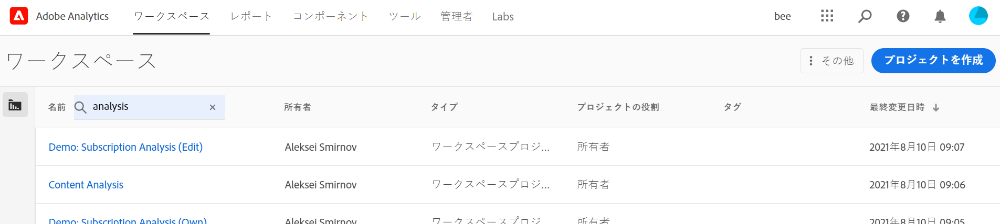
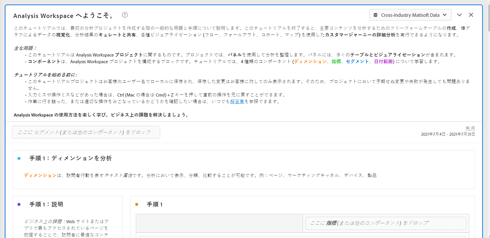
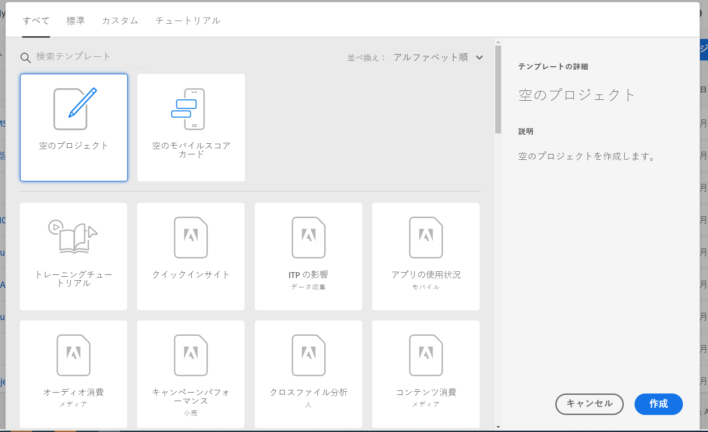
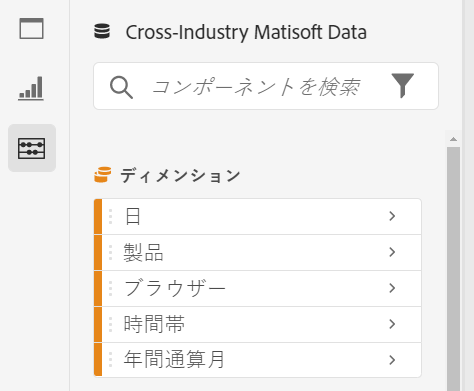
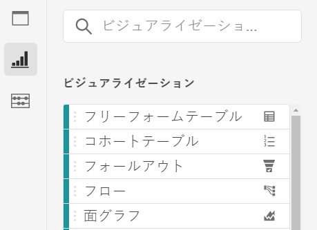
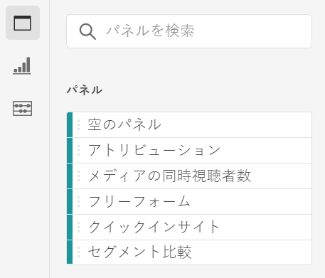

# Analysis Workspace の概要

Analysis Workspace は分析をすばやく構築してインサイトを共有できる、柔軟なブラウザーツールです。ドラッグ&amp;ドロップのインターフェイスを使用して、分析の作成、ビジュアライゼーションの追加をおこない、データを活用、データセットをキュレーション、組織内の任意のユーザーとプロジェクトを共有およびスケジュールできます。

数分しか時間が取れない場合は、この短い概要を視聴し、何ができるかをご確認ください。

>[!VIDEO](https://video.tv.adobe.com/v/26266/?quality=12)

## Adobe Analytics へのログイン {#login}

Analysis Workspace の使用を開始するには、[experience.adobe.com/analytics](http://experience.adobe.com/analytics) に移動して Adobe Analytics にログインします。これまでに特定のプロジェクトを選択したことがない場合は、Workspace プロジェクトリストのホームページに移動します。

## トレーニングチュートリアルの使用 {#training-tutorial}

ログインしたらまず、Analysis Workspace トレーニングチュートリアルに移動します。このチュートリアルでは、Workspace で最初の分析を構築するための一般的な用語と手順を説明します。チュートリアルを開始するには、「**[!UICONTROL 新規プロジェクトを作成]**」をクリックし、新しいプロジェクトモーダル内で「**トレーニングチュートリアル**」を選択します。

## 新規プロジェクトを作成 {#new-project}

チュートリアルが完了したら、最初のプロジェクトの構築を開始する準備が整います。**新しいプロジェクトモーダル**&#x200B;には、分析を開始するための様々なオプションが用意されています。ブラウザーと Adobe Analytics ダッシュボードモバイルアプリのどちらで分析を共有するかに応じて、空のプロジェクトまたは[空のモバイルスコアカード](https://docs.adobe.com/content/help/ja-JP/analytics/analyze/mobapp/curator.html)のどちらで開始するかを選択できます。

また、アドビが提供する標準テンプレートや、組織が作成したカスタム テンプレートなど、事前定義済み&#x200B;**テンプレート**&#x200B;から分析を開始することもできます。想定している分析や用途に応じて、様々なテンプレートを使用できます。使用可能な様々なテンプレートオプションについて詳しくは[こちら](https://docs.adobe.com/content/help/ja-JP/analytics/analyze/analysis-workspace/build-workspace-project/starter-projects.html)を参照してください。

## 分析の構築 {#analysis}

Workspace プロジェクトでは、左パネルから&#x200B;**パネル、テーブル、ビジュアライゼーションおよびコンポーネント**&#x200B;にアクセスします。これらはプロジェクトの構成要素です。

### コンポーネント

**コンポーネント**&#x200B;は、ディメンション、指標、セグメントまたは日付範囲です。これらすべてを&#x200B;**[!UICONTROL フリーフォームテーブル]**&#x200B;に組み合わせることで、ビジネスに関する質問への回答を開始できます。分析を開始する前に、各[コンポーネントのタイプ](/help/analyze/analysis-workspace/components/analysis-workspace-components.md)について理解しておく必要があります。コンポーネントの用語を習得したら、**[!UICONTROL フリーフォームテーブル]**&#x200B;でドラッグ&amp;ドロップを開始し、[分析を構築](https://docs.adobe.com/content/help/ja-JP/analytics/analyze/analysis-workspace/build-workspace-project/t-freeform-project.html)します。

### ビジュアライゼーション

次に、棒グラフや折れ線グラフなどの&#x200B;**ビジュアライゼーション**&#x200B;をデータに追加して、データに命を吹き込みます。左端のパネルで、中央の&#x200B;**[!UICONTROL ビジュアライゼーション]**&#x200B;アイコンを選択し、使用可能な[ビジュアライゼーション](https://docs.adobe.com/content/help/ja-JP/analytics/analyze/analysis-workspace/visualizations/freeform-analysis-visualizations.html)の完全なリストを表示します。

### パネル

**パネル**&#x200B;を使用すると、プロジェクト内の分析を整理し、多数のテーブルやビジュアライゼーションを含めることができます。Analysis Workspace で提供される多くのパネルは、少数のユーザー入力に基づいてフルセットの分析を生成します。左端のパネルで上部の&#x200B;**[!UICONTROL パネル]**&#x200B;アイコンを選択し、使用可能な [パネル](https://docs.adobe.com/content/help/ja-JP/analytics/analyze/analysis-workspace/panels/panels.html)の完全なリストを表示します。

## その他のリソース {#resources}

* アドビでは、数百もの[Analytics ビデオトレーニングチュートリアル](https://docs.adobe.com/content/help/ja-JP/analytics-learn/tutorials/overview.html)を提供しています。
* 機能に関する更新については、「[Analysis Workspace の新機能](/help/analyze/analysis-workspace/new-features-in-analysis-workspace.md)」を参照してください。
