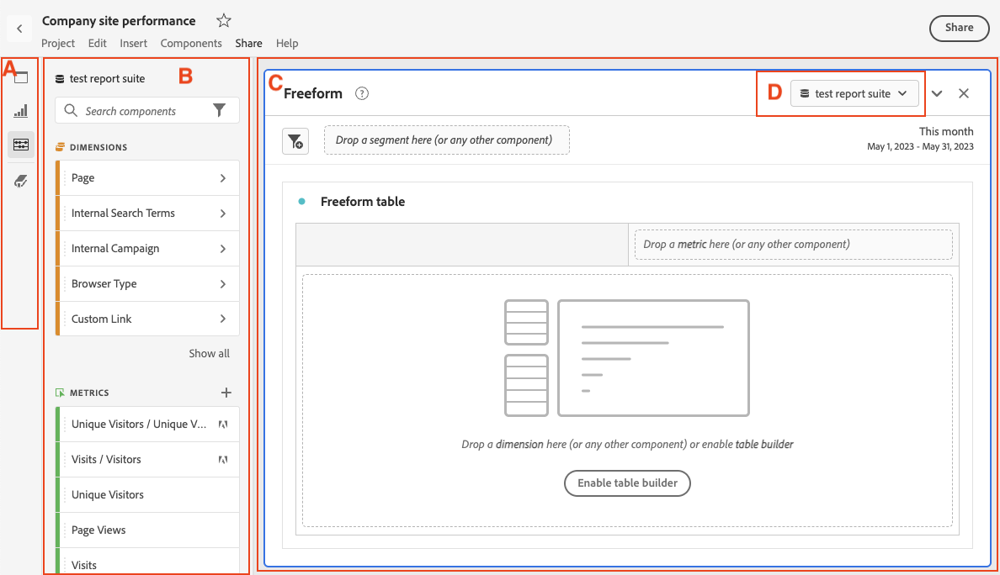

# Analysis Workspace の概要

Analysis Workspaceでは、分析をすばやく構築してインサイトを収集し、他のユーザーと共有できます。 ドラッグ&amp;ドロップブラウザーインターフェイスを使用すると、分析の作成、ビジュアライゼーションの追加、データを有効にする、データセットのキュレーション、選択したユーザーとのプロジェクトの共有およびスケジュールをおこなえます。

次のビデオでは、簡単な概要と可能な例を示します。

>[!VIDEO](https://video.tv.adobe.com/v/26266/?quality=12)

## Analysis Workspaceの地域

次の画像と付属の表は、Analysis Workspaceの主な領域を説明しています。

| 画像内の場所 | 名前と関数 |
|---------|----------|
| A | **左端のレール：** Analysis Workspaceにパネル、ビジュアライゼーションおよびコンポーネントを追加するためのタブが含まれます。 また、データディクショナリを開くためのデータディクショナリアイコンも含まれます。 |
| B | **左レール：** 左端のパネルで選択したタブに応じて、この領域には個々のパネル、ビジュアライゼーションまたはコンポーネントが含まれます。 |
| C | **キャンバス：** これは、左側のレールからコンテンツをドラッグしてプロジェクトを作成する主な領域です。 パネル、ビジュアライゼーションおよびコンポーネントをキャンバスに追加すると、プロジェクトが動的に更新されます。 |
| D | **レポートスイートのドロップダウンメニュー：** Analysis Workspaceの各パネルでは、レポートスイートのドロップダウンメニューを使用して、データソースとして使用するレポートスイートを選択できます。 |

## Analysis Workspaceの機能 {#analysis}

Analysis Workspaceの主な機能の一部を次に示します。

### パネル

**パネル** を使用すると、プロジェクト内の分析を整理し、多数のテーブルやビジュアライゼーションを含めることができます。Analysis Workspace で提供される多くのパネルは、少数のユーザー入力に基づいてフルセットの分析を生成します。左端のパネルで上部の&#x200B;**[!UICONTROL パネル]**&#x200B;アイコンを選択し、使用可能な パネルの完全なリストを表示します。

パネルについて詳しくは、 [パネルの概要](https://experienceleague.adobe.com/docs/analytics/analyze/analysis-workspace/panels/panels.html?lang=ja).

### ビジュアライゼーション

**ビジュアライゼーション**&#x200B;棒グラフや折れ線グラフなど、を使用して、データを目に見えるようにします。 左端のパネルで、中央の **[!UICONTROL ビジュアライゼーション]** アイコンを選択し、使用可能な ビジュアライゼーション の完全なリストを表示します。

ビジュアライゼーションについて詳しくは、 [ビジュアライゼーションの概要](https://experienceleague.adobe.com/docs/analytics/analyze/analysis-workspace/visualizations/freeform-analysis-visualizations.html?lang=ja).

### コンポーネント

Analysis Workspaceのコンポーネントは、次の要素で構成されます。

* ディメンション

* 指標

* セグメント

* 日付範囲

詳しくは、 [コンポーネントの概要](/help/analyze/analysis-workspace/components/analysis-workspace-components.md) を参照して、これらの各コンポーネントタイプの詳細を確認してください。

これらの各コンポーネントタイプをビジュアライゼーション（フリーフォームテーブルなど）に追加して、ビジネスの質問への回答を開始できます。

コンポーネントの用語を理解したら、コンポーネントをビジュアライゼーション（フリーフォームテーブルを含む）にドラッグし、 [分析の構築](https://experienceleague.adobe.com/docs/analytics/analyze/analysis-workspace/build-workspace-project/t-freeform-project.html?lang=ja).

### データ要素

Analysis Workspace のデータ要素は、ユーザーと管理者の両方が Analytics 環境のコンポーネントを追跡し、よりよく理解するのに役立ちます。

データディクショナリの詳細については、 [データディクショナリの概要](/help/analyze/analysis-workspace/components/data-dictionary/data-dictionary-overview.md).

## Analysis Workspaceの使用を開始

### Adobe Analytics へのログイン {#login}

Analysis Workspace の使用を開始するには、[experience.adobe.com/analytics](https://experience.adobe.com/analytics) に移動して Adobe Analytics にログインします。デフォルトでは、Analysis Workspaceのプロジェクトページが表示されます。 特定のプロジェクトが選択されている場合は、そのプロジェクトがデフォルトで表示されます。

### プロジェクトの作成 {#new-project}

Analysis Workspaceの分析は、 [プロジェクト](/help/analyze/analysis-workspace/build-workspace-project/freeform-overview.md).

Analysis Workspaceでプロジェクトを作成できます。詳しくは、 [プロジェクトの作成](/help/analyze/analysis-workspace/build-workspace-project/create-projects.md).

### プロジェクトの保存と共有

Analysis Workspaceで分析を作成する場合、作業内容は次のようになります。 [自動保存](/help/analyze/analysis-workspace/build-workspace-project/save-projects.md).

プロジェクトの構築が完了し、実用的なインサイトを収集すると、他のユーザーが利用できる状態になります。 プロジェクトを組織内のユーザーやグループと共有したり、組織外のユーザーと共有したりできます。 プロジェクトの共有について詳しくは、 [プロジェクトの共有](/help/analyze/analysis-workspace/curate-share/share-projects.md).

### Analysis Workspace でのプロジェクト管理

次のビデオでは、Analysis Workspaceのプロジェクト管理の概要を説明します。

>[!VIDEO](https://video.tv.adobe.com/v/24035/?quality=12)

## その他のリソース {#resources}

* アドビでは、数百もの[Analytics ビデオトレーニングチュートリアル](https://experienceleague.adobe.com/docs/analytics-learn/tutorials/overview.html?lang=ja)を提供しています。
* 新機能の最新情報については、 [Adobe Experience Cloud リリースノート](https://experienceleague.adobe.com/docs/release-notes/experience-cloud/current.html?lang=ja#analytics) を参照してください。
* Analysis Workspaceに慣れるには、 Analysis Workspaceトレーニングチュートリアルテンプレートを使用します。 このテンプレートでは、Workspace で最初の分析を作成するための一般的な用語と手順を順に説明します。 チュートリアルを開始するには：
   1. の [!UICONTROL **Workspace**] Adobe Analyticsの「 」タブで「 」を選択します。 **[!UICONTROL 学習]** 左側に
   1. 選択 **[!UICONTROL チュートリアルを開く]**.
      

