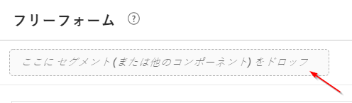

# Analysis Workspace の新機能

## 2019 年 5 月

2019年5月09日にリリースされた機能強化。

| 機能強化 | 説明 |
|--- |--- |
| フロービジュアライゼーション設定に新しい設定を追加しました：繰り返しインスタンスを含める。 | [フローの設定](/help/analyze/analysis-workspace/visualizations/c-flow/flow-settings.md) |

## 2019 年 4 月

2019年4月11日にリリースされた機能強化。

| 機能強化 | 説明 |
|--- |--- |
| 最適化のベストプラクティスの機能強化 | [パフォーマンスの最適化](/help/analyze/analysis-workspace/new-features-in-analysis-workspace.md) |

## 2019 年 1 月

2019 年 1 月 17 日にリリースされた新機能および機能強化。

| 機能 | 説明 |
|--- |--- |
| [コホート分析](/help/analyze/analysis-workspace/visualizations/cohort-table/cohort-analysis.md) | コホート分析が大きく改善され、以下の機能が実現しました。<ul><li>セグメントのインクルージョン指標とリターン指標を別々に適用できます。 </li><li>リテンションの代わりにチャーン（離反）を表示できます。</li><li>待ち時間テーブル（インクルージョンイベントの前後の変化）を表示できます。</li><li>コホートディメンションをカスタマイズできます（時間だけでなく eVar の値で訪問者をグループ化できます）。</li><li>コホートコホートの計算を行います。以前のコホートではなく、以前の期間に基づいてリテンション/チャーンを計算します。 </li><li>セグメントの適用に加え、インクルージョンフィールドとリターンフィールドに複数の指標を追加できます。（計算指標はサポートされません。）</li></ul> |
| [表示密度](/help/analyze/analysis-workspace/build-workspace-project/view-density.md) | この新しい設定を使用すると、左側のレール、フリーフォームテーブルおよびコホートテーブルでの垂直方向のパディングを減らし、1 画面に表示されるデータの量を増やすことができます。プロジェクト／プロジェクト情報および設定から利用できます。 |
| [Attribution IQ における複数値の変数のサポート](/help/analyze/analysis-workspace/attribution-iq/attribution.md) | Analytics の一部のディメンション、たとえばリスト変数、products 変数、リスト prop、マーチャンダイジング eVar などで、1 回のヒットに複数の値を含めることができます。Analysis Workspace では、このような変数にヒットレベルで Attribution IQ を適用できます。 |
| パフォーマンスの向上 | 分類の可視化スピードの向上 - 多くの分類を含むプロジェクトの読み込み速度が向上します。 |

## 2018 年 11 月

2018 年 11 月 1 日にリリースされた新機能および機能強化。

| 機能 | 説明 |
|--- |--- |
| [VRS およびプロジェクトのキュレーション - 機能強化](/help/analyze/analysis-workspace/curate-share/curate-projects-vrs.md) | これらの変更は 2018 年 10 月に実際に導入されました。キュレーションされた Workspace プロジェクトおよびキュレーションされた仮想レポートスイート（VRS）で、管理者および非管理者が表示できるコンポーネントに対して変更が加えられました。 以前は、「すべてのコンポーネントを表示」をクリックすると、誰でもキュレーションされていないコンポーネントを表示できました。更新されたキュレーション機能により、どのコンポーネントを表示できるかをより詳細に制御できます。  |

## 2018 年 10 月

2018 年 10 月 12 日にリリースされた新機能および機能強化。

<table id="table_3DDC812B2F66416F868004416D248BF3"> 
 <thead> 
  <tr> 
   <th colname="col1" class="entry"> 機能 </th> 
   <th colname="col2" class="entry"> 説明 </th> 
  </tr> 
 </thead>
 <tbody> 
  <tr> 
   <td colname="col1"> 
<b>パネルドロップダウンの管理</b> 
 </td> 
   <td colname="col2"> 
9 月の MR で導入されたパネルドロップダウンの管理にいくつか変更を加えました。ドロップダウンを右クリックすると、次の操作を実行できるようになりました。 
 
    <ul id="ul_4BDEC66EEB2243628FE32B43E377E5BD"> 
     <li id="li_EF8277BE972540D3B2604D82BC7C0918">ドロップダウンの削除（このオプションは常に表示されます） </li> 
     <li id="li_6A991208F2744274817DBE1E9D1B443F">ラベルの削除（ラベルが表示されている場合） </li> 
     <li id="li_5C1CFC465C2E41D2B35E8841EFDC82AA">ラベルの追加（ラベルが表示されていない場合） </li> 
    </ul> </td> 
  </tr> 
  <tr> 
   <td colname="col1"> 
<b>パネルとビジュアライゼーションのツールチップ内のリンク</b> 
 </td> 
   <td colname="col2"> 
パネルとビジュアライゼーションのツールチップに、関連するビデオおよびドキュメントへのリンクを追加しました。 
 </td> 
  </tr> 
 </tbody> 
</table>

## 2018 年 9 月

2018 年 9 月 13 日にリリースされた新機能および機能強化。

<table id="table_137719BFA03C44A78FDE872DF8B228A4"> 
 <thead> 
  <tr> 
   <th colname="col1" class="entry"> 機能 </th> 
   <th colname="col2" class="entry"> 説明 </th> 
  </tr> 
 </thead>
 <tbody> 
  <tr> 
   <td colname="col1"> 
<b>パネルドロップダウン</b> 
 </td> 
   <td colname="col2"> 
パネルドロップゾーンにドロップダウン機能が追加されました。ドロップダウンを使用すると、エンドユーザーは、制御された方法でプロジェクトのデータを操作できます。例: 国ごとのレポートを提供するために、プロジェクトのバージョンがいくつかあると想定します。これらのプロジェクトを単一のプロジェクトに集約し、代わりに国のドロップダウンを追加できるようになりました。 
 </td> 
  </tr> 
  <tr> 
   <td colname="col1"> 
<b>カラーパレット</b> 
 </td> 
   <td colname="col2"> 
異なるカラーパレットを選択するか、独自のパレットを指定することで、ワークスペースで使用されるカラースキームを変更できるようになりました。これは、ほとんどのビジュアライゼーションを含むワークスペースの多くの機能に影響します。変更概要、フリーフォームテーブルの条件付き書式およびマップビジュアライゼーションには影響<b>しません</b>。 
 
注記:カラーパレットのサポートは、Internet Explorer 11 に対して有効ではありません。 
 </td> 
  </tr> 
  <tr> 
   <td colname="col1"> 
<b>新規テンプレート: Audio Consumption</b> 
 </td> 
   <td colname="col2"> 
<a href="https://marketing.adobe.com/resources/help/en_US/sc/appmeasurement/hbvideo/media-workspace-templates.html" format="html" scope="external">Audio Analytics</a>を参照してください。 
 </td> 
  </tr> 
 </tbody> 
</table>
## 2018 年 8 月

2018 年 8 月 9 日にリリースされた新機能および機能強化。

<table id="table_DD77C02344414DCD9AC0A6A22E648B72"> 
 <thead> 
  <tr> 
   <th colname="col1" class="entry"> 機能 </th> 
   <th colname="col2" class="entry"> 説明 </th> 
  </tr> 
 </thead>
 <tbody> 
  <tr> 
   <td colname="col1"> 
<b>ドロップゾーンガイド</b> 
 </td> 
   <td colname="col2"> 
これらのガイドを使用すると、各ドラッグ&amp;ドロップ操作の動作をより簡単に把握できます。たとえば、列にマウスオーバーする際には、追加、置換、フィルター基準、分類などを表示します。 
 
また、2 つの指標を積み重ねる（無効なデータの原因となります）など、非推奨または禁止アクションを行っている場合に警告する黄色／赤のガイドも追加しました。 
 </td> 
  </tr> 
  <tr> 
   <td colname="col1"> 
<b>「空のパネルを追加」オプション</b> 
 </td> 
   <td colname="col2"> 
追加のパネルを簡単に追加するために、初期パネルの下に + 記号を追加しました。 
 </td> 
  </tr> 
 </tbody> 
</table>

## 2018 年 7 月

2018 年 7 月 19 日にリリースされた新機能および機能強化。

<table id="table_336E121310204DC492EA004F40830B0F"> 
 <thead> 
  <tr> 
   <th colname="col1" class="entry"> 機能 </th> 
   <th colname="col2" class="entry"> 説明 </th> 
  </tr> 
 </thead>
 <tbody> 
  <tr> 
   <td colname="col1"> 
<b> <a href="../../analyze/analysis-workspace/attribution-iq/attribution.md#concept_5BDCF631FCC841FF920FE07F1B0D08A2" format="dita" scope="local"> Attribution IQ </a> </b> 
 </td> 
   <td colname="col2"> 
Attribution IQ は、マーケティングパフォーマンスについて、さらに高度でインテリジェントな分析を実現します。新しいアトリビューションモデルは、Analysis Workspace（任意のテーブルまたは分類）の指標および計算指標で使用できます。新しい属性パネルでは、ビジュアライゼーションと比較機能が強化されました。 
 </td> 
  </tr> 
  <tr> 
   <td colname="col1"> 
<b> 左レールの改善 </b> 
 </td> 
   <td colname="col2"> 
左レールが改善され、さらに直観的で使いやすくなりました。 
 
    <ul id="ul_087BEDF4338946DA857CD82CB69F98C2"> 
     <li id="li_C751AACAC60442DC93118F0819F8EEA7"> ヘッダーに合わせてコンポーネント（指標、セグメント、日付）を作成する（+）機能を追加しました。 </li> 
     <li id="li_DE2EB184A02D4CE58C23F518DB85EFDD"> 各セクションリストの下に「+ すべて表示」が追加され、5 つ以上のオプションを表示できるようになりました。 </li> 
     <li id="li_5208F3C6026647B09F4A85131B175175">コンポーネントを選択した場合に、アクション（タグ、お気に入りなど）がアイコンで表示されるようになりました。 </li> 
     <li id="li_11E601488A844515928231E09889BC54">ユーザーインターフェイスのデザインを改善しました。 </li> 
    </ul> </td> 
  </tr> 
  <tr> 
   <td colname="col1"> 
<b>計算指標の合計 </b> 
 </td> 
   <td colname="col2"> 
可能な場合は、計算指標の合計（割合を含む）が表示されるようになりました。 
 </td> 
  </tr> 
  <tr> 
   <td colname="col1"> 
<b>新規<a href="../../analyze/analysis-workspace/components/calendar-date-ranges/calendar.md#concept_7705EA2616284F7185D82F5E872257FE" format="dita" scope="local">日付範囲</a>プリセット</b> 
 </td> 
   <td colname="col2"> 
Analysis Workspace の日付範囲プリセットに、「最近の 13 週間」を追加しました。 
 </td> 
  </tr> 
 </tbody> 
</table>

## 2018 年 6 月

2018年6月14日にリリースされた新機能および機能強化です。

<table id="table_57035A06D99447A6BE6ED825A648ED3F"> 
 <thead> 
  <tr> 
   <th colname="col1" class="entry"> 機能 </th> 
   <th colname="col2" class="entry"> 説明 </th> 
  </tr> 
 </thead>
 <tbody> 
  <tr> 
   <td colname="col1"> 
<b> <a href="../../analyze/analysis-workspace/components/dimensions/view-dimensions.md#concept_5459DF3389564391A04AEBC63D732337" format="dita" scope="local"> 動的ディメンション列 </a> </b> 
 </td> 
   <td colname="col2"> 
以前は、ディメンションが列にドロップされると、時間以外のディメンションの上位 5 件（および時間ディメンションの上位 15 件）が表示され、これらの値は静的なままでした（つまり、選択された 5 件は変更されませんでした）。 
 
今後は、デフォルトでは静的な値ではなく動的な値が表示されると共に、静的な値に変更するオプションも用意されます。その他の注意事項を次に示します。 
 
    <ul id="ul_C802BC32CB084E30B4E58E9E90B9A63D"> 
     <li id="li_452466AB416F4737B532849C604BD4CC">動的ディメンションの（i）をクリックすると、ランキング（上位 1～5）およびディメンションタイプが表示されます。 </li> 
     <li id="li_588F6199E38D47869AC855A4C2A4D1B7">データが更新されると、動的ディメンションも上位の 5 個または 15 個の項目で置き換えられます。 </li> 
     <li id="li_19D47638D4D94416B0DAD2B2FB835ABE">手動でコピーまたは移動された動的ディメンション列は、静的に変更されます。 </li> 
     <li id="li_B95411689AE04774B7B9BA128F2DB96F">静的ディメンション列の上にマウスポインターを置くと、ディメンションが静的であることを示すロックアイコンが表示されます。 </li> 
    </ul> </td> 
  </tr> 
  <tr> 
   <td colname="col1"> 
<b>新しいワークスペース機能が表示されるモーダル </b> 
 </td> 
   <td colname="col2"> 
先月導入された今日のヒントと同様、新規リリース後に初めてワークスペースにログインする際に、ワークスペースの新機能についての情報がこのモーダルに表示されます。 
 </td> 
  </tr> 
 </tbody> 
</table>

## 2018 年 5 月

2018年5月10日にリリースされた新機能および機能強化です。

<table id="table_EE4C690A178B4F80BDAF2BB4424D6020"> 
 <thead> 
  <tr> 
   <th colname="col1" class="entry"> 機能 </th> 
   <th colname="col2" class="entry"> 説明 </th> 
  </tr> 
 </thead>
 <tbody> 
  <tr> 
   <td colname="col1"> 
<b>本日のヒント</b> 
 </td> 
   <td colname="col2"> 
インターフェイスの右下隅に、本日のヒントを（ショートビデオとともに）表示します。これらのヒントは、Analysis Workspace の多数ある優れた機能を紹介するものです。ヘルプ／ヒントから、いつでもヒントを解除、または利用可能にすることを選択できます。 
 
 
 </td> 
  </tr> 
  <tr> 
   <td colname="col1"> 
<b><a href="../../analyze/analysis-workspace/components/t-freeform-project-segment.md#task_11C6A2C7717B48049E5750B9D20FEC80" format="dita" scope="local"> セグメントテンプレート </a> と <a href="../../analyze/analysis-workspace/components/apply-create-metrics.md#concept_941E9463B88D4EC59076B0E3D76F7C5B" format="dita" scope="local"> 計算指標テンプレート </a></b> 
 </td> 
   <td colname="col2"> 
左側のレールには、セグメントテンプレートと計算指標テンプレートが表示されるようになりました。 
 </td> 
  </tr> 
  <tr> 
   <td colname="col1"> 
<b>コンポーネントのドラッグ中におけるスクロール機能</b> 
 </td> 
   <td colname="col2"> 
コンポーネントを新しい場所にドラッグしている最中に、上下にスクロールできるようになりました。 
 </td> 
  </tr> 
  <tr> 
   <td colname="col1"> 
<b>詳細情報 <a href="../../analyze/analysis-workspace/virtual-analyst/c-anomaly-detection/view-anomalies.md#concept_B215F229DD804928BB4455198E89A68D" format="dita" scope="local"> 異常値に関する追加情報 </a></b> 
 </td> 
   <td colname="col2"> 
折れ線グラフで異常値にカーソルを合わせると、日付および生の値の情報が表示されるようになりました。 
 </td> 
  </tr> 
 </tbody> 
</table>

## 2018 年 4 月

2018年4月12日にリリースされた新機能および機能強化です。

<table id="table_B9E784CD14A1453EB360FCCDC612250F"> 
 <thead> 
  <tr> 
   <th colname="col1" class="entry"> 機能 </th> 
   <th colname="col2" class="entry"> 説明 </th> 
  </tr> 
 </thead>
 <tbody> 
  <tr> 
   <td colname="col1"> 
 <a href="../../analyze/analysis-workspace/build-workspace-project/column-row-settings/column-settings.md#concept_05C48D3D834F416994602216C9FF6535" format="dita" scope="local">「ヘッダーテキストを折り返し」がデフォルトで有効</a> 
 </td> 
   <td colname="col2"> 
フリーフォームテーブルの列設定で、「ヘッダーテキストを折り返し」がデフォルトで有効になりました。 
 </td> 
  </tr> 
  <tr> 
   <td colname="col1"> 
 <a href="../../analyze/analysis-workspace/build-workspace-project/column-row-settings/table-settings.md#concept_AA32AA9932F744FB9044F59C7B8E562C" format="dita" scope="local">新しい行設定</a> 
 </td> 
   <td colname="col2"> 
行ごとに割合を計算という新しい設定により、フリーフォームテーブルでは、列ではなく行全体のセルの割合が表示されるようになります。これは、あるディメンション値が他の値に対してどの程度公正であるかを経時でトレンド分析する場合など、割合のトレンド分析に特に役立ちます。視覚化アイコンをクリックした場合、これはデフォルトでオンになります。 
 </td> 
  </tr> 
  <tr> 
   <td colname="col1"> 
 <a href="../../analyze/analysis-workspace/visualizations/freeform-analysis-visualizations.md#section_D3BB5042A92245D8BF6BCF072C66624B" format="dita" scope="local">「100% の積み重ね」ビジュアライゼーション設定</a> 
 </td> 
   <td colname="col2"> 
積み重ね面／積み重ね棒／積み重ね横棒グラフのビジュアライゼーションを 100% の積み重ねに変更する新しい設定が追加され、相対的な比率を確認できるようになりました。 
 
 
 </td> 
  </tr> 
  <tr> 
   <td colname="col1"> 
 <a href="../../analyze/analysis-workspace/virtual-analyst/virtual-analyst.md#concept_2DEA84993D8641808C25CF2DC286093E" format="dita" scope="local">異常値検出と貢献度分析</a>は、現在、Analysis Workspace からのみ使用できます。 
 </td> 
   <td colname="col2"> 
異常値検出と貢献度分析は、Reports &amp; Analytics の画面から削除され、現在は、Analysis Workspace からのみ使用できます。 
 
Adobe Analytics Select および Adobe Analytics Foundation をご利用のお客様は、ワークスペースで「毎日の精度」の異常値検出のみにアクセスできます。 
 </td> 
  </tr> 
 </tbody> 
</table>

## 2018 年 3 月

2018年3月8日にリリースされた新機能および機能強化です。

<table id="table_580CF2C1322E4FB78870BE2B1F497B2F"> 
 <thead> 
  <tr> 
   <th colname="col1" class="entry"> 機能 </th> 
   <th colname="col2" class="entry"> 説明 </th> 
  </tr> 
 </thead>
 <tbody> 
  <tr> 
   <td colname="col1"> 
 <a href="../../analyze/analysis-workspace/build-workspace-project/column-row-settings/column-settings.md#concept_05C48D3D834F416994602216C9FF6535" format="dita" scope="local"> ヘッダーテキストの折り返し </a> 
 </td> 
   <td colname="col2"> 
ヘッダーを読みやすく、またテーブルを共有しやすくするため、フリーフォームテーブルでヘッダーテキストを折り返せるようになりました。「ヘッダーテキストを折り返し」というオプションが「列設定」に追加されました。これは、特に .pdf のレンダリングや名前の長い指標に使用すると便利です。 
 </td> 
  </tr> 
  <tr> 
   <td colname="col1"> 
 <a href="../../analyze/analysis-workspace/components/apply-create-metrics.md#concept_941E9463B88D4EC59076B0E3D76F7C5B" format="dita" scope="local"> 右クリックメニューから指標を作成 </a> 
 </td> 
   <td colname="col2"> 
計算指標をすばやく簡単に作成できるように、フリーフォームテーブルの右クリックメニューに「選択から指標を作成」が追加されました。このオプションは、ヘッダー列のセルが 1 つ以上選択されると表示されます。 
 </td> 
  </tr> 
  <tr> 
   <td colname="col1"> 
 <a href="../../analyze/analysis-workspace/visualizations/map-visualization.md#concept_FC933745EDC248D6A783FC6865607F16" format="dita" scope="local"> マップビジュアライゼーションの機能強化 </a> 
 </td> 
   <td colname="col2"> 
マップビジュアライゼーションで対前年比などの前期比を表示できるように、次の機能を追加しました。 
 
    <ul id="ul_F570E6AB174C45788620CF50E2742A08"> 
     <li id="li_746E329037764644A9CCF79161C26350">マップビジュアライゼーションで負の数を表示できるようになりました。たとえば、前年比指標のグラフを表示するときに、ニューヨークの上に -33% と表示することができます。 </li> 
     <li id="li_E05F0380627044E6A4E8A60C98494BF7">「割合」タイプの指標の場合、クラスタリングで割合がまとめて平均化されます。 </li> 
     <li id="li_44C04306EA1B413E91B8256B340D5296">新しい色スキーム：ポジティブ／ネガティブ（緑／赤） </li> 
    </ul> </td> 
  </tr> 
  <tr> 
   <td colname="col1"> 
 <a href="../../analyze/analysis-workspace/build-workspace-project/starter-projects.md#concept_49B9A327C5004DB0A4BE6291435625C5" format="dita" scope="local"> カスタムテンプレートのアップデート </a> 
 </td> 
   <td colname="col2"> 
カスタムテンプレートの最新リリースで、次のアップデートをおこないました。 
 
    <ul id="ul_787F48253F454163B99F6DD50F199FE2"> 
     <li id="li_828DD547DDB54A81B9FFB9FE92790F6C">テンプレートの編集モードとプロジェクトの開始時点でのテンプレートの使用を区別しやすくするため、プロジェクトの上部（タイトル付近）にテンプレートアイコンを追加しました。 </li> 
     <li id="li_EEAA4D115CB74A57BABD524B2561E0CC">Analysis Workspace でプロジェクトを作成／キュレーション権限が与えられている場合に、管理権限なしでワークスペースプロジェクトテンプレートの作成（別名保存）と編集をおこなえるようになりました（管理者／ユーザー管理／グループ／すべてのレポートアクセスを編集／Analytics ツールをカスタマイズ／Analysis Workspace でプロジェクトを作成／キュレーション）。 </li> 
    </ul> </td> 
  </tr> 
 </tbody> 
</table>

## 2018 年 2 月

2018 年 2 月 9 日にリリースされた新機能および機能強化.

<table id="table_824BBE4A554B4DB092ADA9044383D0FA"> 
 <thead> 
  <tr> 
   <th colname="col1" class="entry"> 機能 </th> 
   <th colname="col2" class="entry"> 説明 </th> 
  </tr> 
 </thead>
 <tbody> 
  <tr> 
   <td colname="col1"> 
 <a href="../../analyze/analysis-workspace/build-workspace-project/starter-projects.md#section_309C3DEDC9584A3FA3699BE10BF751ED" format="dita" scope="local"> カスタム Workspace テンプレート </a> 
 </td> 
   <td colname="col2"> 
独自の Workspace テンプレートを作成して保存することで、組織内の他のユーザーが自身の関連するデータを使用して作業を開始することができるようになりました。 
 </td> 
  </tr> 
  <tr> 
   <td colname="col1"> 
 <a href="../../analyze/analysis-workspace/build-workspace-project/t-freeform-project.md#task_C2C698ACC7954062A28E4784911E6CF2" format="dita" scope="local"> 新規プロジェクト開始モーダル </a> 
 </td> 
   <td colname="col2"> 
「新規プロジェクト」をクリックすると、新しい画面が開き、次のどこから開始するかを選択できるようになりました。 
 
    <ul id="ul_FE90E6B9AF334A029D66A43901F8FA0B"> 
     <li id="li_F1DFD9AE140C4E5B849D4C522D5968DB">空白のプロジェクト </li> 
     <li id="li_23BD391D68674C299858A97BFE10598B">標準（ビルトイン）の Workspace テンプレート </li> 
     <li id="li_04D84FE375B84BF88843AA0D43A234BF">カスタム Workspace テンプレート（上記を参照） </li> 
    </ul> </td> 
  </tr> 
  <tr> 
   <td colname="col1"> 
右クリックでのコピーのサポート 
 </td> 
   <td colname="col2"> 
右クリックで「クリップボードにコピー」オプションが追加されたので、セルやテーブルを一貫した方法でコピーできます。 
 </td> 
  </tr> 
  <tr> 
   <td colname="col1"> 
 <a href="../../analyze/analysis-workspace/build-workspace-project/column-row-settings/column-settings.md#concept_05C48D3D834F416994602216C9FF6535" format="dita" scope="local">列の割合に対する改善</a> 
 </td> 
   <td colname="col2"> 
列に表示される全体に占める割合は、シナリオによっては行が全体の 100 ％を超える場合（平均値など）であっても、上限が 100 ％に制限されていました。 
 
精度向上のために、100 ％を超える割合が表示されるようになりました。列の幅をさらに大きくできるように、上限を 1,000 ％まで高める予定です。 
 </td> 
  </tr> 
  <tr> 
   <td colname="col1"> 
 <a href="../../analyze/analysis-workspace/build-workspace-project/column-row-settings/column-settings.md#section_3DD847151DA14914888A70FC4FD7BDFB" format="dita" scope="local"> 分類における条件付き書式の有効化 </a> 
 </td> 
   <td colname="col2"> 
「カスタム」制限を選択した場合を除き、フリーフォームテーブルに適用した条件付き書式（色など）が分類で自動的に有効となります。 
 </td> 
  </tr> 
  <tr> 
   <td colname="col1"> 
デフォルトの <a href="../../analyze/analysis-workspace/components/calendar-date-ranges/calendar.md#concept_7705EA2616284F7185D82F5E872257FE" format="dita" scope="local"> カレンダービュー</a>の変更 
 </td> 
   <td colname="col2"> 
Workspace カレンダーには、デフォルトで当月と翌月ではなく当月と前月が表示されます。 
 </td> 
  </tr> 
  <tr> 
   <td colname="col1"> 
Workspace テーブルの表示色の改善 
 </td> 
   <td colname="col2"> 
フリーフォームテーブルのセル上にカーソルを置いたときの色とセルをクリックしたときの色の違いがより鮮明になりました。 
 </td> 
  </tr> 
 </tbody> 
</table>

## 2018 年 1 月

2018 年 1 月 18 日にリリースされた新機能および機能強化。

<table id="table_7A2E678577F94BDABB1276C826E6554F"> 
 <thead> 
  <tr> 
   <th colname="col1" class="entry"> 機能 </th> 
   <th colname="col2" class="entry"> 説明 </th> 
  </tr> 
 </thead>
 <tbody> 
  <tr> 
   <td colname="col1"> 
フリーフォームテーブルの他のディメンション項目の<a href="../../analyze/analysis-workspace/build-workspace-project/pagination-filtering-sorting.md#concept_3E1AE8B53CBE4D06B2C4470EDA7E9FE9" format="dita" scope="local">フィルタリングオプション</a> 
 </td> 
   <td colname="col2"> 
（既存の「次を含む」および「次を含まない」オプションに加えて）ディメンション項目用に次の（詳細）フィルタリングオプションが追加されました。 
 
    <ul id="ul_869B3E943E304C0282D56AD96BB79E18"> 
     <li id="li_81A49BA0CA3041C7AB892FAD2D129E5A">すべての語句を含む </li> 
     <li id="li_2AB564F917844F82839A91949D0B684A">いずれかの語句を含む </li> 
     <li id="li_16C7938EDC8F422EA006FB63F2881EF1">フレーズを含む </li> 
     <li id="li_5130EBE9A7A54CCFA313F3C3C268B367">いずれの語句も含まない </li> 
     <li id="li_861825154EDC49EBA57514FD0A2AE462">このフレーズを含まない </li> 
     <li id="li_5364BFB73ECF4B92A6663693ABD4BCF5">次と等しい </li> 
     <li id="li_1EBF3119B6364842A35D39BAD645F4AF">次と等しくない </li> 
     <li id="li_487886E0A6EC4245A0E85D2E8B4A20FB">次の語句で始まる </li> 
     <li id="li_A73F54DFBAAB44D4A4134342A3124E47">次の語句で終わる </li> 
    </ul> </td> 
  </tr> 
  <tr> 
   <td colname="col1"> 
  パネルやプロジェクトをまたがった<a href="../../analyze/analysis-workspace/visualizations/freeform-analysis-visualizations.md#section_05B7914D4C9E443F97E2BFFDEC70240C" format="dita" scope="local">ビジュアライゼーション／パネルのコピー＆ペースト</a> 
 </td> 
   <td colname="col2"> 
ビジュアライゼーションまたはパネルを右クリックしてコピーし、コピーした要素をプロジェクト内の別の場所、または別のプロジェクトに貼り付ける（「挿入する」）ことができるようになりました。 
 
この機能を使用すると、ビジネスに固有のデータで「構築ブロック」（定義済みのビジュアライゼーション／パネル）を作成し、他のプロジェクトにコピーして作業を迅速化できます。 
 </td> 
  </tr> 
  <tr> 
   <td colname="col1"> 
 <a href="../../analyze/analysis-workspace/build-workspace-project/starter-projects.md#concept_49B9A327C5004DB0A4BE6291435625C5" format="dita" scope="local">「メッセージング」および「ロケーション」に関する新しい Mobile テンプレート</a> 
 </td> 
   <td colname="col2"> 
2 つの新しいプロジェクトテンプレートが追加されました。 
 
    <ul id="ul_2F5976C849474A2B8A6BCDA2559F2855"> 
     <li id="li_51B7830E062A4CFDBDF219C56249A733">アプリ内およびプッシュメッセージのパフォーマンスに重点を置いた、「メッセージング」に関する Mobile の新しいプロジェクトテンプレート。 </li> 
     <li id="li_D2FB258EF3AF4EB19CEB258D08F4EBBE">ロケーションデータを表示するマップを含む、「ロケーション」に関する Mobile の新しいプロジェクトテンプレート。 </li> 
    </ul> </td> 
  </tr> 
  <tr> 
   <td colname="col1"> 
列のサイズ変更の改善 
 </td> 
   <td colname="col2"> 
左端の列のサイズを変更するときに、残りの列の幅の割合が維持されるようになりました（右隣の列幅が調整されるだけではありません）。この変更により、分析や共有のテーブルを、より短時間で作成できます。 
 </td> 
  </tr> 
  <tr> 
   <td colname="col1"> 
テーブルに <a href="../../analyze/analysis-workspace/visualizations/freeform-table.md#concept_0D2E24FCCBAF4194AA941448860E422F" format="dita" scope="local">400 行</a>を表示 
 </td> 
   <td colname="col2"> 
1 つのテーブルに 400 行を表示できるようになり（変更前は 200 行）、365 日間のトレンドに対応するようになりました。 
 </td> 
  </tr> 
  <tr> 
   <td colname="col1"> 
  PDF での<a href="../../analyze/analysis-workspace/visualizations/map-visualization.md#concept_FC933745EDC248D6A783FC6865607F16" format="dita" scope="local">マップビジュアライゼーション</a>のサポート 
 </td> 
   <td colname="col2"> 
2017 年 10 月に導入されたマップビジュアライゼーションを、PDF でも表示できるようになりました。 
 </td> 
  </tr> 
  <tr> 
   <td colname="col1"> 
 <a href="../../analyze/analysis-workspace/build-workspace-project/t-freeform-project.md#task_C2C698ACC7954062A28E4784911E6CF2" format="dita" scope="local"> プロジェクトをコピー／名前を付けて保存する際の相対的内部リンク</a> 
 </td> 
   <td colname="col2"> 
以前は、プロジェクトをコピーした場合や「名前を付けて保存」をおこなった場合、プロジェクト内に保存されている内部リンクはすべて、コピーされたプロジェクトではなく、元のプロジェクトを指していました。 
 
コピー／名前を付けて保存の後でも、内部リンクは内部のプロジェクトに対して相対的になりました。 
 </td> 
  </tr> 
  <tr> 
   <td colname="col1"> 
貢献度分析：<a href="https://marketing.adobe.com/resources/help/en_US/analytics/contribution/ca_main.html" format="html" scope="external">トークン通知 </a> 
 </td> 
   <td colname="col2"> 
貢献度分析トークンの数が制限されている場合、トークンを消費したときに Analysis Workspace の UI に通知が表示されるようになりました。これにより、残りのトークン数を把握できます。&amp;nbspa; 
 
（管理者ユーザーは、グループ権限を編集することにより、トークンの使用者を制限できます。この権限は、Analytics／管理者／ユーザー管理ホーム／グループの編集／全レポートアクセスを編集／レポートスイートツールをカスタマイズ／ツールとレポートでは「異常値検出と貢献度分析」と呼ばれています。） 
 </td> 
  </tr> 
  <tr> 
   <td colname="col1"> 
マルチバイト文字を含む CSV ファイル 
 </td> 
   <td colname="col2"> マルチバイト文字を含む CSV ファイルが電子メールで送信されたときに、MS Excel で開けるようになりました。 </td> 
  </tr> 
  <tr> 
   <td colname="col1"> 
event#、eVar# および prop# に対する変更 
 </td> 
   <td colname="col2"> 
2017 年に左側のレールのディメンション名に追加された event#、eVar# および prop# は、コンポーネントを<b>検索</b>するときにのみ表示されます。 
 
（仮想レポートスイートビルダーにも該当します。） 
 </td> 
  </tr> 
  <tr> 
   <td colname="col1"> 
なし／未指定に対する変更 
 </td> 
   <td colname="col2"> 
Reports &amp; Analytics、セグメントビルダーおよび Analysis Workspace のディメンション値メニューと一致するように、Analysis Workspace の「なし」／「未指定」の機能を変更しました。 
 
これにより、Analysis Workspace のほとんどのプロジェクトで、値が「なし」ではなく「未指定」と表示されます。 
 </td> 
  </tr> 
 </tbody> 
</table>

## 2017 年 11 月

2017 年 11 月 9 日にリリースされた新機能。

<table id="table_C502E81253634E6CBAE7F12C7B62F7B6"> 
 <thead> 
  <tr> 
   <th colname="col1" class="entry"> 機能 </th> 
   <th colname="col2" class="entry"> 説明 </th> 
  </tr> 
 </thead>
 <tbody> 
  <tr> 
   <td colname="col1"> 
互換性のないコンポーネントのリスト 
 </td> 
   <td colname="col2"> 
プロジェクトに含まれているコンポーネントの一部がレポートスイートに含まれていないことがあります。その場合（プロジェクトの読み込み時またはレポートスイートへの切り替え時）に表示される「互換性のないレポートスイート」メッセージに、互換性のないコンポーネントのリストが表示されるようになりました。 
 </td> 
  </tr> 
 </tbody> 
</table>

## 2017 年 10 月

2017 年 10 月 27 日にリリースされた新機能。

<table id="table_892279F2B4AF4DB38C64AA9AFC5657A7"> 
 <thead> 
  <tr> 
   <th colname="col1" class="entry"> 機能 </th> 
   <th colname="col2" class="entry"> 説明 </th> 
  </tr> 
 </thead>
 <tbody> 
  <tr> 
   <td colname="col1"> 
 <a href="../../analyze/analysis-workspace/visualizations/map-visualization.md#concept_FC933745EDC248D6A783FC6865607F16" format="dita" scope="local"> マップのビジュアライゼーション </a> 
 </td> 
   <td colname="col2"> 
新しいamp（&amp; amp）;nbsp;マップのビジュアライゼーションおよびamp;nbsp;を使用すると、場所のコンテキスト内で顧客のインタラクションを簡単に表示できます。マクロ（グローバル）ビューからミクロ（市区町村）ビューまで、ビジュアライゼーションの様々な階層レベルを簡単にズームインおよびズームアウトして、複数の地域にわたるデータを確認できます。 
 
位置情報は、デスクトップ（非モバイル）の場合は IP アドレス、Mobile SDK を実装したアプリの場合は緯度と経度がベースになります。&amp;nbspa; 
 </td> 
  </tr> 
  <tr> 
   <td colname="col1"> 
 <a href="../../analyze/analysis-workspace/visualizations/line.md#concept_EBE07FCD66C24D2AB58F1EC0F8017AD8" format="dita" scope="local"> トレンドビジュアライゼーションの精度セレクター </a> 
 </td> 
   <td colname="col2"> 
データソースのディメンションが時間ディメンションの場合、時間の精度を簡単に切り替えることができるようになりました。ビジュアライゼーション設定のドロップダウンから精度を切り替えることができます。 
 </td> 
  </tr> 
  <tr> 
   <td colname="col1"> 
 <a href="../../analyze/analysis-workspace/components/t-freeform-project-segment.md#task_11C6A2C7717B48049E5750B9D20FEC80" format="dita" scope="local"> セグメントドロップゾーンの拡張：フルディメンションおよびイベント </a> 
 </td> 
   <td colname="col2"> 
以前は、セグメントドロップゾーンにドロップできるのは、ディメンション項目、日付範囲またはセグメントだけでしたが、フルディメンションまたはイベントをセグメントドロップゾーンにドロップできるようになりました。どちらの場合も、「存在する」ヒットセグメントが Analysis Workspace で作成されます。 
 
例：「eVar1 が存在するヒット」または「event1 が存在するヒット」 
 
注意：計算指標をセグメントゾーンにドロップすることはできません。セグメントゾーンにドロップできるのは、セグメントを作成できるディメンションまたは指標だけです。 
 </td> 
  </tr> 
  <tr> 
   <td colname="col1"> 
 <a href="../../analyze/analysis-workspace/visualizations/t-sync-visualization.md#task_A73B065DC3834AFCA422E364A1468099" format="dita" scope="local"> データソース設定に一覧表示される接続済みのビジュアライゼーション </a> 
 </td> 
   <td colname="col2"> 
フリーフォームテーブルまたはコホートテーブルに接続されたビジュアライゼーションがある場合は、左上の点（データソース設定）から接続済みのビジュアライゼーションを一覧表示できるようになりました。カーソルを合わせるとリンク済みのビジュアライゼーションが強調表示され、クリックで移動できます。 
 
さらに、データテーブルの表示または非表示が可能な「データテーブルを表示／非表示」チェックボックスもあります。 
 </td> 
  </tr> 
  <tr> 
   <td colname="col1"> 
 <a href="../../analyze/analysis-workspace/build-workspace-project/t-freeform-project.md#task_C2C698ACC7954062A28E4784911E6CF2" format="dita" scope="local"> 左側レールのイベント名に追加されたイベント番号表示 </a> 
 </td> 
   <td colname="col2"> 
以前は、evar の番号および prop の番号がディメンション名に追加され、これらの番号を使用して検索できました。この同じ機能がイベントでも使用できるようになりました。 
 
例：「サブスクリプション」という名前のイベントは、左側のレールに「サブスクリプション（event1）」と表示されます。 
 
次の点に注意してください。 
 
    <ul id="ul_5DF85C65F7004539949DDC4F23922296"> 
     <li id="li_A685834B4914460D87568583BB39C474">テーブル中では、表示文字数を短くするためイベント番号は表示されません。 </li> 
     <li id="li_D742D04470244633900335B7F5A79FD9">一貫性を保つために、prop および eVar の番号もテーブルでは表示されなくなりました。 </li> 
    </ul> </td> 
  </tr> 
  <tr> 
   <td colname="col1"> 
 <a href="../../analyze/analysis-workspace/build-workspace-project/t-freeform-project.md#task_C2C698ACC7954062A28E4784911E6CF2" format="dita" scope="local">デフォルトで論理順序で並べ替えられる事前設定済みディメンション</a> 
 </td> 
   <td colname="col2"> 
次の場合における一部の事前設定済みディメンションのデフォルトの並べ替え順が更新されました。 
 
    <ul id="ul_B9C0C761F39E43A4977EC028F4D4525C"> 
     <li id="li_FE72ADDCD32A4FF7907462726D6E7758">フリーフォームテーブルにドラッグされる場合。 </li> 
     <li id="li_5D78DD0DCB7347AC85E260F53109010C">左側のレールに表示される場合。 </li> 
    </ul> 
例えば、「時間帯」がテーブルにドロップされる場合、午前 12 時～午後 11 時の順に並べ替えられます。指標列で並べ替えるオプションは現在も使用できます。 
 </td> 
  </tr> 
  <tr> 
   <td colname="col1"> 
 <a href="../../analyze/analysis-workspace/virtual-analyst/c-anomaly-detection/view-anomalies.md" format="dita" scope="local"> 信頼区間でチャートを再調整するオプション </a> 
 </td> 
   <td colname="col2"> 
異常値検出の信頼区間では、ビジュアライゼーションの Y 軸を自動的に調整しないため分かりやすくなります。 
 
信頼区間でチャートを調整できるオプションが追加されました。 
 </td> 
  </tr> 
  <tr> 
   <td colname="col1"> 
 <a href="/help/components/c-alerts/alert-manager.md" format="dita" scope="local"> アラート：「<b>更新</b>」オプションの追加 </a> 
 </td> 
   <td colname="col2"> 
アラートマネージャーで、1 つまたは複数のアラートを選択して「更新」をクリックすると、これらを更新できます。 
 
これにより、元の有効期限に関係なく、「更新」がクリックされた日から 1 年先に有効期限日が延長されます。 
 </td> 
  </tr> 
  <tr> 
   <td colname="col1"> 
UI の改善 
 </td> 
   <td colname="col2"> 
    <ul id="ul_645B43AC6F554353B887DD58F0AA86E8"> 
     <li id="li_05B16A84008E4DA3A5DE91AF3C942D55">空のパネル：アドビでは現在、マップ、フォールアウト、フロー、ヒストグラム、コホート、ベンなど、パネルに追加できるすべてのビジュアライゼーションが見やすくなるように改善をおこなっています。このパネルをデフォルトプロジェクトの開始状態として保存できるオプションがあります。 </li> 
     <li id="li_9F1ED138DB0E453DA6BD4B4A512492CC">左側のレールのスタイルが新しくなり、パネル、ビジュアライゼーション、コンポーネントが見やすく、使いやすくなりました。 </li> 
     <li id="li_5DF6177F0EFD4D4D9D432768DEA3F37D">フリーフォームテーブル：空白のフリーフォームテーブルに、Analysis Workspace のドラッグ＆ドロップの操作方法を示す GIF アニメーションが表示されるようになりました。 </li> 
    </ul> </td> 
  </tr> 
 </tbody> 
</table>

## 2017 年 9 月

2017 年 9 月 22 日にリリースされた新機能。

<table id="table_DC0DA93B8A3B481080FCB2BA8F985753"> 
 <thead> 
  <tr> 
   <th colname="col1" class="entry"> 機能 </th> 
   <th colname="col2" class="entry"> 説明 </th> 
  </tr> 
 </thead>
 <tbody> 
  <tr> 
   <td colname="col1"> 
 <a href="../../analyze/analysis-workspace/components/dimensions/time-parting-dimensions.md#concept_03D6295D84CD42528D40B932AD80AE04" format="dita" scope="local">Analysis Workspace の時間分割ディメンション</a> 
 </td> 
   <td colname="col2"> 
タイムスタンプに基づくディメンションが Analysis Workspace に追加されました。ディメンションに含まれるものを以下に示します。 
 
    <ul id="ul_9BDBC0B344504E85840040E493873A47"> 
     <li id="li_826A8CBF4FDB4C98AC176C7145C09DB2">時間帯（例：01、12、15、23） </li> 
     <li id="li_FD6AAD4D3F544224A757D8124F973BE5">午前 / 午後（例：午前、午後） </li> 
     <li id="li_5CAE35FB8E3E490A8FCF72DF8AC619CC">曜日（例：月曜日、火曜日、水曜日など） </li> 
     <li id="li_930DFC6BFCC740A392EC7FA859FF0E73">平日 / 週末（例：週末、平日） </li> 
     <li id="li_C09F8BF8C598498392732C183C5BB720">日付（例：1、2、...30、31） </li> 
     <li id="li_E80A8932C32B4410A9BC703090FB5CFF">月（例：1 月、2 月、3 月） </li> 
     <li id="li_67620F09B58244B2B17317E0DB97067A">通日（例：1 日、2 日など） </li> 
     <li id="li_A96CD77357064FC19D92EFA8244560D6">四半期（例：第 1 四半期、第 2 四半期など） </li> 
    </ul> </td> 
  </tr> 
  <tr> 
   <td colname="col1"> 
 <a href="../../analyze/analysis-workspace/build-workspace-project/column-row-settings/column-settings.md#concept_05C48D3D834F416994602216C9FF6535" format="dita" scope="local"> フリーフォームテーブル内で一度に複数の列を管理 </a> 
 </td> 
   <td colname="col2"> 
複数の列の設定を一度に変更できるようになりました。複数の列を選択し、いずれかの列の設定アイコンをクリックするだけです。加えた変更が、選択されているセルを含むすべての列に適用されます。 
 </td> 
  </tr> 
  <tr> 
   <td colname="col1"> 
 <a href="../../analyze/analysis-workspace/visualizations/c-flow/multi-dimensional-flow.md#concept_7D1D66E9D34D4C52902C8E2D92658B27" format="dita" scope="local"> フロー：ディメンション間のラベル付け </a> 
 </td> 
   <td colname="col2"> 
各フロー列の先頭の新しいディメンションラベルにより、フローのビジュアライゼーションで複数のディメンションをより直感的に使用できます。 
 </td> 
  </tr> 
  <tr> 
   <td colname="col1"> 
 <a href="../../analyze/analysis-workspace/visualizations/histogram.md#section_09D774C584864D4CA6B5672DC2927477" format="dita" scope="local"> ヒストグラムの「ヒット」カウント方法 </a> 
 </td> 
   <td colname="col2"> 
これまで、ヒストグラムのビジュアライゼーションでのカウント方法には、訪問と訪問者（デフォルト）の 2 種類がありました。 
 
3 番目のカウント方法である「ヒット」をセグメントコンテナとして使用できるようになりました。フリーフォームテーブルの y 軸指標として、「回数」が使用されます。 
 </td> 
  </tr> 
  <tr> 
   <td colname="col1"> 
  セグメント比較および貢献度分析設定の「すべてクリア」ボタン 
 </td> 
   <td colname="col2"> 
以下の Workspace 領域において、各要素を手動で削除する代わりにすべての要素をクリアできるようになりました。 
 
    <ul id="ul_73E06D64CDCA4E83B9FEC2FD99D41CD3"> 
     <li id="li_A51EF8FADFA04CC19FD79C1675597659"> <a href="../../analyze/analysis-workspace/virtual-analyst/contribution-analysis/run-contribution-analysis.md#section_F6932F4BF74544B5872164E7B1E0C6FC" format="dita" scope="local"> 貢献度分析の除外されたコンポーネント </a> </li> 
     <li id="li_30E612D5A7584484967260931DB9E30E"> <a href="../../analyze/analysis-workspace/c-panels/c-segment-comparison/compare-segments.md#section_5E98FFA0744140C08D83700E3F025937" format="dita" scope="local"> セグメント比較の除外されたコンポーネント </a> </li> 
    </ul> </td> 
  </tr> 
  <tr> 
   <td colname="col1"> 
 <a href="../../analyze/analysis-workspace/visualizations/summary-number-change.md#concept_804726EA096349F8AECF8C2D3DFD9BE4" format="dita" scope="local">変更概要表示タイプの名前の更新</a> 
 </td> 
   <td colname="col2"> 
変更概要の設定画面における表示タイプの選択肢の名前が、その用途をわかりやすくするために変更されました。 
 
    <ul id="ul_7301D1C73E72424F911EE8DAAD9247A0"> 
     <li id="li_89D94632E0C94263A84887AF5B360E27">表示タイプ／変化の割合 </li> 
     <li id="li_D48EB4055019449DAF2998CB9A5D23DF">表示タイプ／生の差異データ </li> 
    </ul> </td> 
  </tr> 
  <tr> 
   <td colname="col1"> 
 <a href="../../analyze/analysis-workspace/visualizations/summary-number-change.md#concept_804726EA096349F8AECF8C2D3DFD9BE4" format="dita" scope="local">短縮された数値の概要／変更概要の小数点以下の桁数の拡張</a> 
 </td> 
   <td colname="col2"> 
これまで、短縮された数値の概要／変更概要のビジュアライゼーションで表示される小数点以下の桁数は 0 でした。 
 
0～3 の小数点以下の桁数を選択して、レポートの質を高めることができるようになりました。 
 </td> 
  </tr> 
 </tbody> 
</table>

## 2017 年 8 月

2017 年 8 月 18 日にリリースされた新機能。

<table id="table_C29887097C894B1C91AD7086F0DAEC73"> 
 <thead> 
  <tr> 
   <th colname="col1" class="entry"> 機能 </th> 
   <th colname="col2" class="entry"> 説明 </th> 
  </tr> 
 </thead>
 <tbody> 
  <tr> 
   <td colname="col1"> 
 <a href="../../analyze/analysis-workspace/build-workspace-project/t-freeform-project.md#task_C2C698ACC7954062A28E4784911E6CF2" format="dita" scope="local"> 保存中のプロジェクトのタグ付け </a> 
 </td> 
   <td colname="col2"> 
プロジェクトの保存中にプロジェクトにタグ付けできるようになりました。 
 </td> 
  </tr> 
  <tr> 
   <td colname="col1"> 
 <a href="../../analyze/analysis-workspace/build-workspace-project/freeform-overview.md#concept_F5EE3CF6691545D6AA69AD6F512555D7" format="dita" scope="local"> プロジェクト一覧ページのタグ列 </a> 
 </td> 
   <td colname="col2"> 
Workspace のプロジェクト一覧ページにタグ列を追加しました。この列には、各プロジェクトに設定されたタグが表示されます。 
 </td> 
  </tr> 
  <tr> 
   <td colname="col1"> 
 <a href="../../analyze/analysis-workspace/visualizations/c-flow/flow.md#concept_2F210EC358ED4887AE6DAA8C095DB55E" format="dita" scope="local"> フロービジュアライゼーションの .CSV ファイルでの書き出し </a> 
 </td> 
   <td colname="col2"> 
フロービジュアライゼーションを .csv ファイルとしてダウンロードできるようになりました。これにより、フロー結果を Microsoft Excel （表として表示）またはその他のツールで分析できます。 
 </td> 
  </tr> 
  <tr> 
   <td colname="col1"> 
 <a href="/help/components/c-alerts/intellligent-alerts.md" format="dita" scope="local"> インテリジェントアラート：信頼レベルの追加 </a> 
 </td> 
   <td colname="col2"> 
異常値検出に基づいたアラートに、2 つの信頼レベル（99.75％と 99.9％）が新しく追加されました。精度の選択のデフォルトも変更されました。 
 
    <ul id="ul_EB1F07A4D2204D57B2DDD9838CE4F5D9"> 
     <li id="li_542AAACE703F4EBFBD91F11F5ABC2929">1 時間ごと：99.75％になりました </li> 
     <li id="li_D01E4598FB33473FAAC5D60441FD081B"> 毎日：99％になりました </li> 
    </ul> </td> 
  </tr> 
 </tbody> 
</table>

## 2017 年 7 月

2017 年 7 月 21 日にリリースされた新機能。

<table id="table_64E3A9960F314E2F9FFC738696EACDF7"> 
 <thead> 
  <tr> 
   <th colname="col1" class="entry"> 機能 </th> 
   <th colname="col2" class="entry"> 説明 </th> 
  </tr> 
 </thead>
 <tbody> 
  <tr> 
   <td colname="col1"> 
<b> <a href="../../analyze/analysis-workspace/visualizations/text.md#concept_2315D97E27364E3194AC1C459B654B2F" format="dita" scope="local"> リッチテキストエディター </a></b> 
 </td> 
   <td colname="col2"> 
テキストボックスビジュアライゼーションおよびパネル／ビジュアライゼーションの説明内でフォント設定（太字、斜体など）およびハイパーリンクを設定できるようになりました。 
 </td> 
  </tr> 
  <tr> 
   <td colname="col1"> 
<b><a href="../../analyze/analysis-workspace/analysis-workspace-features.md#section_253EA04E067F4A29A8B54CE2B7631086" format="dita" scope="local">イントラリンク（クイックビジュアライゼーションリンク）</a></b> 
 </td> 
   <td colname="col2"> 
<b>イントラリンク</b>を使用すると、例えばプロジェクトの目次を作成するために、テキストボックスからプロジェクト内の特定のパネルおよびビジュアライゼーションにリンクできます。プロジェクトリンクを共有するのと同じように、誰かに対してプロジェクト内の特定のビジュアライゼーションやパネルを共有することができます。「パネルリンクを取得」および「ビジュアライゼーションリンクを取得」という新しい右クリックオプションが追加されました。 
 </td> 
  </tr> 
  <tr> 
   <td colname="col1"> 
<b> <a href="../../analyze/analysis-workspace/visualizations/freeform-analysis-visualizations.md#section_94F1988CB4B9434BA1D9C6034062C3DE" format="dita" scope="local"> 凡例ラベルの編集 </a></b> 
 </td> 
   <td colname="col2"> 
使いやすくするために、ビジュアライゼーション凡例の系列名を変更できます（フォールアウト、面グラフ、積み重ね面グラフ、棒グラフ、積み重ね棒グラフ、ドーナツ、ヒストグラム、横棒グラフ、積み重ね横棒グラフ、折れ線グラフ、散布図、ベン図）。 
 
凡例の編集は、ツリーマップ、ブレットグラフ、変更概要または数値の概要、テキスト、フリーフォーム、ヒストグラム、コホートまたはフローのビジュアライゼーションには適用<b>されません</b>。 
 </td> 
  </tr> 
  <tr> 
   <td colname="col1"> 
<b><a href="../../analyze/analysis-workspace/visualizations/t-sync-visualization.md#task_A73B065DC3834AFCA422E364A1468099" format="dita" scope="local">「データソースを管理」の更新</a></b> 
 </td> 
   <td colname="col2"> 
（ビジュアライゼーションに使用する）データソースの管理方法を改善しました。データソースをテーブルにロックした場合、他の非表示のテーブルはなくなります。 
 
代わりに、作成したテーブルに関連する表示を維持します。また、これにより、精度を変更しても次にプロジェクトを読み込むと古い精度に戻っていた、ライブリンクテーブルの問題も解決されました。 
 </td> 
  </tr> 
  <tr> 
   <td colname="col1"> 
<b> <a href="../../analyze/analysis-workspace/virtual-analyst/contribution-analysis/run-contribution-analysis.md#concept_0E420C3EB71847399AA1D719C0B75250" format="dita" scope="local"> 特定の異常値をハイライトする機能 </a></b> 
 </td> 
   <td colname="col2"> 
貢献度分析およびそれにリンクされたインテリジェントアラートプロジェクトで、異常値が青い点でハイライト表示されるようになりました。これにより、分析された異常値がより明確に示されます。 
 </td> 
  </tr> 
  <tr> 
   <td colname="col1"> 
<b>Experience Cloud ログインの「プロジェクトリンクを取得」</b> 
 </td> 
   <td colname="col2"> 
以前は、Experience Cloud 資格情報でログインして Analytics に移動すると、共有／プロジェクトリンクを取得の機能を使用できませんでした。この問題を修正しました。このオプションを使用するには、その前にプロジェクトを保存する必要があります。 
 </td> 
  </tr> 
  <tr> 
   <td colname="col1"> 
<b><a href="../../analyze/analysis-workspace/curate-share/schedule-projects.md#concept_A7B9856EF2504BD791FE5A9E8AA7C29C" format="dita" scope="local">スケジュール済みプロジェクトマネージャーの「期限切れのプロジェクト」フィルター</a></b> 
 </td> 
   <td colname="col2"> 
スケジュール済みプロジェクトマネージャーで、期限切れのプロジェクトをフィルターできるようになりました。これにより、それらのプロジェクトを再開するか削除するかを決定できます。 
 </td> 
  </tr> 
 </tbody> 
</table>

## 2017 年 6 月

2017 年 6 月 9 日にリリースされた新機能。

<table id="table_5B859A64363A44A98FC55E7AFB3C1D0C"> 
 <thead> 
  <tr> 
   <th colname="col1" class="entry"> 機能 </th> 
   <th colname="col2" class="entry"> 説明 </th> 
  </tr> 
 </thead>
 <tbody> 
  <tr> 
   <td colname="col1"> <b> <a href="../../analyze/analysis-workspace/visualizations/fallout/configuring-fallout.md#concept_298891C950D5498FA820CC4D7F51F4CA" format="dita" scope="local"> フォールアウト</a></b>機能の強化 </td> 
   <td colname="col2"> 
    <ul id="ul_8A979BC0BE0F4D008F68B019A2D83A08"> 
     <li id="li_C8093834980B43A094FA9E2A7906E135">無制限のセグメント比較 </li> 
     <li id="li_45D709C9B04F4E6A9BD94FD03E0C80FA">タッチポイントグループの名前を設定する機能と、タッチポイントグループの管理（追加、削除、移動など）を簡単におこなえる機能 </li> 
     <li id="li_BC609CDFD9AA4EB081987922DB318040">右クリックして「トレンドタッチポイント (%)」を選択：合計フォールアウト数の割合のトレンドを追跡します。 </li> 
     <li id="li_C72BB725368644DDA3FCE479A918CDB3">右クリックして「すべてのタッチポイント (%) のトレンドを追跡」を選択：同じチャート上のフォールアウト（「すべての訪問」が含まれている場合はこれを除く）で、すべてのタッチポイントの割合のトレンドを追跡します。 </li> 
     <li id="li_40D0A8B481B04F21BEC0A4E421C77865">パス内の次のヒットまで（最後までではなく）個別のタッチポイントを抑制する機能 </li> 
    </ul> </td> 
  </tr> 
  <tr> 
   <td colname="col1"> <a href="../../analyze/analysis-workspace/visualizations/c-flow/flow-settings.md#concept_1DD357A991414622877364BAB40C8E26" format="dita" scope="local"> <b>フロー</b></a>機能の強化 </td> 
   <td colname="col2"> 
    <ul id="ul_54675DB3F59E4B24AF0C8F6E6AB2F3C1"> 
     <li id="li_DEF7D9BF03CD4A2D86A4BDD89FB3731A">「ラベルの切り捨てを無効化」という新しいビジュアライゼーション設定が追加されました（デフォルト = オフ）。 </li> 
    </ul> </td> 
  </tr> 
  <tr> 
   <td colname="col1"> <b><a href="../../analyze/analysis-workspace/components/calendar-date-ranges/calendar.md#concept_7705EA2616284F7185D82F5E872257FE" format="dita" scope="local"> カレンダー </a></b> の変更 </td> 
   <td colname="col2"> Reports &amp; Analytics カレンダーに合わせて、カレンダーが変更されました。 
    <ul id="ul_BD706B07369F4339BF4925F22FEC1C7F"> 
     <li id="li_33A47BAAD3C04C8784D2FC00A6F6782E">最初のクリックでは、日付範囲の選択を開始します。前または後の日付範囲をハイライト表示し、2 回目のクリックで日付範囲の終了を選択します。最初の日付をクリックしたまま Shift キーを押す（または右クリックする）と、その日付が範囲に追加されます。 </li> 
     <li id="li_C3BEC56ABCED482C82A41EA0550B3077">様々な相対日付について、ルックバック期間が延長されました（例えば、最大 2 年間さかのぼることができます）。 </li> 
    </ul> </td> 
  </tr> 
  <tr> 
   <td colname="col1"> 
<b>ディメンション項目の検索の強化</b> 
 </td> 
   <td colname="col2"> 
    <ul id="ul_E955585818FF4553A869003B94DDB697"> 
     <li id="li_A37D2DB6290842578FE752DD8E712B73">速度の向上 </li> 
     <li id="li_BADFD0FF3D574F1C8F19EFB37F95969C">必要に応じてより多くのデータを取り込める「過去 6 ヶ月の上位の項目を表示」オプション </li> 
    </ul> </td> 
  </tr> 
  <tr> 
   <td colname="col1"> 
<b><a href="../../analyze/analysis-workspace/build-workspace-project/column-row-settings/column-settings.md#concept_05C48D3D834F416994602216C9FF6535" format="dita" scope="local">「割合制限を使用」チェックボックス</a></b> 
 </td> 
   <td colname="col2"> 
    <ul id="ul_7B6B794EDF874A4D87770AB9BAB42F33"> 
     <li id="li_0B403D892320434FBAD9A7F7B808947C"> 特に割合に基づく指標用に、割合カットオフを指定するチェックボックスが追加されました（ただし、割合に基づく指標以外でも機能します）。 </li> 
    </ul> </td> 
  </tr> 
  <tr> 
   <td colname="col1"> 
<b>コンポーネントマネージャー</b>機能の強化 
 </td> 
   <td colname="col2"> 
    <ul id="ul_BB22F84ABFB04685A9752AD4BDE6E60A"> 
     <li id="li_B3D460C15C454911A9D7254F50815355">アラートおよびスケジュール済みプロジェクトの有効期限が追加されました。 </li> 
    </ul> </td> 
  </tr> 
  <tr> 
   <td colname="col1"> 
<b> <a href="/help/components/c-alerts/alert-manager.md" format="dita" scope="local"> アラートマネージャー</a></b>機能の強化 
 </td> 
   <td colname="col2"> 
    <ul id="ul_72464DC499744290BA37DB3B1E143F74"> 
     <li id="li_C687F0A3A99F4CC39B482BDA0F7B75DD">アラートを有効／無効にする機能が追加されました。 </li> 
     <li id="li_F7415EE7DF29417FAF416594E36A38A4">有効/無効列が追加されました。 </li> 
     <li id="li_61B3A60A2AFB4BD0AA4D83803AB95B1E">アラートの有効化／無効化フィルターが追加されました。 </li> 
    </ul> </td> 
  </tr> 
  <tr> 
   <td colname="col1"> 
新規 <b> <a href="../../analyze/analysis-workspace/build-workspace-project/fa-shortcut-keys.md#concept_9A6356084DBC4D468E265E7A65B3E051" format="dita" scope="local"> ホットキー </a></b> 
 </td> 
   <td colname="col2"> 
以下のホットキーが追加されました。 
 
    <ul id="ul_5AE965D910DA4883BC2067CDFDBBA75A"> 
     <li id="li_6DBD6DFB9CA54F89B9A0627F3B1D5928">Alt + Shift + 1 = パネルウィンドウに移動 </li> 
     <li id="li_1B7E7C1115A84DB8A1BC07EA1C3AB15F">Alt + Shift + 2 = ビジュアライゼーションウィンドウに移動 </li> 
     <li id="li_1BDB09DDEEDC4E7DB0D1C08A4E02A613">Alt + Shift + 3 = コンポーネントウィンドウに移動 </li> 
    </ul> </td> 
  </tr> 
 </tbody> 
</table>

## 2017 年 4 月

2017年4月21日にリリースされた新機能です。

<table id="table_53EEFB870ED943F5BFD71FAB2DBCE49B"> 
 <thead> 
  <tr> 
   <th colname="col1" class="entry"> 機能 </th> 
   <th colname="col2" class="entry"> 説明 </th> 
  </tr> 
 </thead>
 <tbody> 
  <tr> 
   <td colname="col1"> 
 <a href="../../analyze/analysis-workspace/build-workspace-project/starter-projects.md#concept_49B9A327C5004DB0A4BE6291435625C5" format="dita" scope="local"> 人物テンプレート </a> 
 </td> 
   <td colname="col2"> 
注意：人物テンプレートとそれに関連する人の指標は、<a href="https://marketing.adobe.com/resources/help/en_US/mcdc/mcdc-people.html" format="html" scope="external">Adobe Experience Cloud Device Co-op</a> の一部としてのみ使用可能です。 
 
このテンプレートは、実訪問者指標の重複を排除したバージョンである人物指標に基づいています。人物指標は、消費者がブランドと関わる際にどのくらいの頻度で複数のデバイスを使用しているかを測定します。 
 </td> 
  </tr> 
  <tr> 
   <td colname="col1"> 
「元に戻す」／「やり直し」オプションの強化 
 </td> 
   <td colname="col2"> 
Analysis Workspace で元に戻す／やり直すことができる操作とできない操作については、<a href="../../analyze/analysis-workspace/build-workspace-project/undo-redo.md#concept_993110B9F2F84EB192308108882F8EEC" format="dita" scope="local">こちらのリスト</a>に示されています。 
 </td> 
  </tr> 
 </tbody> 
</table>

## 2017 年 2 月

2017 年 2 月 17 日にリリースされた新機能：

<table id="table_227D3668E9FD4FF4A1906FC619DCAFBF"> 
 <thead> 
  <tr> 
   <th colname="col1" class="entry"> 機能 </th> 
   <th colname="col2" class="entry"> 説明 </th> 
  </tr> 
 </thead>
 <tbody> 
  <tr> 
   <td colname="col1"> 
 <a href="../../analyze/analysis-workspace/build-workspace-project/column-row-settings/table-settings.md#concept_AA32AA9932F744FB9044F59C7B8E562C" format="dita" scope="local"> 位置で分類 </a> 
 </td> 
   <td colname="col2"> 
テーブルの位置による分類を許可します。例：「常にフリーフォームテーブルの上位 7 行を分類したい」フリーフォームテーブルを作成するとチェックボックスが表示されるようになりました。これにより、「位置で分類」することができます。この設定は、デフォルトで無効になっています。 
 
以前は、分類の値のリストはレポート作成の時点で「ロック」されていました。例えば、日付をページごとに分類した場合、選択した日付範囲の上位 50 ページのリストが表示されていました。 
 
そのレポートを保存して 1 ヶ月後に実行した場合、上位 50 ページが変動している可能性があるものの、Analysis Workspace は現在の月を日付範囲としながらも、以前の分類の結果を「信頼」して同じページを返していました。 
 </td> 
  </tr> 
 </tbody> 
</table>

## 2017 年 1 月

2017 年 1 月 20 日にリリースされた新機能：

<table id="table_0AB06B81BFA34521A9BF1150E64663C3"> 
 <thead> 
  <tr> 
   <th colname="col1" class="entry"> 機能 </th> 
   <th colname="col2" class="entry"> 説明 </th> 
  </tr> 
 </thead>
 <tbody> 
  <tr> 
   <td colname="col1"> 
 <a href="../../analyze/analysis-workspace/curate-share/download-send.md#concept_BB548979F47F45739679B830428C3025" format="dita" scope="local">プロジェクトを保存することなく PDF を送信およびダウンロード</a> 
 </td> 
   <td colname="col2"> 
プロジェクトを保存しなくても Workspace で PDF を送信およびダウンロードできるようになりました。未保存でも最新のプロジェクト名が PDF ファイル名になります。ダウンロードされた PDF にはプロジェクトの未保存の変更内容が含まれています。保存されていないプロジェクトはスケジュールできないことに注意してください（保存されていない CSV ファイルも送信およびダウンロードできますが、それらはスケジュールできません）。 
 </td> 
  </tr> 
  <tr> 
   <td colname="col1"> 
 <a href="../../analyze/analysis-workspace/curate-share/curate.md#concept_4A9726927E7C44AFA260E2BB2721AFC6" format="dita" scope="local">プロジェクトコンポーネントの自動共有</a> 
 </td> 
   <td colname="col2"> 
すべての受信者とプロジェクトのコンポーネント（セグメント、計算指標および日付範囲）を自動的に共有するオプションが用意されるようになりました。共有すると、これらのコンポーネントは受信者のワークスペースのコンポーネントドロップダウンに表示されます。 
 </td> 
  </tr> 
  <tr> 
   <td colname="col1"> 
CSV 形式でのフォールアウトビジュアライゼーション 
 </td> 
   <td colname="col2"> 
フォールアウトビジュアライゼーションの CSV 形式でのダウンロードがサポートされるようになりました。 
 </td> 
  </tr> 
  <tr> 
   <td colname="col1"> 
 <a href="../../analyze/analysis-workspace/components/t-freeform-project-segment.md#task_11C6A2C7717B48049E5750B9D20FEC80" format="dita" scope="local"> セグメント内の日付範囲 </a> 
 </td> 
   <td colname="col2"> 
セグメントドロップゾーン（例えば、パネルのセグメントドロップゾーンやフォールアウトビジュアライゼーションのセグメントドロップゾーンなど）に日付範囲をドロップできます。それらの日付範囲はセグメントに自動変換されます。日付範囲はカスタムでもカスタムでなくてもかまいませんが、時間／日／週／月／四半期／年のような精度ではありません。 
 </td> 
  </tr> 
  <tr> 
   <td colname="col1"> 
 <a href="../../analyze/analysis-workspace/components/calendar-date-ranges/time-comparison.md#concept_93BCAD81B7A54ABBBA5CD9E419F6F764" format="dita" scope="local"> テーブルの各列に期間を追加 </a> 
 </td> 
   <td colname="col2"> 
テーブルの各列に期間を追加できるようになりました。これにより、カレンダーの設定先とは異なる期間を追加できます。この機能でも日付を比較することができます。各列の日付を整列させて、すべて同じ行から始まるようにすることもできます。 
 </td> 
  </tr> 
 </tbody> 
</table>

## 2016 年 11 月

2016 年 11 月 11 日にリリースされた新機能：

<table id="table_9B2B9CC7A3574A99A716BF1C9745E32B"> 
 <thead> 
  <tr> 
   <th colname="col1" class="entry"> 機能 </th> 
   <th colname="col2" class="entry"> 説明 </th> 
  </tr> 
 </thead>
 <tbody> 
  <tr> 
   <td colname="col1"> 
 <a href="../../analyze/analysis-workspace/components/calendar-date-ranges/time-comparison.md#concept_93BCAD81B7A54ABBBA5CD9E419F6F764" format="dita" scope="local"> 日付の比較 </a> 
 </td> 
   <td colname="col2"> 
新しい日付比較機能により、任意の列を使用して、前年比、前四半期比、前月比などの一般的な日付比較を作成できます。 
 
日付比較を利用すると、自動的に「差異」列が追加され、割合（％）の変化が表示されます。 
 </td> 
  </tr> 
 </tbody> 
</table>

## 2016 年 10 月

2016 年 10 月 21 日にリリースされた新機能：

<table id="table_56258080C60F480AA83E1D5DE7D2C782"> 
 <thead> 
  <tr> 
   <th colname="col1" class="entry"> 新機能 </th> 
   <th colname="col2" class="entry"> 使用方法 </th> 
  </tr> 
 </thead>
 <tbody> 
  <tr> 
   <td colname="col1"> <b> <a href="../../analyze/analysis-workspace/visualizations/fallout/fallout-flow.md#concept_D7ED51D138C747CA8F35BD93F21E79A6" format="dita" scope="local"> フォールアウト分析 </a></b> </td> 
   <td colname="col2"> 
新しいフォールアウト機能は、Analysis Workspace にマーケティングファネル機能をもたらします。ファネルを使用すると、顧客がマーケティングキャンペーンを放棄した地点や、Web サイトまたはクロスチャネルキャンペーンとの対話中に、定義済みのコンバージョンパスからそれた地点を特定できます。フォールアウト分析は、主要成功指標のコンバージョンを識別するために Analysis Workspace が提供する新しいビジュアライゼーションと特有の柔軟性を備えた堅牢なファネルを構築できます。フォールアウト分析を使用すると、次のことができます。 
 
 
 
    <ul id="ul_E7C8255BA5D84F74ABBC6CC0E148DFB0"> 
     <li id="li_B7AC104F2A9348DCB2BCAA2FC9D3F3E6">ファネルステップ（タッチポイント）のドラッグ、ドロップ、整列 </li> 
     <li id="li_CC85524BC64546CD84794CC02C24CF21">複数のディメンションのフォールアウトを分析する（異なるディメンションおよび指標からの値を組み合わせる） </li> 
     <li id="li_FA59CEE0211E4894B9109FF6A2FA3F80">フォールアウト直後に顧客がどこに移動したかを把握するための次のステップの識別 </li> 
    </ul> 
 
 </td> 
  </tr> 
  <tr> 
   <td colname="col1"> <b> <a href="../../analyze/analysis-workspace/visualizations/c-flow/flow.md#concept_2F210EC358ED4887AE6DAA8C095DB55E" format="dita" scope="local"> フロービジュアライゼーション </a></b> </td> 
   <td colname="col2"> 
新しいフロー機能を使用すると、顧客がサイト／アプリをどのように移動および処理しているかを発見するための、Analysis Workspace の新しい、更新された柔軟性のあるビジュアライゼーションにより、サイト／アプリの顧客フロー／カスタマージャーニーを表示できます。フローを使用すると、次のことができます。 
 
 
 
    <ul id="ul_F1D4A99743664CB3B17E9485CF5E72FC"> 
     <li id="li_0F7AF953EAB746DC95032FF9A533E560">アセット全体のカスタマージャーニーをビジュアライズする </li> 
     <li id="li_697A47BE06CF4284ACA3DBE4CA4012BF">カスタマージャーニーの入口、出口または特定のディメンション項目から直近の次の手順を分析する </li> 
     <li id="li_D13AD928AC434D599D43836FB334B14D">選択したパスの特定のポイントを指定することで、ユーザーのセグメントを動的に作成する </li> 
    </ul> 
 
 </td> 
  </tr> 
  <tr> 
   <td colname="col1"> <b> <a href="/help/components/c-alerts/intellligent-alerts.md" format="dita" scope="local"> インテリジェントアラート </a></b> </td> 
   <td colname="col2"> 
Adobe Analytics 全体の新しいアラートシステムであるインテリジェントアラートでは、アラートプレビューとルール貢献度を備えた Analysis Workspace 内でアラートの作成と管理をおこなうことができます。次のことができます。 
 
 
 
    <ul id="ul_02BD64D3047942009880B8F1DA1F2A40"> 
     <li id="li_01504AABBC514DF38354683843222541">異常値（90％、95％または 99％のしきい値、変化の率、超過／未満）に基づいたアラートの構築。 </li> 
     <li id="li_9BFE2B4C429D441287F1A37A08E62A40">アラートがトリガーされる頻度のプレビュー。 </li> 
     <li id="li_08D310196581483DB499C00358835B73">自動生成される Analysis Workspace プロジェクトへのリンクが記載された電子メールまたは SMS によるアラートの送信。 </li> 
     <li id="li_2ADF9465EE474CDB839ED867662CCE6F">1 つのアラートで複数の指標を示す「積み重ね」アラートの作成。 </li> 
    </ul> 
 
 </td> 
  </tr> 
  <tr> 
   <td colname="col1"> <b> <a href="../../analyze/analysis-workspace/virtual-analyst/c-anomaly-detection/anomaly-detection.md#concept_65E7C869C20B4509984189C8FD971F0E" format="dita" scope="local"> 異常値検出と貢献度分析 </a></b> </td> 
   <td colname="col2"> 
トレンドデータにおける変化が有意な場合に、その旨とその原因を通知します。 
 
異常値検出と貢献度分析の双方が、Analysis Workspace の主要ワークフローになりました。 
 
重要：貢献度分析は、Adobe Analytics Premium のお客様のみご利用いただけます。 
 
次のことができます。 
 
 
 
    <ul id="ul_9CEE47788F3640838D8598F2E2C020D6"> 
     <li id="li_787236BB5EA545B8833B311C06C24337">データの統計的に有意なデータの異常値を自動的に検出します。 </li> 
     <li id="li_2FB3D94DEEF14DD5ADA6AD69E15F243D">毎日の異常値に対して貢献度分析を実行し、Analysis Workspace プロジェクトに埋め込みます。 </li> 
    </ul> 
 
 
 
 </td> 
  </tr> 
  <tr> 
   <td colname="col1"> <b> <a href="../../analyze/analysis-workspace/build-workspace-project/starter-projects.md#concept_49B9A327C5004DB0A4BE6291435625C5" format="dita" scope="local"> スタータープロジェクト </a></b> </td> 
   <td colname="col2"> ユーザーが Analysis Workspace を開始しやすくするために、次のような一般的なビジネス上の問題のための事前作成されたプロジェクトテンプレートを作成しました。 
 
 
    <ul id="ul_603F5ACC16F74D53AEB9F762FAC91656"> 
     <li id="li_6B3F2E5D4B044EC19D45E5501E33DB91">ユーザーの定着 </li> 
     <li id="li_7240EE8852FC4642B3AD4837C990A775">モバイルアプリの獲得 </li> 
    </ul> 
 
 </td> 
  </tr> 
  <tr> 
   <td colname="col1"> <b><a href="../../analyze/analysis-workspace/visualizations/freeform-analysis-visualizations.md#section_46E886D108DF49BDB6EE2D5A0E054E95" format="dita" scope="local">ヒストグラムビジュアライゼーション</a></b> </td> 
   <td colname="col2"> 
ヒストグラムを使用すると、ユーザーは成功イベントにわたるユーザーの分布を確認できます。グループおよびグループサイズをカスタマイズして、あらゆる分布に対応し、高価値および低価値のユーザーを識別できます。 
 
 
 </td> 
  </tr> 
  <tr> 
   <td colname="col1"> その他の更新 </td> 
   <td colname="col2"> 
    <ul id="ul_2585F74DC7754C819017F280E16BF06F"> 
     <li id="li_412446013E7F42DBB1BF50F9E2C4D92F"> 
      <!--AN-124610: -->プロジェクトレベルの設定として、「繰り返しインスタンスをカウント」を追加しました（プロジェクト／プロジェクト情報および設定）。この設定は、繰り返しインスタンスをレポート内でカウントするかどうかを指定します。同じ変数に対して複数の連続する値が存在する場合に、それらの値を変数の 1 つのインスタンスとしてカウントすることも、複数のインスタンスとしてカウントすることもできます。 </li> 
     <li id="li_480E1B307C62418CBC2F50ADE32B9EE9">カレンダーの「キャンセル」と「実行」の横に、「すべてのパネルに適用」という新しいボタンを追加しました。「実行」を「適用」に変更しました。「新規」ボタンをクリックすると、現在のパネルだけでなくプロジェクト内の他のすべてのパネルで選択された日付の範囲が変更されます。 </li> 
     <li id="li_4D10DFE307344D06AA60792FABE5B57E"> 
      <!--AN-124168: -->左側のナビゲーションレール上に、タグ、お気に入り、承認、<b>共有（新規）</b>、<b>削除（新規）</b>の操作をおこなうための「アクション」ボタンを追加しました。 </li> 
     <li id="li_946EC05568D4447193E9307546DF6F9B">タグ、お気に入り、承認された項目およびコンポーネントで検索できるフィルターを検索バーに追加しました。 </li> 
     <li id="li_4EA118ACCD3B4F88B0ECF72717F631FA">セグメント、指標、日付範囲をプレビューするためのプレビューアイコンを手動の行に追加しました（ディメンション項目を表示する動的な行には表示されません）。 </li> 
     <li id="li_81D5241EA3FD49CEA0E9F412837D87A8"> 
      <!--AN-128702: -->Analysis Workspace のチュートリアルの YouTube リンクを <a href="https://www.youtube.com/playlist?list=PL2tCx83mn7GuNnQdYGOtlyCu0V5mEZ8sS" format="https" scope="external">https://www.youtube.com/playlist?list=PL2tCx83mn7GuNnQdYGOtlyCu0V5mEZ8sS</a> に更新しました。 </li> 
     <li id="li_D81DB98C49664D2884CCCC1DB0058CD8"> 
      <!--AN-124004:-->ビジュアライゼーションで、「やり直し」という右クリックオプションをコンテキストメニューに追加しました（フロー、ベン、ヒストグラムで動作します）。現在のビジュアライゼーションの設定は削除され、設定し直すための新しいパネルが開きます。 </li> 
     <li id="li_84632BFCE1794B49A31FF45067FA04B7">「凡例を表示」という新しいビジュアライゼーション設定では、数値の概要／変更概要ビジュアライゼーションのフィルター詳細テキストを隠すことができます。 </li> 
     <li id="li_EE8C48642DD54A04B08F4222F9565BF6">変更概要ビジュアライゼーションの新しいビジュアライゼーション設定では、「差異を表示」で 2 つの割合から表示を選択できます。割合以外の数値で「差異を表示」を選択すると、数が表示されます。 </li> 
     <li id="li_17AAABCA7B3A477182FB70453CA2EEBB">時間ディメンションの行数を調整しました。 </li> 
     <li id="li_35A91D50CD514CD0B939C24AEEC64BF4">セグメントビルダーの左側のナビゲーションレールのルックアンドフィールが変更され、計算指標ビルダーが Analysis Workspace と似た外観になりました。 </li> 
    </ul> </td> 
  </tr> 
 </tbody> 
</table>

## 2016 年 6 月

2016 年 6 月 17 日にリリースされた新機能：

* [管理者がユーザーに](https://marketing.adobe.com/resources/help/en_US/reference/groups.html)**[!UICONTROL 対してAnalytics]** / **[!UICONTROL Workspace]** タブへのアクセスを許可または拒否できる新しいグループ権限です。2016 年 6 月 17 日現在、すべてのユーザーはこのタブにアクセスする権限があります。アクセスを拒否するには、Analysis Workspace アクセスグループからユーザーを削除します。
* "[セグメント比較パネル](../../analyze/analysis-workspace/c-panels/c-segment-comparison/segment-comparison.md#concept_74FAC1C6D0204F9190A110B0D9005793)では、アクセス権のあるすべての単一のセグメントおよびディメンションを自動分析することで、2 つのセグメント間の最も大きな統計的差異を見つけることができます。
* トップメニューを再配置し、拡張可能になった[新しいプロジェクトメニュー構造](../../analyze/analysis-workspace/build-workspace-project/freeform-overview.md#concept_F5EE3CF6691545D6AA69AD6F512555D7)。例えば、**新しいコホートパネル**&#x200B;を作成すると、空のパネルが作成され、コホートテーブルのビジュアライゼーションがドラッグされます。
* [新しい左側のレール](../../analyze/analysis-workspace/build-workspace-project/freeform-overview.md#concept_F5EE3CF6691545D6AA69AD6F512555D7)：パネル、ビジュアライゼーションおよびコンポーネント
* 最大 3 セグメントおよび 1 つの指標をドラッグして、ベン図を作成できる新しいベン図のビジュアライゼーションタイプ。
* ランク付けされたテーブルの[トレンド選択](../../analyze/analysis-workspace/analysis-workspace-features.md#section_34930C967C104C2B9092BA8DCF2BF81A)（折れ線グラフ）がリンクされました。
* [ビジュアルを作成アイコン](../../analyze/analysis-workspace/visualizations/freeform-analysis-visualizations.md#concept_09242627629147A88A68F1506954C276)：このアイコンをクリックすると、次の操作がインテリジェントに推測されます（棒グラフ、ベン図など）。
* 拡張された[手動の行](../../analyze/analysis-workspace/build-workspace-project/column-row-settings/manual-vs-dynamic-rows.md#concept_C50E7DFBC0504C72A973123192F487D8)機能
* [セグメントを追加](../../analyze/analysis-workspace/components/t-freeform-project-segment.md#task_11C6A2C7717B48049E5750B9D20FEC80)ドロップゾーン
* マイナーアップデート：

   * パネル内のすべてのビジュアライゼーション、およびプロジェクト内のすべてのパネルを削除できるようになりました。（以前は、少なくとも 1 つのビジュアライゼーションか 1 つのパネルを維持する必要がありました。）
   * Analysis Workspace の操作を容易にする[ショートカットキー](../../analyze/analysis-workspace/build-workspace-project/fa-shortcut-keys.md#concept_9A6356084DBC4D468E265E7A65B3E051)（ホットキー）が変更されました。
   * スタイルの変更：ビジュアライゼーションのフォントが小さくなり、行のカラースウォッチが追加され、パネルの日付選択機能が下に移動されました。

## 2016 年 4 月

2016 年 4 月 22 日にリリースされた新機能：

<table id="table_2649645FDED84B71952F741ABB3FC20E"> 
 <thead> 
  <tr> 
   <th colname="col1" class="entry"> 機能 </th> 
   <th colname="col2" class="entry"> 説明 </th> 
  </tr> 
 </thead>
 <tbody> 
  <tr> 
   <td colname="col1"> ファイルを送信 </td> 
   <td colname="col2"> 
電子メールを使用して Analysis Workspace を送信したり、Analysis Workspace の配信をスケジュールしたりします。詳しくは、 <a href="../../analyze/analysis-workspace/curate-share/t-schedule-report.md#task_509549DD2D83495A94A0DFC6724DA907" format="dita" scope="local"> ファイルの送信 - プロジェクトの配信スケジュールの設定 </a>. 
 </td> 
  </tr> 
  <tr> 
   <td colname="col1"> PDF をダウンロード </td> 
   <td colname="col2"> 
アクションメニューから、Analysis Workspace プロジェクトを PDF 形式でダウンロードできます（CSV 形式でのダウンロードと同様）。 
 </td> 
  </tr> 
 </tbody> 
</table>

## 2016 年 1 月

2016 年 1 月 22 日にリリースされた新機能。

* [操作を元に戻す](../../analyze/analysis-workspace/new-features-in-analysis-workspace.md#section_12890C393D5E4FC8A3CF050318BD8482)
* [このプロジェクトへのリンク](../../analyze/analysis-workspace/new-features-in-analysis-workspace.md#section_453E70F7409F4501B8E976A0D18C9A46)
* [ブレットグラフ、散布図、ツリーマップビジュアライゼーション](../../analyze/analysis-workspace/new-features-in-analysis-workspace.md#section_B19EA50EBF5546E99D3A142827153FD6)
* [セグメント、指標、日付を名前を付けて保存](../../analyze/analysis-workspace/new-features-in-analysis-workspace.md#section_04C8B10A0751453AAE5F1BC35938C6CE)
* [「新しいセグメントを追加」ボタン](../../analyze/analysis-workspace/new-features-in-analysis-workspace.md#section_85CC88C02C79456EA2B41F2BFBB64FC4)
* [条件付き書式](../../analyze/analysis-workspace/new-features-in-analysis-workspace.md#section_5775B505D83041408B8C3EAEC5D7C32B)
* [ディメンションプレビュー](../../analyze/analysis-workspace/new-features-in-analysis-workspace.md#section_F519EBF889B244E8B25BB6BA2833325A)
* [凡例を表示](../../analyze/analysis-workspace/new-features-in-analysis-workspace.md#section_28D10D86CAE343AB838808C1DD2E7983)
* [Y 軸をゼロに固定](../../analyze/analysis-workspace/new-features-in-analysis-workspace.md#section_83DF5DE79EF04F9F8DCB3154F5E799B3)
* [タブタイトルのプロジェクト名](../../analyze/analysis-workspace/new-features-in-analysis-workspace.md#section_497C61A030984BCCA2CEA553312C3226)
* [プロジェクト所有権の転送](../../analyze/analysis-workspace/new-features-in-analysis-workspace.md#section_989C2CCB80B5408EB85E6B12C8D943E3)

## 操作を元に戻す {#section_12890C393D5E4FC8A3CF050318BD8482}

Analysis Workspace で行ったほとんどの操作を元に戻すことができるようになりました。

元に戻すには、アクションメニューから「**[!UICONTROL 元に戻す]」をクリックします。**

You can also use standard Windows and Mac [keyboard shortcuts](../../analyze/analysis-workspace/build-workspace-project/fa-shortcut-keys.md#concept_9A6356084DBC4D468E265E7A65B3E051) (ctrl or cmd + z) for Undo.

*`Undo`*&#x200B;は、テーブルの分類操作を元に戻す場合に特に便利です。

*`not`* 取り消し可能なアクション:

* [!UICONTROL コホートテーブル]の設定の変更（指標のドラッグ、値の変更など）。However, you can click **[!UICONTROL Undo]** after clicking **[!UICONTROL Run]**.

* パネルおよびサブパネルのサイズ変更または移動。

次の操作は、元に戻す履歴がクリアされます。

* プロジェクトの保存。
* レポートスイートの変更。

## このプロジェクトへのリンク {#section_453E70F7409F4501B8E976A0D18C9A46}

プロジェクトで、アクションメニューから「**[!UICONTROL このプロジェクトへのリンク]」をクリックすると、保存したプロジェクトの URL が他のユーザーに電子メールで送信されます。**&#x200B;このメールを受信したユーザーに管理者権限があれば、この方法で共有されたプロジェクトを編集して、保存できます。それ以外の場合は、このようなプロジェクトは読み取り専用になります。

>[!NOTE]
>
>会社でシングルサインオン（従来のシングルサインオンとExperience Cloudを使用してログインする場合）を使用している場合、レポートリンクの共有は利用できません。

## ブレットグラフ、散布図、ツリーマップビジュアライゼーション {#section_B19EA50EBF5546E99D3A142827153FD6}

次のビジュアライゼーション新機能は、2016 年 1 月リリースで提供されます。

**ブレットグラフ**

目的の値が、他のパフォーマンス範囲（目標）と照らし合わせて、どのように比較または測定されるかを確認できます。

ブレットグラフでは、単一の主要測定値（例えば、過去 1 年間の売上）を使用して、1 個以上の他の測定値と比較し、これに意味を加えることができます（売上目標との比較など）。また、高、中、低などのパフォーマンスの質的範囲のコンテキストに合わせて、これを表示します。「[!UICONTROL ビジュアライゼーション設定]」で目標範囲を指定できます。

**散布図**

インプレッションや、これらのインプレッションを表示した個別ユーザー数を表示します。各データポイントのサイズによって、閲覧者が広告を表示した平均回数を視覚的に推測できます。サイズとデータは、選択したディメンション、日付範囲、フィルターによって異なります。

>[!NOTE]
>
>散布図に関連付けられたテーブルには、少なくとも2つの列が必要です。最初の列では X 軸を定義し、2 番目の列では Y 軸を定義します。3 番目の列がある場合は、散布図ではこれを使用して、点の半径を決定します。つまり、列 *1*、*2*、*3*&#x200B;は、*X 軸*、*Y 軸*、*点の半径*&#x200B;に対応します。

**ツリーマップ**

ネストされた長方形の集まりとして、（ツリー構造の）階層データが表示されます。ツリーの各分岐が長方形で示され、これに、下位レベルの分岐を示す小さな長方形がタイル状に並べられています。

何らかの方法でツリー構造にカラーとサイズディメンションを関連付けると、特定のカラーが特に重要な場合など、他の方法では特定困難なパターンを容易に確認することが可能です。ツリーマップの 2 つ目のメリットは、構造上、スペースを有効活用できるようになるという点です。

## セグメント、指標、日付を名前を付けて保存 {#section_04C8B10A0751453AAE5F1BC35938C6CE}

Analysis Workspace セグメントビルダーで既存の（保存した）セグメントを編集する際に、「**[!UICONTROL 名前を付けて保存]」をクリックすると、コピーが作成されます。**

新しいセグメントは、[!UICONTROL コンポーネント]パネルの「[!UICONTROL セグメント]」グループに表示されます。

*`Save As`*&#x200B;は、[!UICONTROL 計算指標ビルダー]と[!UICONTROL 日付範囲ビルダー]でも使用できます。

## 「新しいセグメントを追加」ボタン{#section_85CC88C02C79456EA2B41F2BFBB64FC4}

プロジェクト上のセグメントをドラッグ＆ドロップした場所に、「**[!UICONTROL 新しいセグメントを追加]」ボタンが追加されるようになりました。**

この強化は、[!UICONTROL セグメント]パネルを使用してセグメントを作成するよりも、プロジェクトでの作業中に直接セグメントを作成したい場合に便利です。

## 条件付き書式 {#section_5775B505D83041408B8C3EAEC5D7C32B}

列設定では、セルデータに条件付き書式を適用できます。

<table id="table_4285E6982FBD4B66AC95AAF6C5C7B347"> 
 <thead> 
  <tr> 
   <th colname="col1" class="entry"> 要素 </th> 
   <th colname="col2" class="entry"> 説明 </th> 
  </tr> 
 </thead>
 <tbody> 
  <tr> 
   <td colname="col1"> 条件付き書式 </td> 
   <td colname="col2"> 
 データ値に基づいて、セルに次の色を適用します。 
 
    <ul id="ul_97E3AD5F6B41460C882D8B4EE0A8C77A"> 
     <li id="li_88874B4250224DE781C03E4A5931D6A2">緑：高い値 </li> 
     <li id="li_B4863F967C7544D7AA2847696FB85525">黄色：中間点の値 </li> 
     <li id="li_5B06D7CD0C39437898DA55EA653A1124">赤：低い値 </li> 
    </ul> 
テーブルのディメンションを置き換えると、条件付き書式の制限がリセットされます。指標を置き換えると、その列の制限が再計算されます（指標が X 軸、ディメンションが Y 軸で示される場合）。 
 </td> 
  </tr> 
  <tr> 
   <td colname="col1"> 自動生成 </td> 
   <td colname="col2"> 
条件付き書式の制限を自動的に生成します。上限は、この列の最大値です。下限は最小値であり、中間点は上限と下限の平均値です。 
 </td> 
  </tr> 
  <tr> 
   <td colname="col1"> カスタム </td> 
   <td colname="col2"> 
条件付き書式の「上限」、「中間点」、「下限」の各フィールドに手動で値を割り当てることができます。これにより、どのような場合に列の値が良好、平均的、望ましくないと判断されるかを柔軟に決定できます。 
 </td> 
  </tr> 
 </tbody> 
</table>

## ディメンションプレビュー {#section_F519EBF889B244E8B25BB6BA2833325A}

[!UICONTROL ディメンション]コンポーネントパネルで、ディメンションの隣の情報アイコンの上にマウスポインターを置くと、上位 5 つのプレビューが表示されます。

## 凡例を表示 {#section_28D10D86CAE343AB838808C1DD2E7983}

[!UICONTROL ビジュアライゼーション設定]の&#x200B;**[!UICONTROL 凡例を表示]オプションは、ビジュアライゼーションの凡例を表示または非表示にできます。**

## Y 軸をゼロに固定 {#section_83DF5DE79EF04F9F8DCB3154F5E799B3}

線グラフおよび面グラフの数値によっては、Y 軸の一番下がゼロでないことがあります。**[!UICONTROL ビジュアライゼーション設定]の「**[!UICONTROL Y 軸をゼロに固定]」を有効にすると、Y 軸が強制的にゼロになり、より正確なトレンドの表示が実現します。次の例では、売上グラフでこの設定が有効な場合と無効な場合を比較しています。

**「Y 軸をゼロに固定」が無効な場合**

**「Y 軸をゼロに固定」が有効な場合**

## タブタイトルのプロジェクト名 {#section_497C61A030984BCCA2CEA553312C3226}

When saving a project, the title on the browser tab will be displayed as "`<Project Name>` - Analysis Workspace". この強化は、複数のブラウザータブで複数のプロジェクトを開く場合に便利です。

## プロジェクト所有権の転送 {#section_989C2CCB80B5408EB85E6B12C8D943E3}

管理者は、あるユーザーから別のユーザーに [!UICONTROL Analysis Workspace] プロジェクトを転送できます。

Navigate to **[!UICONTROL Admin]** &gt; **[!UICONTROL User Management]** &gt; **[!UICONTROL Transfer]** to transfer projects.
