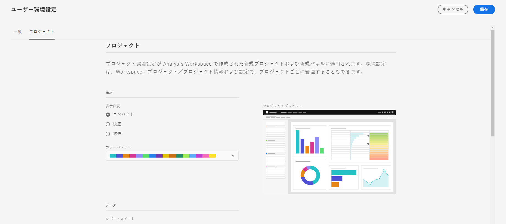

# ユーザー環境設定

[!UICONTROL コンポーネント]/[!UICONTROL ユーザー環境設定]ページでは、ユーザーレベルでAnalysis Workspaceとその関連コンポーネントの設定を管理できます。 ユーザーの環境設定は、すべて&#x200B;**&#x200B;の新しいプロジェクトまたはパネルに適用されます。

## 一般環境設定

一般環境設定は、ブラウザーでの Adobe Analytics エクスペリエンスに適用されます。

| 環境設定 | オプション |
| --- | --- |
| Landing page | <ul><li>プロジェクトリスト（デフォルト）</li><li>空のプロジェクト</li><li>特定のプロジェクト リストから選択される</li></ul> |
| ヒント | <ul><li>有効（デフォルト）</li><li>無効</li></ul> |

## プロジェクトの環境設定

プロジェクトの環境設定は、Analysis Workspaceで作成された新しいプロジェクトや新しいパネルに適用されます。 [!UICONTROL ワークスペース] > [!UICONTROL プロジェクト] > [!UICONTROL プロジェクト情報と設定]の下で、特定の環境設定をプロジェクト単位で管理することもできます。

| セクション | 環境設定 | オプション |
| --- | --- | --- |
| **表示** |  |  |
|  | [表示密度](https://experienceleague.adobe.com/docs/analytics/analyze/analysis-workspace/build-workspace-project/view-density.html?lang=ja) | <ul><li>コンパクト</li><li>快適</li><li>拡張（デフォルト）</li></ul> |
|  | [カラーパレット](https://experienceleague.adobe.com/docs/analytics/analyze/analysis-workspace/build-workspace-project/color-palettes.html?lang=ja) | <ul><li>Adobe が提供するパレット（デフォルト）</li><li>カスタム定義パレット</li></ul> |
| **データ** |  |  |
|  | [レポートスイート](https://experienceleague.adobe.com/docs/analytics/analyze/analysis-workspace/panels/panels.html?lang=ja#report-suite) | <ul><li>最新（デフォルト）</li><li>リストから選択された特定のレポートスイート</li></ul> |
|  | [カレンダー](https://experienceleague.adobe.com/docs/analytics/analyze/analysis-workspace/panels/panels.html?lang=ja#calendar) | 次のリストから選択します。 <ul><li>Adobeが指定する範囲（デフォルトは今月）</li><li>カスタム定義範囲</li></ul> |
|  | [パネルタイプ](https://experienceleague.adobe.com/docs/analytics/analyze/analysis-workspace/panels/panels.html?lang=ja) | <ul><li>フリーフォーム（デフォルト）</li><li>空白</li><li>クイックインサイト</li></ul> |
|  | 数値の形式 | <ul><li>1,000.00（デフォルト）</li><li>1.000,00</li><li>1 000,00</li></ul> |
|  | CSV 区切り文字 文字 | <ul><li>カンマ（デフォルト）</li><li>セミコロン</li><li>コロン</li><li>パイプ</li><li>ピリオド</li><li>空白文字</li><li>タブ</li></ul> |
