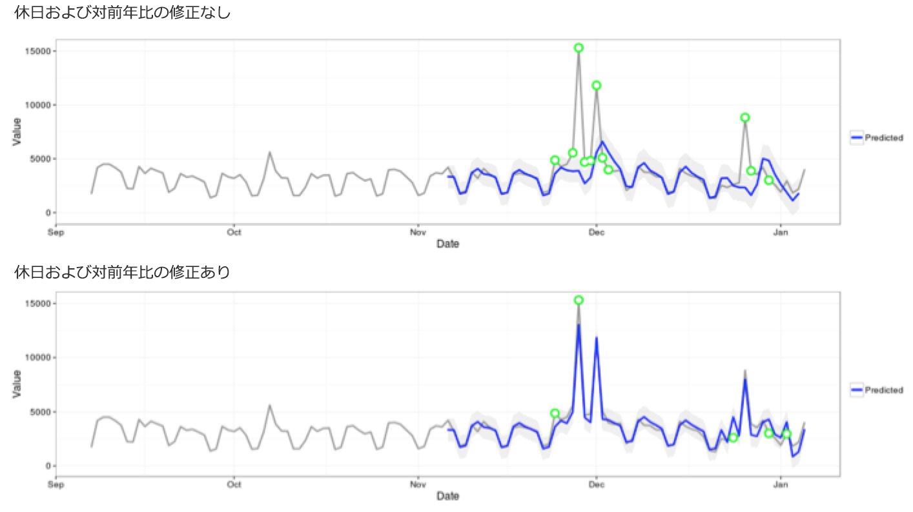

# 異常値検出で使用される統計的手法

Analysis Workspace の異常値検出は、一連の高度な統計的手法を用いて、計測値を異常値と見なすべきかどうかを判定します。

レポートで使用される日付精度に応じて、特に毎時、毎日、毎週/毎月の異常値検出用に、3つの異なる統計的手法が使用されます。各統計的手法の概要を次に示します。

## Anomaly detection for daily granularity {#section_758ACA3C0A6B4D399563ECABFB8316FA}

毎日の精度のレポートの場合、アルゴリズムは、いくつかの重要な要素を考慮して、可能性のある最も正確な結果を産出します。まず、1つの時間系列ベースのモデルまたは外れ値検出モデル（機能フィルタリングと呼ばれる）の2つのクラスのいずれかから選択した使用可能なデータに基づいて、適用するモデルのタイプを決定します。

時系列モデルの選択は、エラーのタイプ、トレンド、シーズナリティ（ETS）の組み合わせに基づいています（[ハインドマンおよびその他の人々（2008）](https://www.springer.com/us/book/9783540719168)を参照）。特に、アルゴリズムは、次の組み合わせを試します。

1. ANA（エラー加算、トレンドなし、シーズナリティ加算）
1. AAA（エラー加算、トレンド加算、シーズナリティ加算）
1. MNM（エラー乗算、トレンドなし、シーズナリティ乗算）
1. MNA（エラー乗算、トレンドなし、シーズナリティ加算）
1. AAN（エラー加算、トレンド加算、シーズナリティなし）

アルゴリズムは、最高の平均絶対誤差率（MAPE）を使用して選択することで、これらのそれぞれの適合性をテストします。ただし、最高の時系列モデルの MAPE が 15％より高い場合、機能フィルタリングが適用されます。通常、繰り返し率の高いデータ（前週比や前月比など）は、時系列モデルに最適です。

モデルの選択後、アルゴリズムは、休日および前年比のシーズナリティに基づいて結果を調整します。休日の場合、アルゴリズムは、レポートの日付範囲に次の休日のいずれかが存在するかどうかをチェックします。

* メモリアルデー（米国のみ）
* 7 月 4 日（米国のみ）
* 感謝祭（米国のみ）
* ブラックフライデー（米国のみ）
* サイバーマンデー（米国のみ）
* 12 月 24 ～ 26 日
* 1 月 1 日
* 12 月 31 日

これらの休日は、顧客のトレンドの最多数に対して最も重要な休日を識別するために、多くの顧客データポイントにわたる広範な統計分析に基づいて選択されました。このリストは、確かにすべての顧客またはビジネスサイクルにとって完全ではありませんが、これらの休日を適用すると、ほぼすべての顧客のデータセットにわたって、アルゴリズムのパフォーマンスに大幅な改善が見られました。

モデルが選択されて、レポートの日付範囲で休日が識別されると、アルゴリズムは、次の方法で進行します。

1. 異常値参照期間を作成します。これには、レポート日付範囲の最大35日前、および一致する日付範囲1年前（必要な場合はうるう日の会計）が含まれます。また、前年の異なるカレンダー日に発生した可能性のある適用可能な休日を含めます。
1. 現在の期間（前年を除く）の休日が最近のデータに基づいて異常かどうかをテストします。
1. 現在の日付範囲の休日が異常である場合、前年の休日を前提として現在の休日の期待値と信頼区間を調整します（前後 2 日間を考慮）。現在の休日の修正は、次の最も低い平均絶対誤差率に基づきます。

   1. 加算効果
   1. 乗算効果
   1. 対前年比の差異

次の例では、クリスマスおよび元日のパフォーマンスが大幅に向上していることがわかります。

## Anomaly detection for hourly granularity {#section_014C9E9209AF43F8A03D5D46E3B3AEE7}

時間単位のデータは、毎日の精度のアルゴリズムと同じ時系列アルゴリズムアプローチに依存しています。ただし、24 時間サイクルと週末／平日サイクルの 2 つのトレンドパターンに大きく依存しています。これら 2 つの季節的影響を把握するために、時間単位のアルゴリズムは、これまでに説明してきたのと同じアプローチを使用した、週末と平日の 2 つの独立したモデルを構成します。

時間単位のトレーニング期間は、336 時間のルックバック期間に依存しています。

## Anomaly detection for weekly and monthly granularities {#section_5D421576BFBC4B24A58DFCC0A6407545}

毎週および毎月のトレンドは、毎日または時間単位の精度で見つかるのと同じ週または月単位のトレンドを提示しないので、このように独立したアルゴリズムが使用されます。毎週および毎月の場合、GESD（Generalized Extreme Studentized Deviate）検定として知られる、2 ステップの外れ値検出アプローチが使用されます。この検定は、調整された箱ひげ図アプローチ（外れ値発見のためのノンパラメトリック手法）を組み合わせて、期待される異常値の最大数を考慮し、外れ値の最大数を判別します。次に、2 つのステップを示します。

1. 調整された箱ひげ図関数：この関数は、入力データを前提とした異常の最大数を判別します。
1. GESD 関数：ステップ 1 の出力と共に入力データに適用されます。

休日および対前年比のシーズナリティの異常値検出ステップは、今年のデータから前年のデータを減算してから、上記の 2 ステッププロセスを使用してもう一度データに対して繰り返して、異常が季節的に適切であることを検証します。これらのデータ精度のそれぞれは、選択したレポート日付範囲（15 ヶ月または 15 週間のどちらか）を含む 15 期間のルックバックおよびトレーニングに関する対応する日付範囲 1 年前を使用します。
