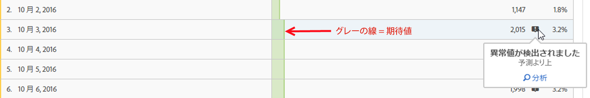
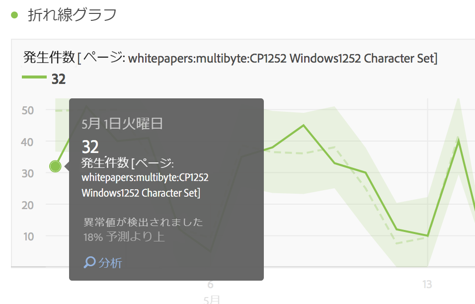
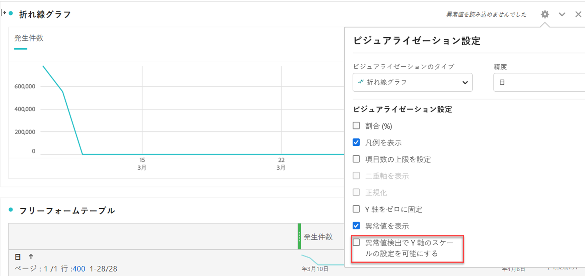

# Analysis Workspaceの異常値の表示

異常値をテーブルまたは線グラフで表示できます。

## View anomalies in a table {#section_869A87B92B574A38B017A980ED8A29C5}

時系列のフリーフォームテーブルで、データの異常値が検出されると、各行に自動的にダークグレーの感嘆符のフラグが設定されるようになりました。

各行のグレーの縦線は、期待値を示します。感嘆符の上にマウスポインターを置くと、異常値が期待値から離れている程度が示されます（+ または - %）。

## View anomalies in a line chart {#section_7C1192AFDB4345A8A2CCFB3AE0C47D82}

折れ線グラフには、薄緑色の信頼帯が異常値（白い点）と共に表示されます。

白い点をクリックすると緑色に変わり、以下が表示されます。

* 異常値が発生した日付
* 異常値の生の値
* 期待値を上回るまたは下回る割合の値。これは緑の実線で表されます。
* [貢献度分析](../../../../analyze/analysis-workspace/virtual-analyst/contribution-analysis/ca-tokens.md)を開始するための分析リンク。

折れ線グラフに複数の指標がある場合、異常値のみが表示され、その指標の信頼帯を表示するには、各異常値の上にマウスポインターを置く必要があります。

異常値検出の信頼区間では、ビジュアライゼーションの Y 軸を自動的に調整しないので、分かりやすくなります。

信頼区間でチャートを調整できるオプションがあります。Just click the Settings (gear) icon and check **[!UICONTROL Allow Anomaly Detection to Scale Y Axis]**.

