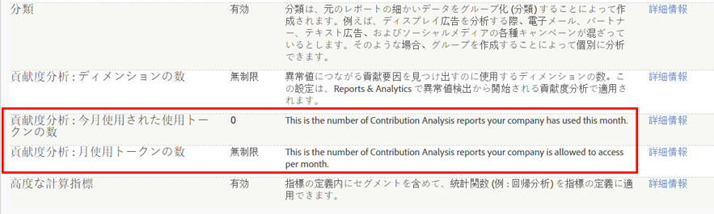

# 貢献度分析の概要

貢献度分析は、選択した指標の統計的な異常値を自動で発見し、予期せぬ顧客の行動や範囲外の値、特定セグメントにおける特定指標の突然の上昇や下降など、相関する原因を特定することで、データ内の隠れたパターンを発見するための機能です。

発生しました。なぜですか？異常値検出レポートが、注文の指標で普通でないスパイクを示しています。普通とは異なる何が起こっているのでしょうか。誰がどのキャンペーンやリンクに反応したのでしょうか。何かが急速に広まったのでしょうか。この異常値に貢献した特定の要因は何でしょうか。そしておそらく最も重要なこととして、どうしたら顧客に関する重要な情報をつかむことができ、このパフォーマンスを繰り返すことができるのでしょうか（または、負の指標の上昇または下降が発生した場合、将来はどうしたら避けることができますか。）

貢献度分析は、データを即座に評価して、異常値が発生した原因を知るのに役立ちます。これまで数週間かかっていた、異常値に対する貢献の分類を数秒で行い、オーディエンスセグメントのパターンを提供して、顧客インタラクションの成功パターンをプランすることを支援します。貢献度分析を戦略的に使用して、重要な相関を特定し、新しいオーディエンスセグメントを作成するか、戦術的に使用して、アラートをトリガーすべき範囲外または不正なアクティビティを識別します。

[異常値検出](/help/analyze/analysis-workspace/virtual-analyst/c-anomaly-detection/anomaly-detection.md)は、選択した指標やオーディエンスセグメントの範囲で、データのスパイクや極端な統計的下降を特定します。トレーニング期間のデータを分析して予測範囲を算出し、指定したイベントそれぞれについて、極端な外れ値をハイライト表示します。注文指標の急激な上昇、バウンス指標の上昇、または両方で下降をレポートでき、統計的に優位な差を持つデータポイントを特定し、さらに貢献度分析で評価できます。統計的な異常値が識別された次のステップとして、貢献度分析を使い、選択したデータポイントとの相関が高いマーケティングやキャンペーン関連の変数を発見することができます。高度なアルゴリズムと機械学習プロセスを実行して、大幅なスパイクまたは下降に貢献した関連性を自動で評価します。この次に、インタラクティブなビジュアライゼーションに計算を表示して、発生した理由とその対処方法について、様々な観点から説明します。

貢献度分析は、異常値が発生した理由とそれへの対応方法を理解するのに役立ちます。重要な指標ごとに隠れたパターンを見つけることで、オーディエンスのインタラクションの全体的な理由や顧客の興味の傾向を把握します。異常値には、2,000 艘のカヤックといった注文ミスなど、簡単に確認や修正を行えるものがあります。特定の対象キャンペーンにのみ反応する、ある地域である期間に現れるトレンドなど、複雑な場合もあります。様々なディメンションやその関連性の指標の貢献項目を総合すると、オーディエンスインタラクションの全体的なアイデアと、異常なデータポイントのコンテキストを得ることができます。

アイデアの例を次に示します。

* 製品需要の変化を監視することで、リマーケティングの可能性を特定する。
* 特定のオーディエンスの興味に対応することで、顧客体験を強化する。
* 範囲外レポートで不正注文を早期に識別する。
* 大量のアクセスとダウンロード数を識別して、企業スパイから自社を守る。
* ページ更新時の Analytics タグ破壊など、運用ミスを監視する。

異常値貢献度分析をスタートさせてしばらくすると、貢献度の高いトップアイテムが合計発生数と貢献度の値の項目の割合で並べられた貢献度の概要レポートが生成されます。正規化された貢献度スコアを使用すると、ディメンション間での比較、対象、関連度の調整ができます。

## Contribution Analysis Tokens - overview {#section_3EF8D2BBCE6E4C309D753BCF04A453D0}

>[!IMPORTANT]
>
>貢献度分析は、Reports&amp; Analytics機能セットから削除されました。現在は、Analysis Workspaceからのみ利用できます。

貢献度分析の権限を持つすべてのお客様は、Analysis Workspace 内で、毎月限られた回数だけ完全な貢献度分析を実行できます。ただし、特定の製品（SiteCatalyst 15）をご利用のお客様や、Analytics Foundation をご利用のお客様、Analytics Select をご利用のお客様は&#x200B;**除外**&#x200B;されます。これらに該当するお客様は、貢献度分析を実行できません。

会社ごとの実行回数は、会社が購入した Adobe Analytics 製品の種類に基づいて付与される月ごとのトークンによって制限されます。これには、貢献度分析へのアクセスを制限して、トークンの誤用を避ける効果があります。

## よくある質問（FAQ） {#section_11D0431AD2014B96AB9561CA66A367CE}

<table id="table_357775E5058644099E26B15A6790E8AF"> 
 <thead> 
  <tr> 
   <th colname="col1" class="entry"> 質問 </th> 
   <th colname="col2" class="entry"> 回答 </th> 
  </tr>
 </thead>
 <tbody> 
  <tr> 
   <td colname="col1"> 
<b>アドビがトークンを導入した理由</b> 
 </td> 
   <td colname="col2"> 
貢献度分析は、2015 年のリリース以降、Adobe Analytics の最も重要な機能の 1 つになりました。一部の Analytics 製品のようにディメンション数を 3 つに制限するのではなく、ごく限られた回数でも 1 ヶ月に何度か「完全な」機能を実行できるようにすることで、制限のない完全な貢献度分析のメリットを実感していただけるものと考えています。 
 </td> 
  </tr> 
  <tr> 
   <td colname="col1"> 
<b>貢献度分析のトークンはどのように機能しますか。プロジェクトに既存の貢献度分析を実装するときもトークンが必要ですか。それとも、新しい貢献度分析を実行するときにのみ、トークンが必要ですか。</b> 
 </td> 
   <td colname="col2"> 
各ログイン会社（各ユーザーではなく）は、1 ヶ月あたり定められた数のトークンを入手します。これらのトークンを使用して、Analysis Workspace 内で「完全な」貢献度分析を実行できます。 
 
新しい貢献度分析を生成するたびにトークンが 1 つ必要です。事前実行された貢献度分析をプロジェクトに実装するときは、トークンは不要です。 
 </td> 
  </tr> 
  <tr> 
   <td colname="col1"> 
<b>Reports &amp; Analytics での貢献度分析にトークンは適用されますか。</b> 
 </td> 
   <td colname="col2"> 
いいえ。2018 年 4 月リリースより、Reports &amp; Analytics で貢献度分析が提供されなくなりました。 
 </td> 
  </tr> 
  <tr> 
   <td colname="col1"> 
<b>トークンを切らしていますが、さらに貢献度分析を実行したい場合はどうしますか。</b> 
 </td> 
   <td colname="col2"> 
別の Adobe Analytics 製品にアップグレードします。例えば、Standard（2 トークン／月）から Ultimate（20 トークン／月）にアップグレードします。トークンを追加購入することはできません。既存のパッケージフレームワーク内でアップグレードする必要があります。 
 </td> 
  </tr> 
  <tr> 
   <td colname="col1"> 
<b>貢献度分析へのアクセスを制限するには、どのようにしますか。</b> 
 </td> 
   <td colname="col2"> 
By default, only admins have access to run Contribution Analyses, but admins can grant access to other users by creating a permission group in the <a href="https://docs.adobe.com/content/help/en/core-services/interface/manage-users-and-products/admin-getting-started.html" format="html" scope="external"> Admin Console </a>. 貢献度分析を使用する権限を持つユーザーのみに対して、貢献度分析を使用する権限を与え、アクセスを不正にしないことを信頼する必要があります。 
 
この権限は、Analytics／管理者／ユーザー管理ホーム／グループの編集／全レポートアクセスを編集／レポートスイートツールをカスタマイズ／ツールとレポートでは「貢献度分析」と呼ばれています。 
 </td> 
  </tr> 
  <tr> 
   <td colname="col1"> 
<b>1 ヶ月あたり使用可能なトークン数は、どうすればわかりますか。また、当月に使用したトークン数は、どうすればわかりますか。</b> 
 </td> 
   <td colname="col2"> 
管理者／会社設定／機能アクセスレベルを表示を選択します。以下のページに、新しい項目が 2 つあります。 
 
 
 </td> 
  </tr> 
 </tbody> 
</table>

## Anomaly Detection and Contribution Analysis entitlements {#section_9278D58F21A840AA9B1ED1BD07A1EF0A}

Analysis Workspace における異常値検出と貢献度分析の詳細な権限のリストを以下に示します。

>[!IMPORTANT]
>
>異常値検出と貢献度分析は、Reports &amp; Analytics の画面から削除され、現在は、Analysis Workspace からのみ使用できます。Adobe Analytics Select および Adobe Analytics Foundation をご利用のお客様は、ワークスペースで「毎日の精度」の異常値検出のみにアクセスできます。

<table id="table_5C9B7E4AE82640B5A913519E576889B5"> 
 <thead> 
  <tr> 
   <th colname="col1" class="entry"> Adobe Analytics の権限 </th> 
   <th colname="col2" class="entry"> 異常値検出 </th> 
   <th colname="col3" class="entry"> 貢献度分析 </th> 
  </tr>
 </thead>
 <tbody> 
  <tr> 
   <td colname="col1"> 
Foundation 
 </td> 
   <td colname="col2"> 
毎日の精度のみ 
 </td> 
   <td colname="col3" colsep="1"> 
トークンなし 
 </td> 
  </tr> 
  <tr> 
   <td colname="col1"> 
<a href="https://www.adobe.com/data-analytics-cloud/analytics/select.html?promoid=B4XQ3X7G&amp;mv=other" format="html" scope="external">Select</a> 
 </td> 
   <td colname="col2"> 
毎日の精度のみ 
 </td> 
   <td colname="col3"> 
トークンなし 
 </td> 
  </tr> 
  <tr> 
   <td colname="col1"> 
<a href="https://www.adobe.com/data-analytics-cloud/analytics/prime.html?promoid=91BF51TR&amp;mv=other" format="html" scope="external">Prime</a> 
 </td> 
   <td colname="col2"> 
○ 
 </td> 
   <td colname="col3"> 
1 ヶ月あたり 10 トークン 
 </td> 
  </tr> 
  <tr> 
   <td colname="col1"> 
<a href="https://www.adobe.com/data-analytics-cloud/analytics/ultimate.html?promoid=8N4B5F1V&amp;mv=other" format="html" scope="external"> Ultimate</a> 
 </td> 
   <td colname="col2"> 
○ 
 </td> 
   <td colname="col3"> 
1 ヶ月あたり 20 トークン 
 </td> 
  </tr> 
  <tr> 
   <td colname="col1"> 
+Predictive Workbench 
 </td> 
   <td colname="col2"> 
○ 
 </td> 
   <td colname="col3"> 
トークン数に制限なし 
 </td> 
  </tr> 
  <tr> 
   <td colname="col1"> 
Standard 
 
    <ul id="ul_73D52020793B44868C9CE0F90893075D"> 
     <li id="li_21EE0871C87E43C8B781219B2BA0FA74">Adobe Analytics Core </li> 
     <li id="li_AB3593200F33439BAEE8FEB13CAE57F4">Adobe Analytics OD </li> 
     <li id="li_2B7D625519BC4A4CB598C95F15D3029B">Adobe Analytics MA </li> 
    </ul> </td> 
   <td colname="col2"> 
○ 
 </td> 
   <td colname="col3"> 
1 ヶ月あたり 2 トークン 
 </td> 
  </tr> 
  <tr> 
   <td colname="col1"> 
Premium（360、Attribution） 
 </td> 
   <td colname="col2"> 
○ 
 </td> 
   <td colname="col3"> 
1 ヶ月あたり 2 トークン 
 </td> 
  </tr> 
  <tr> 
   <td colname="col1"> 
Premium（Complete、<a href="https://www.adobe.com/data-analytics-cloud/analytics/predictive-intelligence.html" format="html" scope="external">Predictive Intelligence</a>） 
 </td> 
   <td colname="col2"> 
○ 
 </td> 
   <td colname="col3"> 
トークン数に制限なし 
 </td> 
  </tr> 
 </tbody> 
</table>
