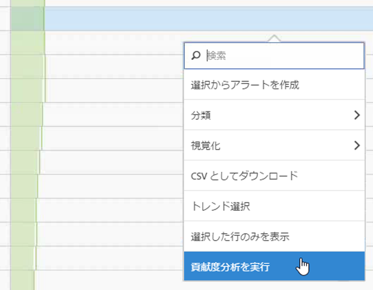
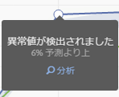
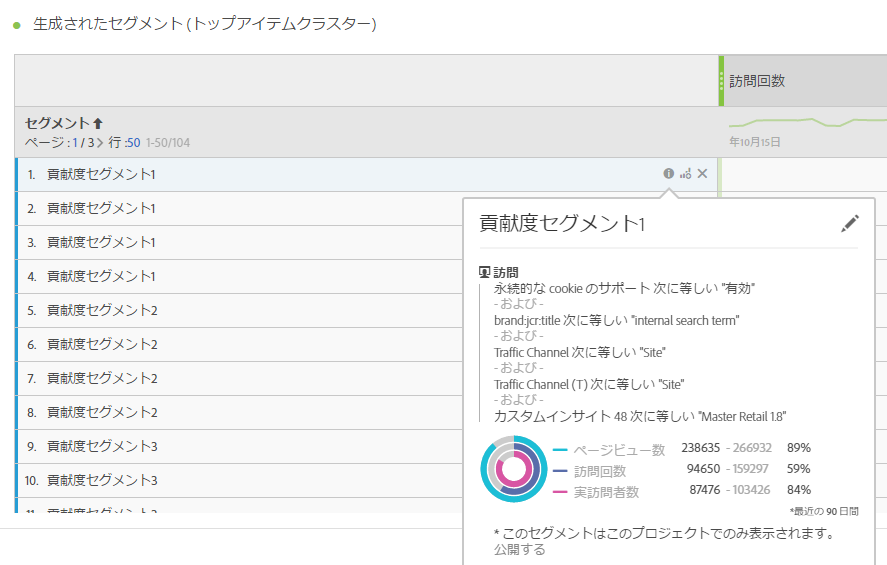
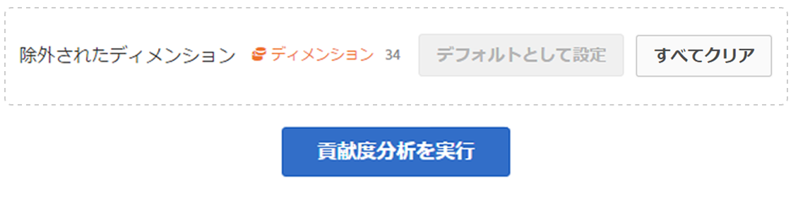
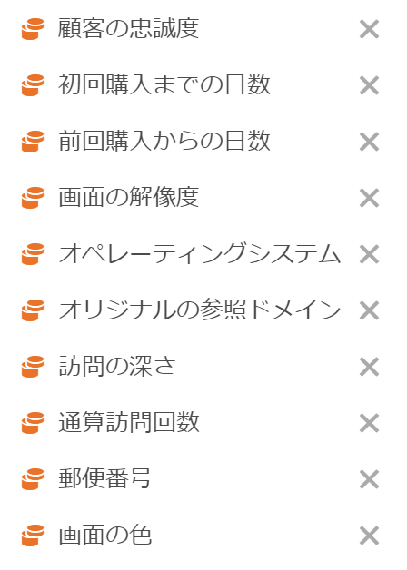

# 貢献度分析の実行

貢献度分析は、Adobe Analytics で異常値と見なされた結果に貢献した要因を発見するために設計された、集中的な機械学習プロセスです。目的は、ユーザーが、別の方法よりもずっと迅速に、焦点を当てるべき領域や追加の分析のオポチュニティを見つけるのを支援することです。

## 貢献度分析の実行 {#section_7D2C5E48A5664727941DF4C90976D9DC}

プロジェクトで貢献度分析を呼び出すには、2 つの方法があります。

* In a freeform table with daily granularity, right-click any row and select **[!UICONTROL Run Contribution Analysis]**. 異常値が表示されていない行でも実行できます。

   >[!NOTE]
   >
   >現在、貢献度分析は毎日の精度でのみサポートされています。

   

* 折れ線グラフでは、折れ線グラフの異常値データポイントの上にマウスポインターを置きます。表示される&#x200B;**[!UICONTROL 分析]リンクをクリックします。**

   

1. （オプション）折れ線グラフまたはテーブルで&#x200B;**[!UICONTROL 貢献度分析を実行]**&#x200B;をクリックしたら、[ディメンションを除外](../../../../analyze/analysis-workspace/virtual-analyst/contribution-analysis/run-contribution-analysis.md#section_F6932F4BF74544B5872164E7B1E0C6FC)することで、分析の範囲を狭める（その結果、スピードアップする）ことができます。

1. 貢献度分析が読み込まれるまでしばらく待ちます。レポートスイートのサイズおよびディメンションの数によって、これには、かなりの時間がかかる可能性があります。貢献度分析は、ディメンションあたり上位 50,000 項目の分析を実行します。
1. 次に、このプロジェクト内に直接新しい貢献度分析パネルが読み込まれます。以前 Reports &amp; Analytics の貢献度分析を使用したことがあるユーザーは、多くのパネルを既に目にしたことがあるでしょう。

   * その日の&#x200B;**訪問**&#x200B;数を表示するビジュアライゼーション。
   * コンテキストに関する毎月の&#x200B;**訪問トレンドライン**。
   * [貢献度スコア](https://marketing.adobe.com/resources/help/en_US/analytics/contribution/ca_contribution_score.html)で並べ替えられた、この異常値に貢献した&#x200B;**トップアイテム**。加えて、問題の指標と、サイズの観点から指標を文脈の中でとらえるための実訪問者数指標。

   * [生成されたセグメント](https://marketing.adobe.com/resources/help/en_US/analytics/contribution/ca_workflow_premium.html)（トップアイテムクラスター）テーブルは、貢献度スコア、異常値の発生数、異常な指標に貢献する全体的な割合に基づいて、トップアイテムの関連性を識別します。これは、その後、オーディエンスセグメントとしてキャプチャされます（貢献度セグメント 1、貢献度セグメント 2 など）。「i」（情報）ボタンをクリックすると、構成する上位の項目を含む、各自動セグメントの定義が表示されます。

      

1. 貢献度分析は、Analysis Workspace の一部なので、テーブルの右クリックメニューから数多くの機能を活用して、分析を一層意味のあるものにすることができます。例えば、次のような機能があります。

   * [各ディメンション項目を別のディメンションで分類する](../../../../analyze/analysis-workspace/components/dimensions/t-breakdown-fa.md#task_B594DA2476E84DFDA8279E831F0BD9C4)
   * [1 つまたは複数の行のトレンドを示す](../../../../analyze/analysis-workspace/analysis-workspace-features.md#section_34930C967C104C2B9092BA8DCF2BF81A)
   * [新しいビジュアライゼーションを追加する](../../../../analyze/analysis-workspace/visualizations/freeform-analysis-visualizations.md#concept_09242627629147A88A68F1506954C276)
   * [アラートを作成する](/help/components/c-alerts/intellligent-alerts.md)
   * [セグメントを作成したり比較したりする](../../../../analyze/analysis-workspace/c-panels/c-segment-comparison/segment-comparison.md#concept_74FAC1C6D0204F9190A110B0D9005793)

>[!NOTE]
>
>貢献度分析内の青い点とリンクされたインテリジェントアラートプロジェクトの異常値を強調表示します。これにより、分析された異常値がより明確に示されます。

## Exclude dimensions from Contribution Analysis {#section_F6932F4BF74544B5872164E7B1E0C6FC}

貢献度分析から一部のディメンションを除外したい場合があります。例えば、ブラウザーまたはハードウェア関連のディメンションは関係がなく、これらを削除することで分析を高速化したい場合です。

1. 「**[!UICONTROL 貢献度分析を実行]**」（または折れ線グラフの「**[!UICONTROL 分析]」）をクリックすると、**&#x200B;除外されたディメンション&#x200B;**パネルが表示されます。**

1. Just drag any unwanted dimensions into the **[!UICONTROL Excluded Dimensions]** panel, then save the list by clicking **[!UICONTROL Set as Default]**. または、「**[!UICONTROL すべてクリア]」をクリックして、除外するディメンションを選択することからやり直します。**

   

1. 除外するディメンションを追加したら（または除外しないものを選択したら）、もう一度「**[!UICONTROL 貢献度分析を実行]」をクリックします。**
1. 除外されたディメンションのリストを変更する必要がある場合はいつでも、ディメンションをダブルクリックすると、除外されたディメンションのリストが表示されます。

   

1. Just delete any unwanted dimensions by clicking the x next to them, then save the list by clicking **[!UICONTROL Set as Default]**.

