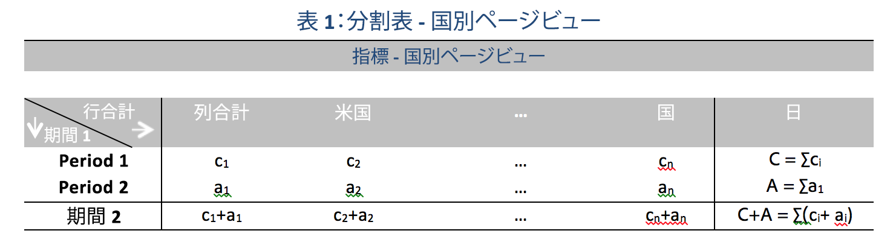

# 貢献度分析で使用される統計的手法

貢献度分析は、Adobe Analytics で異常値と見なされた結果に貢献した要因を発見するために設計された、集中的な機械学習プロセスです。目的は、ユーザーが、別の方法よりもずっと迅速に、焦点を当てるべき領域や追加の分析のオポチュニティを見つけるのを支援することです。

貢献度分析は、ユーザーの貢献度分析レポートで使用可能なディメンション項目ごとに 2 つのアルゴリズムを実行することによってこれを実現します。アルゴリズムは、次の順番で動作します。

1. 各ディメンションの場合、クラメールの V 検定統計を計算します。次の例では、2 つの期間にわたる国別ページビュー数の分割表について検討します。

   

   表 1 では、クラメールの V は、期間 1（例：履歴）および期間 2（例：異常値が発生した日）の国別ページビュー数の間の関連を測定するのに使用できます。クラメールの V の低い値は、関連が低レベルであることを示しています。クラメールの V の範囲は、0（関連なし）から 1（完全な関連性）です。クラメールの V 統計は、次のように計算されます。

   

1. 各ディメンション項目の場合、ピアソン残差（PR）が、異常な指標と各ディメンション項目の間の関連の測定に使用されます。PR は、標準正規分布に従い、偏差が比較可能でなくてもアルゴリズムで 2 つのランダム変数の PR を比較できます。実際には、エラーは不明で、有限のサンプル補正を使用して見積もられます。

   前の例の表 1 では、国 i および期間 2 の有限サンプル補正を含む PR は、次の式によって得られます。

   

   ここで、

   

   （同様の式が期間 1 に対しても得られます。）

   最終結果として、各ディメンション項目のスコアは、クラメールの V 指標で重み付けされ、0 ～ 1 の数値に再測定されて、貢献度スコアが提供されます。

