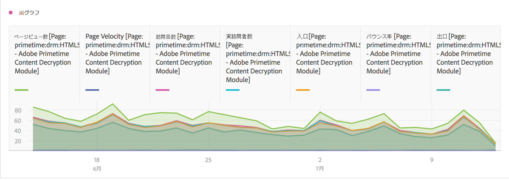
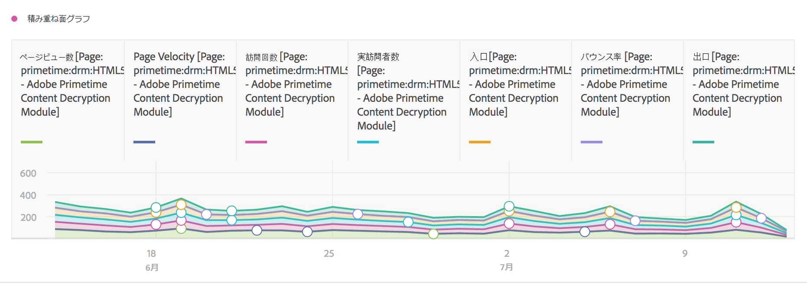
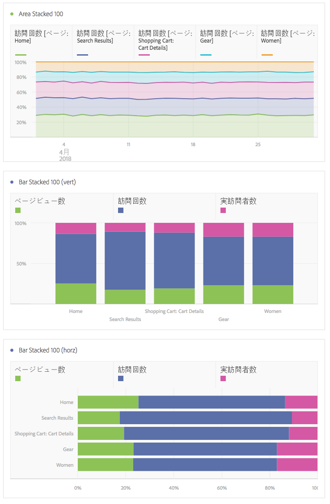

# 領域と領域

## 面グラフ {#section_FDC4B6AA944F4F8AAAEAA5E17359F28A}

このビジュアライゼーションは折れ線グラフに似ていますが、線の下に色付きの領域があります。指標が複数あり、2 個以上の指標の交差により表現される領域を視覚化する場合は、面グラフを使用します。

## Area stacked {#section_922BBC5A6D254778A050DF710B0BD8D9}

このビジュアライゼーションは面グラフに似ていますが、各系列は前の系列の上から開始されています。

積み重ね面グラフのビジュアライゼーションを「100% の積み重ね」に変更する新しい設定が追加されました。

