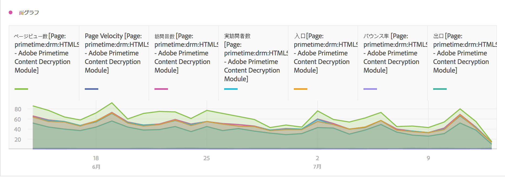
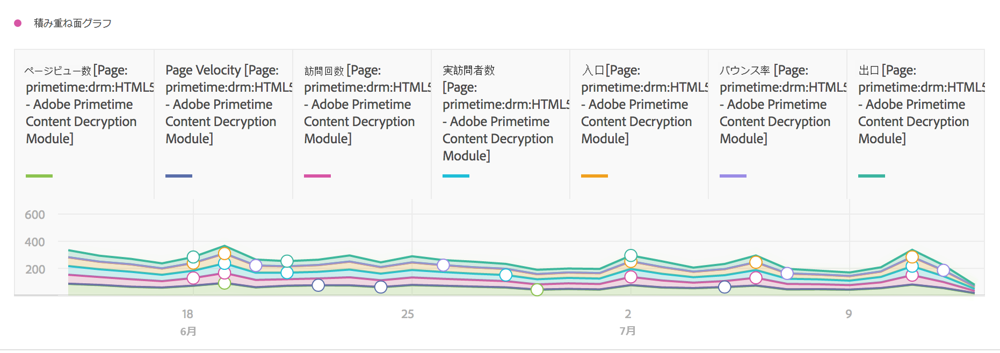

# 積み重ね面グラフ

>[!BEGINSHADEBOX]

_この記事では、この記事の_  _&#x200B;**Customer Journey Analytics**&#x200B;版の[&#x200B; エリアとエリアの積み重ね](https://experienceleague.adobe.com/ja/docs/analytics-platform/using/cja-workspace/visualizations/area)を参照してください。 _&#x200B;**Adobe Analytics**。_ _この記事の__

>[!ENDSHADEBOX]

面グラフビジュアライゼーションには、標準および積み重ねオプションがあります。

## 面グラフ {#area}

<!-- markdownlint-disable MD034 -->

>[!CONTEXTUALHELP]
>id="workspace_area_button"
>title="階層グラフ"
>abstract="複数の指標の積集合を表す、階層グラフのビジュアライゼーションを作成します。"

<!-- markdownlint-enable MD034 -->

 **[!UICONTROL 面グラフ]**&#x200B;ビジュアライゼーションは折れ線グラフに似ていますが、線の下に色付きの領域があります。 指標が複数あり、2 個以上の指標の積集合により表現される領域を視覚化する場合は、面グラフを追加します。

## 積み重ね面グラフ {#area-stacked}

<!-- markdownlint-disable MD034 -->

>[!CONTEXTUALHELP]
>id="workspace_areastacked_button"
>title="積み重ね面グラフ"
>abstract="複数の指標の積み重ねを表す、階層グラフのビジュアライゼーションを作成します。"

<!-- markdownlint-enable MD034 -->

 **[!UICONTROL 積み重ね面グラフ]**&#x200B;ビジュアライゼーションは面グラフに似ていますが、各系列は前の系列の上から開始されています。

 **[!UICONTROL 設定]**&#x200B;の「**[!UICONTROL 100％積み重ね]**」オプションを使用すると、グラフを 100％積み重ねビジュアライゼーションに変換できます。

>[!MORELIKETHIS]
>
>[&#x200B; パネルへのビジュアライゼーションの追加](/help/analyze/analysis-workspace/visualizations/freeform-analysis-visualizations.md#add-visualizations-to-a-panel)
>[ビジュアライゼーション設定](/help/analyze/analysis-workspace/visualizations/freeform-analysis-visualizations.md#settings)
>[ビジュアライゼーションコンテキストメニュー](/help/analyze/analysis-workspace/visualizations/freeform-analysis-visualizations.md#context-menu)
>
