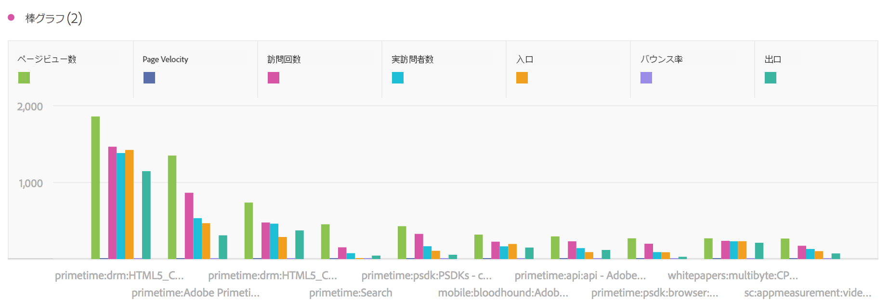
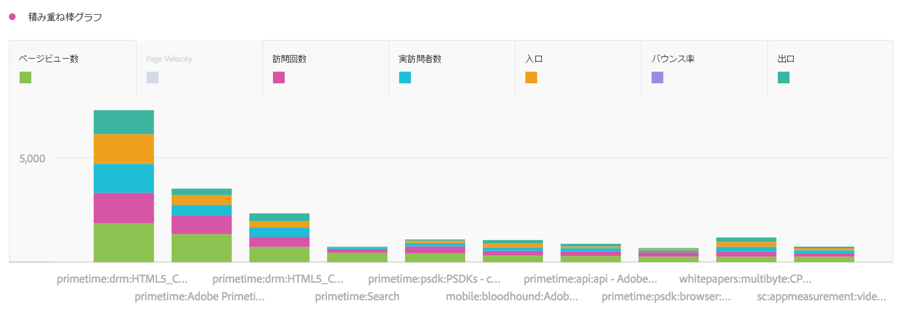

# 棒グラフと横向き棒グラフ

## 棒グラフ {#section_2E96E55D4E8E488CBCA6A3508DDF3918}

このビジュアライゼーションでは、1 つ以上の指標の様々な値を表す縦棒グラフが表示されます。

ビジュアライゼーション設定の精度のドロップダウンにより、トレンドのビジュアライゼーション（折れ線、棒など）を日別から週別、月別などに変更できます。

## Bar stacked {#section_9EA83779AE964635907EE5031A785A49}

このビジュアライゼーションは棒グラフに似ていますが、系列を表す棒は相互に積み重なっています。

積み重ね棒グラフのビジュアライゼーションを「100% の積み重ね」に変更する新しい設定が追加されました。

