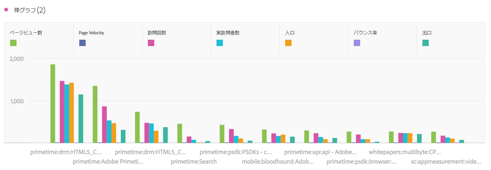
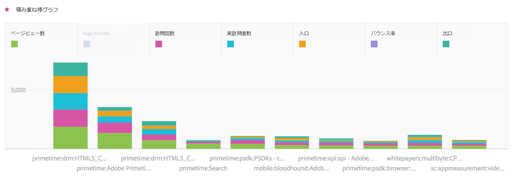

# 積み重ね棒グラフ

>[!BEGINSHADEBOX]

_この記事では、この記事の_  _**Customer Journey Analytics**&#x200B;版の[ バーとバーの積み重ね](https://experienceleague.adobe.com/ja/docs/analytics-platform/using/cja-workspace/visualizations/bar)を参照してください。__**Adobe Analytics**。_ _ バーとバーの積み重ね&#x200B;_を参照してください。

>[!ENDSHADEBOX]

棒グラフビジュアライゼーションには、標準と積み重ね棒グラフのオプションがあります。

## 棒グラフ {#bar}

<!-- markdownlint-disable MD034 -->

>[!CONTEXTUALHELP]
>id="workspace_bar_button"
>title="棒グラフ"
>abstract="1 つ以上の指標の様々な値を表す、棒グラフのビジュアライゼーションを作成します。"

<!-- markdownlint-enable MD034 -->

この  **[!UICONTROL 棒グラフ]**&#x200B;ビジュアライゼーションでは、1 つ以上の指標の様々な値を表す縦棒グラフが表示されます。

ビジュアライゼーション設定の精度ドロップダウンでは、トレンドビジュアライゼーション（折れ線、棒など）を日別から週別、月別などに変更できます。

## 積み重ね棒グラフ {#bar-stacked}

<!-- markdownlint-disable MD034 -->

>[!CONTEXTUALHELP]
>id="workspace_barstacked_button"
>title="積み重ね棒グラフ"
>abstract="1 つ以上の積み重ね指標の様々な値を表す、棒グラフのビジュアライゼーションを作成します。"

<!-- markdownlint-enable MD034 -->

 **[!UICONTROL 積み重ね棒グラフ]**&#x200B;ビジュアライゼーションは棒グラフに似ていますが、系列を表す棒は相互に積み重なっています。

 **[!UICONTROL 設定]**&#x200B;の「**[!UICONTROL 100％積み重ね]**」オプションを使用すると、グラフを 100％積み重ねビジュアライゼーションに変換できます。

>[!MORELIKETHIS]
>
>[ パネルへのビジュアライゼーションの追加](/help/analyze/analysis-workspace/visualizations/freeform-analysis-visualizations.md#add-visualizations-to-a-panel)
>[ビジュアライゼーション設定](/help/analyze/analysis-workspace/visualizations/freeform-analysis-visualizations.md#settings)
>[ビジュアライゼーションコンテキストメニュー](/help/analyze/analysis-workspace/visualizations/freeform-analysis-visualizations.md#context-menu)
>