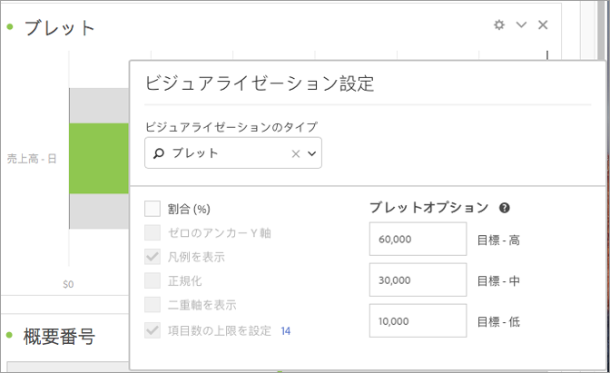

# ブレットグラフ

目的の値が、他のパフォーマンス範囲（目標）と照らし合わせて、どのように比較または測定されるかを確認できます。

ブレットグラフには、単一の主要な測定値（例えば、現在の年から日付までの売上）があり、定性的な範囲のパフォーマンス範囲を入力できます（例えば、ターゲットの売上高と比較して）。高、中、低のいずれかを指定できます。「[!UICONTROL ビジュアライゼーション設定]」で目標範囲を指定できます。
