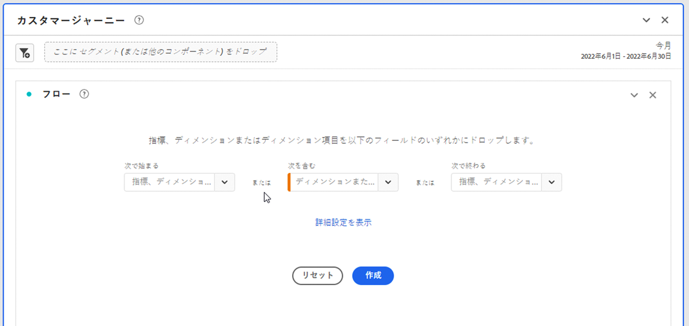
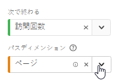
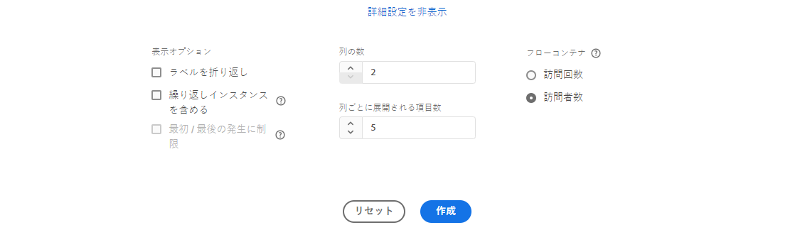
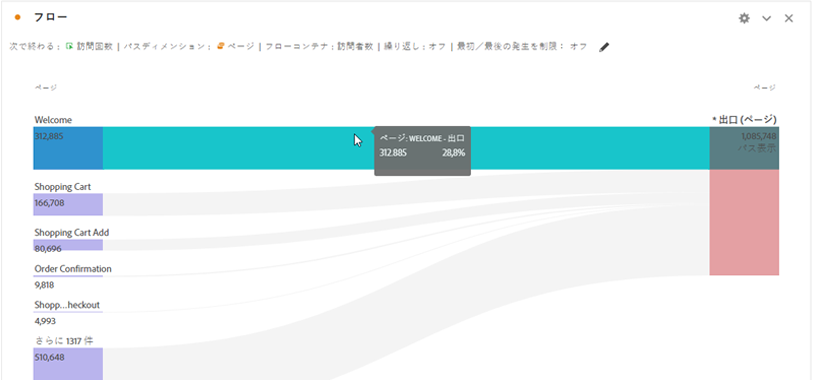
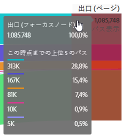

# フロービジュアライゼーションの設定

>[!NOTE]
>
>この新しいバージョンの [!UICONTROL フロー] ビジュアライゼーションは現在、限られたテストになっています。

更新されたフロービジュアライゼーションを使用すると、Web サイトやアプリ上の特定のコンバージョンイベントに由来する、またはそれに至るジャーニーを把握できます。 ディメンション（およびディメンション項目）または指標を通るパスをトレースします。 フローでは、目的のパスの開始または終了を設定したり、ディメンションまたはディメンション項目を流れるすべてのパスを分析したりできます。

新しい [!UICONTROL 流れ] エクスペリエンスは、いくつかの方法でワークフローを強化します。

* 指標とパスディメンションを組み合わせて、パスの開始または終了を選択できるようになりました。
* 次を含む [!UICONTROL 詳細設定] を追加すると、 [!UICONTROL 流れ].
* 新しい「ビルド」ボタンを使用すると、ジャーニーを一度に設定し、クエリを実行して、複数の列とノードを一度に自動的に構築できるので、分析にかかる時間を節約できま&#x200B;す。

## 設定の手順 {#configure}

1. フロー図の作成を開始するには、プロジェクトに空のパネルを追加し、左側のパネルのビジュアライゼーションアイコンをクリックします。 次に、フロービジュアライゼーションをパネルにドラッグします。 または、 [!UICONTROL フロー] ビジュアライゼーションを既存のプロジェクトに組み込む。

1. 次の 3 つのオプションのいずれかを使用して、フロービジュアライゼーションをアンカーします。

   * [!UICONTROL 次で始まる] （指標、ディメンション、または項目）、
   * [!UICONTROL 次を含む] （ディメンション、または項目）、
   * [!UICONTROL 次で終わる] （指標、ディメンションまたは項目）

   これらの各カテゴリは、画面上に「ドロップゾーン」として表示されます。ドロップゾーンは次の 3 つの方法で設定できます。

   * ドロップダウンメニューを使用して、指標またはディメンションを選択します。
   * ディメンションまたは指標のリストから項目をドラッグします。
   * 検索を使用して、探している指標またはディメンションを見つけます。

   例えば、チェックアウトイベントに至るまでのすべての情報を追跡するとします。 チェックアウト関連のディメンションまたは指標 ( [!UICONTROL 注文が存在します]) を **[!UICONTROL 次で終わる]** ドロップゾーン。

1. 指標を選択する場合は、 [!UICONTROL パスDimension]を作成します。 デフォルトはです。 [!UICONTROL ページ].

   

   >[!IMPORTANT]
   >
   >計算指標は  **[!UICONTROL 次で始まる]** または **[!UICONTROL 次で終わる]** ドロップゾーン。

1. （オプション）「 **[!UICONTROL 詳細設定を表示]** 詳細設定を構成するには：

   

   | 設定 | 説明 |
   | --- | --- |
   | **[!UICONTROL ラベルを折り返し]** | 通常、フロー要素のラベルは、画面の領域を節約するために切り捨てられます。しかし、このチェックボックスをオンにすることで完全なラベルを表示できます（デフォルト = オフ）。 |
   | **[!UICONTROL 繰り返しインスタンスを含める]** | フロービジュアライゼーションは、ディメンションのインスタンスに基づいています。この設定により、ページのリロードなど、繰り返し発生するインスタンスを含めるか除外するかを選択できます。ただし、listVar、listProp、s.product、マーチャンダイジング eVar など複数の値を持つディメンションを含むフロービジュアライゼーションから、繰り返しを削除することはできません。（デフォルト = オフ）。 |
   | **[!UICONTROL 最初／最後の発生件数に制限]** | ディメンション、項目、指標の 1 番目/最後の出現で始まる/最後に終わるパスにパスを制限します。 詳しくは、以下の「最初/最後のオカレンスに制限するシナリオの例」の節を参照してください。 |
   | **[!UICONTROL 列の数]** | フロー図で必要な列数を決定します。 |
   | **[!UICONTROL 列ごとに展開された項目]** | 各列に必要な項目数。 |
   | **[!UICONTROL フローコンテナ]** | <ul><li>訪問</li><li>訪問者。</li></ul> 「訪問」と「訪問者」を切り替えて、訪問者のパスを分析できます。これらの設定により、訪問者のエンゲージメントを（訪問全体にわたって）訪問者レベルで分析したり、1 回の訪問に分析を制限したりできます。 |

1. 「**[!UICONTROL 作成]**」をクリックします。

## フロー出力の表示と変更 {#output}

図の上部に、フロー設定の概要が表示されます。 図のパスは比例します。アクティビティの多いパスは太く表示されます。

データをさらに詳しく調べるには、次の複数のオプションがあります。

* フロー図はインタラクティブです。図にマウスポインターを置いて、表示する詳細情報を変更します。

* 図のノードをクリックすると、そのノードの詳細が表示されます。ノードを再度クリックして折りたたみます。

   

* 列にフィルターを適用して、特定の結果（含める、除外する、条件を指定するなど）のみを表示できます。

* 左側のプラス記号 (+) をクリックして、列を展開します。

* 出力をさらにカスタマイズするには、以下に説明する右クリックのオプションを使用します。

* 設定概要の横にある鉛筆アイコンをクリックして、フローをさらに編集するか、別のオプションで再構築します。

* さらに、**[!UICONTROL プロジェクト]**／**[!UICONTROL CSV をダウンロード]**&#x200B;に移動して、プロジェクトの .CSV ファイルの一部としてフロー図を書き出し、分析することもできます。

## フィルター

各列の上にカーソルを置くと、フィルターが表示されます。 フィルターをクリックすると、今日のフリーフォームテーブルに存在するのと同じフィルターダイアログが表示されます。 このフィルターは、フリーフォームテーブルの場合と同じように機能します。

* 詳細設定を使用して、特定の条件を演算子のリストに含めたり除外したりします。
* リストから項目をフィルターすると、その特定の列にフィルターが反映されます。 ( フィルターは、フィルターで許可されている項目のみを表示するように減らすか、フィルターで必要な 1 つの項目を除くすべての項目を削除します。
* 残りのノードにデータが流れ込む限り、すべてのダウンストリーム列とアップストリーム列が保持されます。
* 適用すると、フィルターアイコンが、フィルター対象の列の上に青色で表示されます。
* フィルターを削除するには、フィルターアイコンをクリックして、フィルターメニューを開きます。 適用したフィルターを削除し、「 **[!UICONTROL 保存]**. フローは、フィルターを適用せずに前の状態に戻ります。

## 右クリックのオプション {#right-click}

| オプション | 説明 |
|--- |--- |
| [!UICONTROL このノードにフォーカス] | 選択したノードにフォーカスを変更します。フロー図の中央にフォーカスノードが表示されます。 |
| [!UICONTROL やり直し] | 新しいフロー図を作成できる、フリーフォーム図ビルダーに戻ります。 |
| [!UICONTROL フローのこのポイントからセグメントを作成] | セグメントの作成. 新しいセグメントを設定できる、セグメントビルダーに移動します。 |
| [!UICONTROL 分類] | 利用可能なディメンション、指標、時間でノードを分類します。 |
| [!UICONTROL トレンド] | ノードのトレンド図を作成します。 |
| [!UICONTROL 列全体を展開] | 列を展開して、すべてのノードを表示します。デフォルトでは、上位 5 つのノードのみ表示されます。 |
| [!UICONTROL 列全体を折りたたむ] | すべてのノードを列内に隠します。 |
| [!UICONTROL 項目を除外]/[!UICONTROL 除外された項目を復元] | 特定のノードを列から削除し、列の上部にフィルターとして自動的に作成します。 除外した項目を復元するには、再度右クリックし、「 」を選択します。 **[!UICONTROL 除外された項目を復元]**. また、列の上部にあるフィルターを開き、除外した項目の pillbox を削除することもできます。 |

## 「最初/最後のオカレンスに制限」のシナリオの例

このオプションを使用する場合は、次の点に注意してください。

* **[!UICONTROL 最初/最後の繰り返しに制限]** は系列内の最初と最後の出現のみをカウントします。 その他すべての **[!UICONTROL 次で始まる]** または **[!UICONTROL 次で終わる]** 条件が破棄されます。
* を **[!UICONTROL 次で始まる]** フローの場合、開始条件に一致する最初のオカレンスのみが含まれます。
* を **[!UICONTROL 次で終わる]** フローの場合、最後の条件に一致するオカレンスのみが含まれます。
* 使用されるシリーズは、コンテナによって異なります。 を使用する場合、 **[!UICONTROL 訪問]** コンテナの場合、一連のヒットはセッションになります。 を使用する場合、 **[!UICONTROL 訪問者]** コンテナの場合、一連のヒットは、指定した日付範囲にある特定のユーザーのすべてのヒットです。
* この **[!UICONTROL 最初/最後の繰り返しに制限]** オプションは、「次の語句で始まる」または「次の語句で終わる」フィールドで指標またはDimension項目を使用する場合に、詳細設定で設定できます。

一連のヒットの例：

ホーム/製品/買い物かごに追加/製品/買い物かごに追加/請求/注文の確認

### 次の設定を使用してフロー分析を検討します。

* 開始[!UICONTROL  買い物かごに追加] (Dimension項目 )
* [!UICONTROL ページ] パスディメンション
* [!UICONTROL 訪問] コンテナ

「最初/最後のアイテムに制限」が無効になっている場合、この 1 回のヒットで「買い物かごに追加」の発生回数が 2 回カウントされます。
予想されるフロー出力：&quot;買い物かごに追加&quot; (2) —> &quot;製品&quot; (1) -> &quot;請求&quot; (1)

ただし、「最初と最後のオカレンスに制限」が有効な場合は、「買い物かごに追加」の最初のオカレンスのみが分析に含まれます。
予想されるフロー出力：&quot;買い物かごに追加&quot; (1) —> &quot;製品&quot; (1)

### 同じ一連のヒットについて考えて、次の設定を使用します。

* 次で終わる [!UICONTROL 買い物かごに追加] (Dimension項目 )
* [!UICONTROL ページ] パスディメンション
* [!UICONTROL 訪問] コンテナ

If **[!UICONTROL 最初/最後の繰り返しに制限]** が *無効*に値を入力しない場合、この 1 回のヒットシリーズでは、「買い物かごに追加」の 2 回の発生としてカウントされます。
予想されるフロー出力：&quot;製品&quot; (2) &lt;— &quot;買い物かごに追加&quot; (2)

ただし、 **[!UICONTROL 最初/最後の繰り返しに制限]** が *有効*( 最後に出現する [!UICONTROL 買い物かごに追加] が分析に含まれます。
予想されるフロー出力：&quot;製品&quot; (1) &lt;— &quot;買い物かごに追加&quot; (1)
