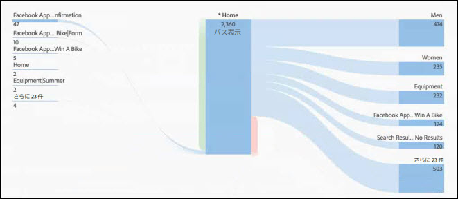
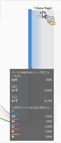
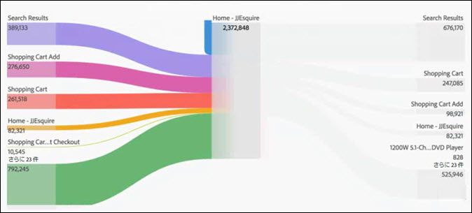
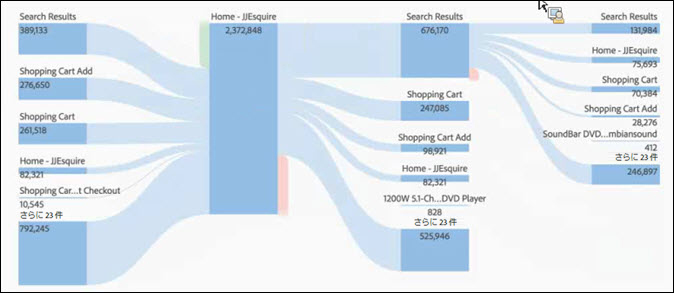

# フロービジュアライゼーションの設定

フローを使用すると、eVar など、ページやディメンションのパスをトラッキングできます。

* 入口（ディメンションのみ）
* ディメンションまたは項目
* 出口（ディメンションのみ）

これらの各カテゴリは、画面上に「ドロップゾーン」として表示されます。リストから項目をドラッグして、目的のドロップゾーンにドロップします。ディメンションでないページおよび他の項目は、中央のドロップゾーンにのみ配置できます。ディメンションを中央のゾーンにドロップすると、レポートが自動的に実行され、そのディメンションのトップアイテムが挿入されます。

項目をドロップゾーンにドロップすると、フロー図が開きます。フロー図のコンテンツは、ディメンションまたは項目をドロップしたドロップゾーンによって異なります。出口および入口は、入口または出口ドロップゾーンにドロップしたディメンション（ページなど）のすべての項目を表します。例えば、ディメンションを特定のドロップゾーンにドロップすると、そのディメンションのフロー図が開きます。

図の中央の「ノードをフォーカス」にマウスポインターを置いて、そのノードに関する情報を表示します。

フロー図はインタラクティブです。図にマウスポインターを置いて、表示する詳細情報を変更します。

図のパスは比例します。アクティビティの多いパスは太く表示されます。

図のノードをクリックすると、そのノードの詳細が表示されます。例えば、上部の図の右上にある「**[!UICONTROL Search Results]」（検索結果）をクリックすると、図が展開されて、検索結果ノードに関する詳細が表示されます。**&#x200B;折りたたむには、もう一度ノードをクリックします。

デフォルトでは、図には上位 5 つのフローが表示されます。図の下部にある「**[!UICONTROL さらに x 件]」ノードをクリックすると、図が展開されて、5 位以下のフローが表示されます。**&#x200B;引き続き「**[!UICONTROL さらに x 件]」をクリックして、追加のフローが表示されなくなるまで展開します。**

フロー図内で表示できるフロー数に制限はありません。

**[!UICONTROL プロジェクト]** / **[!UICONTROL CSVをダウンロードに移動して、フロー図をプロジェクトの. CSVファイルの一部として書き出し、さらに分析]**&#x200B;することもできます。
