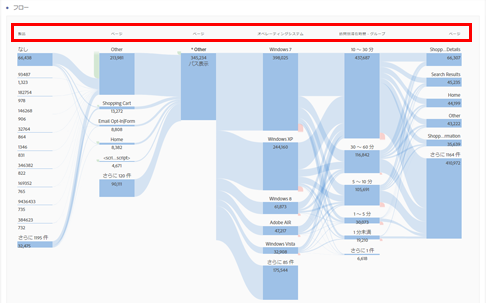
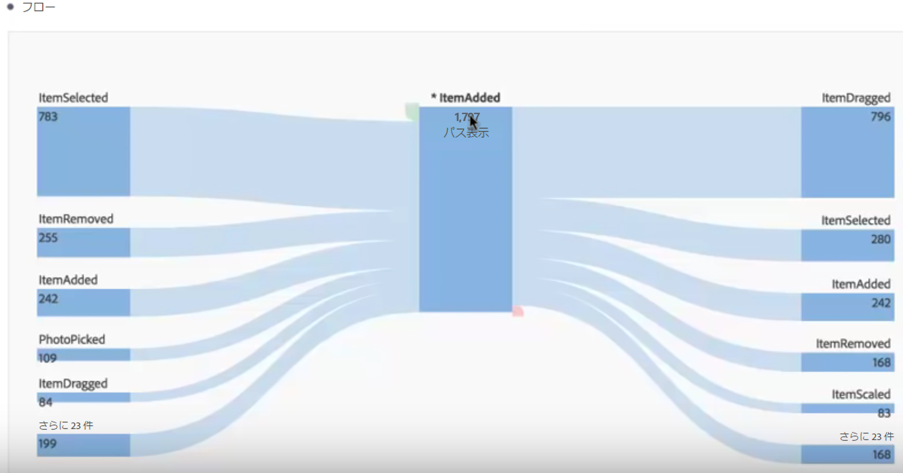
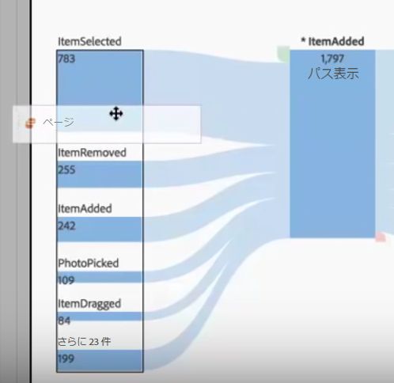
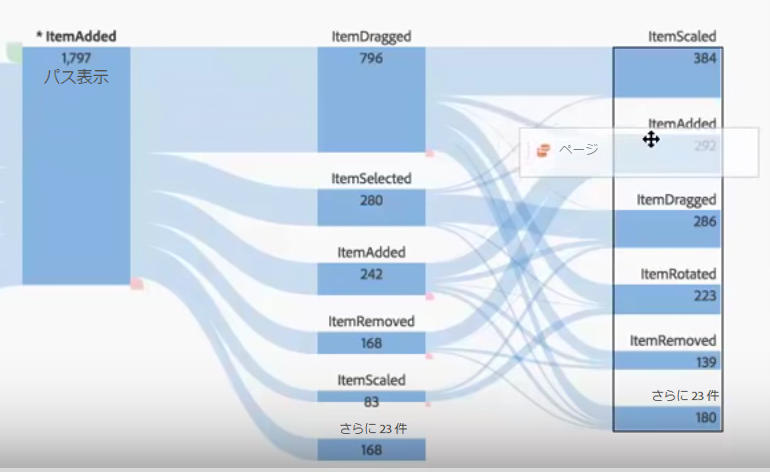
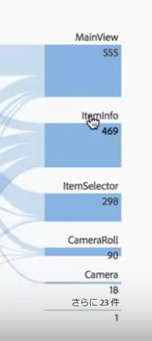
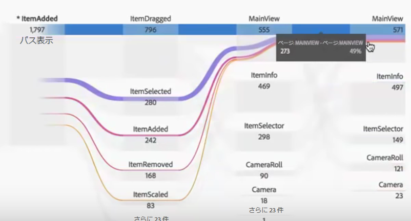
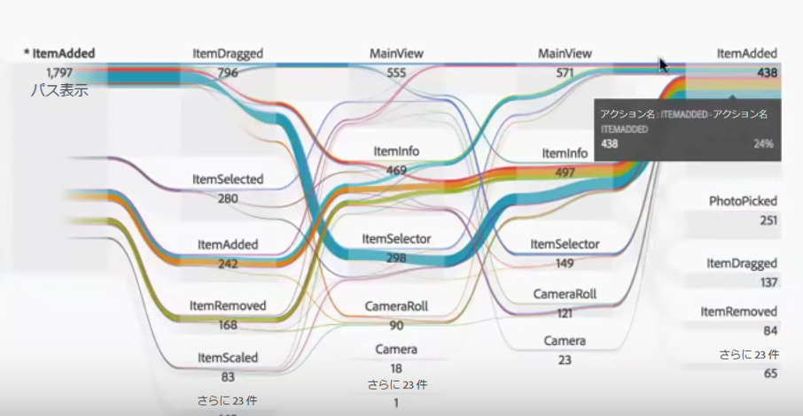
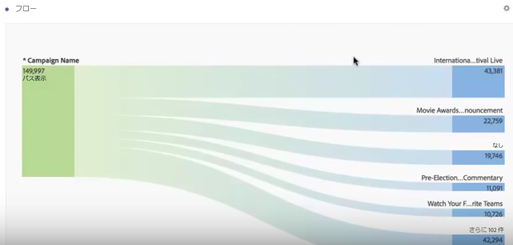
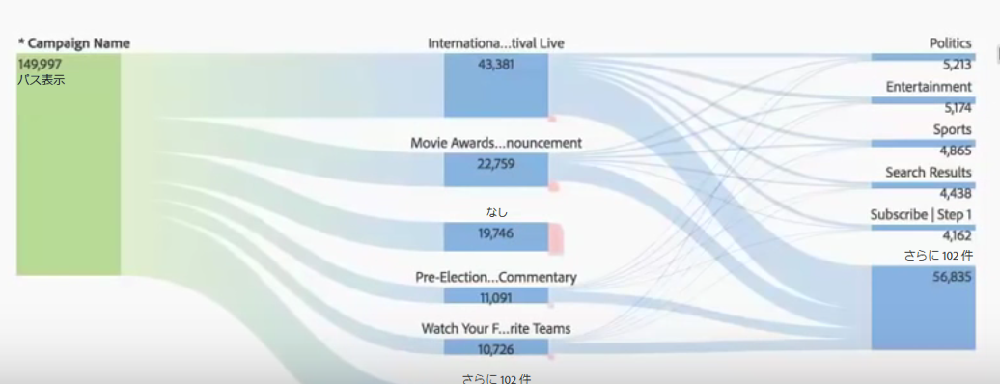

# ディメンション間のフロー

ディメンション間のフローを使用すると、様々なディメンションにわたるユーザーパスを検証できます。

各フロー列の先頭のディメンションラベルにより、フローのビジュアライゼーションで複数のディメンションをより直感的に使用できます。

アプリの使用例と Web の使用例の 2 つについて見ていきます。

## Use case one: app {#section_3D31D37B9C9F4134AE46C96291E41294}

返される上位の項目が [!UICONTROL ItemAdded] で、[!UICONTROL アクション名]ディメンションがフローに追加されました。

画面／ページ間のインタラクションおよびこのアプリのアクションを調査するには、調査対象に応じて複数の場所にページディメンションをドラッグできます。

* ドロップゾーンのどちらかの端（表示される黒い縁の長方形のゾーンの内側）にドラッグして、その端の上位の結果を&#x200B;**置き換えます**。

    

* その端の白いスペース（黒い括弧で示される）にドラッグして、ビジュアライゼーションに&#x200B;**追加**&#x200B;します。

   

右の列の ItemScaled 項目をページディメンションで置き換える場合の結果を次に示します。上位の結果は、ページディメンションの上位の結果に変更されています。

これで、顧客がアクションおよびページをどのように移動しているかを確認できます。別のノードをクリックすることで、さらにフローを調査できます。

これは、別のアクション名ディメンションをビジュアライゼーションの端に追加する場合に発生することです。

これにより、深いインサイトが可能になり、分析するアプリに対する変更の可能性を考慮できます。

## Use case two: web {#section_8D55983FA0C84926995270052AE01CD8}

この使用例は、最も多くのエントリを Web サイトに導くキャンペーンをどのようにして分析できるかを示します。

キャンペーン名ディメンションを新しいフローにドラッグします。

ここで、それらのキャンペーンがトラフィックを推進しているのはどのページかを確認したいので、ページディメンションをフロー結果の右側にドラッグして、ビジュアライゼーションに追加します。

次に、この結果を他のディメンションまたは指標（売上、訪問など）で分類します。
