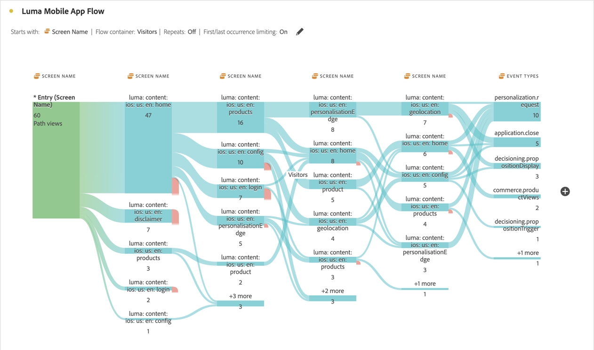

# ディメンション間のフロー

ディメンション間のフローを使用すると、様々なディメンションにわたるユーザーパスを検証できます。

>[!BEGINSHADEBOX]

デモビデオについて詳しくは、 [ディメンション間のフロー](https://video.tv.adobe.com/v/327472?quality=12&learn=on&captions=jpn){target="_blank"}を参照してください。

>[!ENDSHADEBOX]

この記事では、モバイルアプリのインタラクションおよびイベントと、キャンペーンで web 訪問を推進する方法という 2 つのユースケースに対して、このフローを使用する方法について説明します。

## モバイルアプリのインタラクションとイベント

このフロー例では、[!UICONTROL 画面名]ディメンションを使用して、ユーザーがアプリ内の様々な画面（シーン）をどのように使用するかを確認します。返される上部の画面は **[!UICONTROL luma: content: ios: en: home]** で、これはアプリのホームページです。

このアプリの画面とイベントタイプ（買い物かごへの追加、購入など）間のインタラクションを調べるには、**[!UICONTROL イベントタイプ]**&#x200B;ディメンションをドラッグ＆ドロップします。

* フロー内の使用可能なステップに加えて、そのディメンションを置き換えるには：

  

* 現在のフロービジュアライゼーションの外部で、ディメンションを追加するには：

  

以下のフロービジュアライゼーションは、**[!UICONTROL イベントタイプ]**&#x200B;ディメンションを追加した結果を示しています。このビジュアライゼーションでは、モバイルアプリのユーザーが、商品を買い物かごに追加する前にどのように画面を移動し、アプリケーションを閉じ、オファーを提示されているかといったインサイトが得られます。

## キャンペーンがどのように web 訪問を促しているか

Web サイトへの訪問を推進するキャンペーンを分析します。**[!UICONTROL キャンペーン名]**&#x200B;をディメンションとするフロービジュアライゼーションを作成します

最後の&#x200B;**[!UICONTROL キャンペーン名ディメンション]**&#x200B;を&#x200B;**[!UICONTROL 書式設定されたページ名]**&#x200B;ディメンションに置き換え、フロービジュアライゼーションの最後に別の&#x200B;**[!UICONTROL 書式設定されたページ名]**&#x200B;ディメンションを追加します。

いずれかのフローにポインタを合わせると、詳細が表示されます。例えば、どのキャンペーンが買い物かごのチェックアウトにつながったかが表示されます。

