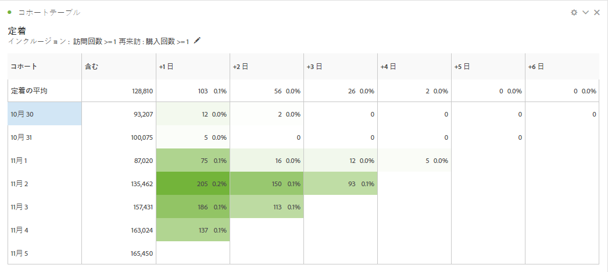
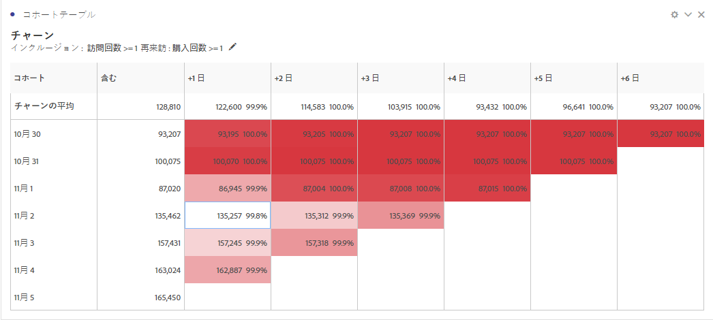
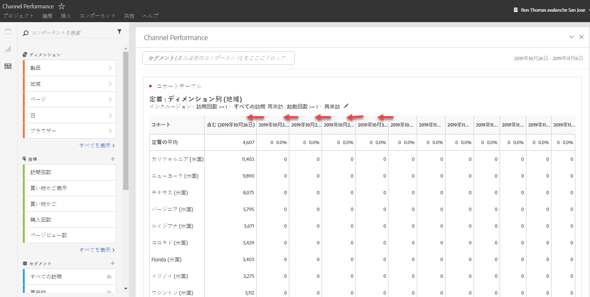
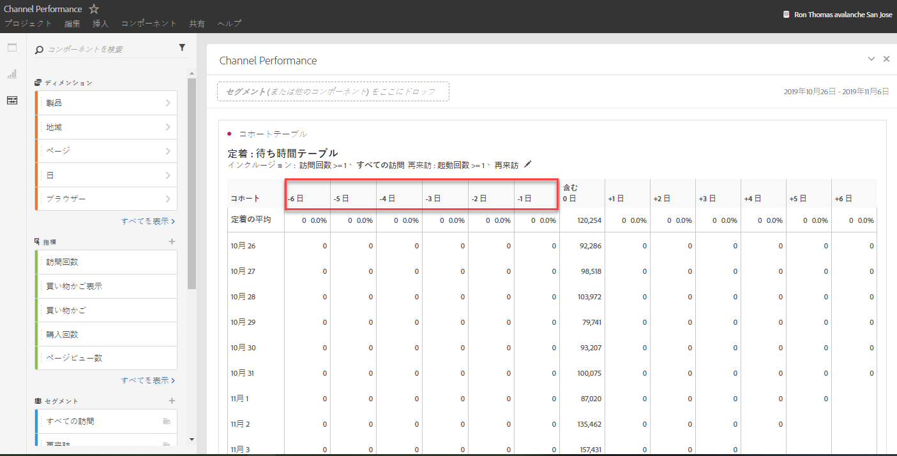
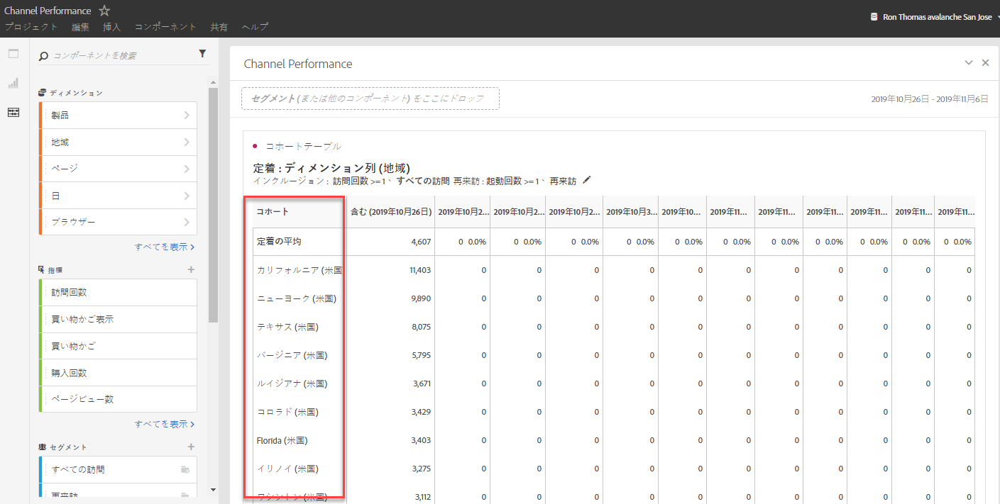

# コホート分析とは

A *`cohort`* is a group of people sharing common characteristics over a specified period. コホート分析は、例えば、コホートがブランドとどのように関わっているかを知る場合に役立ちます。 トレンドの変更を簡単に見分けて、それに応じて対応できます(Explanations of Cohort Analysis are available on the web, such as at [Cohort Analysis 101](https://en.wikipedia.org/wiki/Cohort_analysis).)

コホートレポートを作成したら、コンポーネント（特定のディメンション、指標およびセグメント）をキュレーションして、任意のユーザーとコホートレポートを共有できます。詳しくは、 [Curate and Share](../../../../analyze/analysis-workspace/curate-share/curate.md#concept_4A9726927E7C44AFA260E2BB2721AFC6).

コホート分析でできる操作の例を次に示します。

* 目的のアクションを促進するために設計したキャンペーンを開始する。
* 顧客のライフサイクルのまさに適切なタイミングでマーケティング予算を移行する。
* 価値を最大化するために、トライアルやオファーを終了するタイミングを認識する。
* 価格やアップグレードパスなどの領域で、A/B テストの着想を得る。
* ガイド付き分析内にコホート分析レポートを表示する。
* 価値を最大化するために、トライアルやオファーを終了するタイミングを認識する。
* 価格やアップグレードパスなどの領域で、A/B テストの着想を得る。

コホート分析は、Analysis Workspace へのアクセス権を持つすべての Analytics ユーザーが利用できます。

[YouTubeでのコホート分析](https://www.youtube.com/watch?v=kqOIYrvV-co&index=45&list=PL2tCx83mn7GuNnQdYGOtlyCu0V5mEZ8sS) (4:36)

>[!IMPORTANT]
>
>コホート分析は計算指標をサポートしていません。

## Cohort Analysis capabilities

2019年1月に、アドビは、大幅に強化された新しいバージョンのコホート分析をリリースしました。 新バージョンでは、作成するコホートに対してより詳細な制御が可能になります。主な機能強化は以下のとおりです。

### リテンションテーブル

A retention cohort report returns visitors: each data cell shows the raw number and percentage of visitors in the cohort who did the action during that time period. 指標は最大 3 個、セグメントは最大 10 個含めることができます。

### チャーンテーブル

A Churn cohort is the inverse of a retention table and shows the visitors who fell out or never met the return criteria for your cohort over time. 指標は最大 3 個、セグメントは最大 10 個含めることができます。

### ローリング計算

「含む」列ではなく、直前の列に基づいてリテンションまたはチャーンを計算できます。

### 待ち時間テーブル

インクルージョンイベントが発生した前後の経過時間を測定します。このツールは、イベント発生前後の分析に役立ちます。「含む」列がテーブルの中央にあり、インクルージョンイベント発生の前と後の期間が両側に表示されます。

### カスタムディメンションコホート

デフォルトの時間に基づくコホートではなく、選択したディメンションに基づいてコホートを作成します。マーケティングチャネル、キャンペーン、製品、ページ、地域などのディメンションや、Adobe Analytics のその他のディメンションを使用して、これらのディメンションの様々な値に基づいてリテンションがどのように変化しているかを表示します。

コホートレポートの設定および実行方法について詳しくは、 [コホート分析レポートの設定](/help/analyze/analysis-workspace/visualizations/cohort-table/t-cohort.md).

